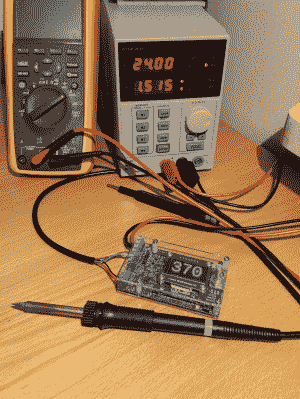

# 另一个整洁的通用烙铁驱动器

> 原文：<https://hackaday.com/2022/01/31/another-neat-general-purpose-soldering-iron-driver/>

在 Hackaday.io 上，用户[Tomasz Jastrzebski]设计了一个外观整洁的[定制控制器，用于驱动温控烙铁](https://hackaday.io/project/183790-all-purpose-power-micro-controller)。该设计旨在通用，能够与不同电压和探针类型的熨斗一起操作，无论是基于热电偶还是基于热敏电阻。这不是集成一个电源，而是由一个外部单元处理，提供了从不一定与电网相连的各种来源供电的可能性。【T2

硬件方面，我们让无处不在的 STM32 微控制器负责这场表演，它有一个基于 [INA823 仪表放大器](https://www.ti.com/product/INA823)的漂亮前端，参考了 [REF2030 精密电压源](https://www.ti.com/product/REF2030)。输入级配置为多功能惠斯通电桥输入电路，有很大的调整余地。

设计中有几个额外的功能不是烙铁驱动器所必需的，例如 RTC 支持，以及超级电容器备份，但这并不一定要驱动烙铁，它可以驱动任何具有温度反馈的 DC 加热器。随着固件的变化，这可以服务于其他任务。一个潜在的功能跃入脑海——让设备在一天中的某个时间自动断电，以防它意外地开着。

原理图有许多相关细节，因为许多器件都有一个很好的备选方案列表，可能是因为半导体短缺，如果你问我们，这是一个很好的习惯。我们许多参与制造的人已经这样做了很多年，因为给装配车间额外的选择是有意义的，但这实际上现在基本上是强制性的做法。

STM32G0 系列微控制器的固件基于 STM32 HAL，保持简单，为您提供了一个 [Visual Studio 代码](https://code.visualstudio.com/)项目。所有硬件(KiCAD)和固件都可以在[项目 GitHub 上找到。](https://github.com/tdjastrzebski/All-Purpose-Power-Micro-Controller)

这些年来，我们已经看到了一些这样的项目，比如这个[真正通用的焊接控制器](https://hackaday.com/2017/03/08/one-soldering-controller-to-rule-them-all/)，一个用于 JBC 烙铁的[定制控制器](https://hackaday.com/2017/11/06/roll-your-own-jbc-soldering-station/)，以及这个[基于 Arduino 的便携式设备](https://hackaday.com/2018/07/09/build-your-own-portable-arduino-soldering-iron/)。