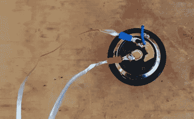

# 回收空饮料罐的另一种方法

> 原文：<https://hackaday.com/2021/11/27/another-way-to-recycle-those-empty-beverage-cans/>

你有没有坐过思考如何重新利用家里的物品？嗯,[BevCanTech]找到了一种方法来回收他的一些空饮料罐，把它们变成自制的金属丝。

前提很简单。他沿着饮料罐的圆周切下 2 毫米厚的金属丝，制成了一个细长的“金属丝”线轴。他用砂纸打磨每根金属条的末端，将自制的金属线压接在一起。他发现，当他打开易拉罐时，他可以从一个标准尺寸的饮料罐(大约 12 盎司)中伸出约 4 米。然后，他用压接连接器将自制的电线连接到电池端子和手电筒的末端。他用另一个罐子上的一个红色盖子作为伪光扩散器和灯罩，创造了一个非常酷的，几乎像熔岩灯一样的光。

也许这个项目的内容不会像你的感恩节大餐一样丰盛，但希望它能成为你下一个[自由电路设计](https://hackaday.com/2019/01/15/twelve-circuit-sculptures-we-cant-stop-looking-at/)的一点灵感。虽然你可能会想沿着你自制的电线磨平那些锋利的边缘。