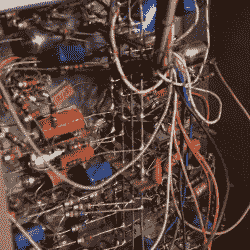

# 古董节拍盒展示了 1950 年的工程实力

> 原文：<https://hackaday.com/2022/03/03/antique-beat-box-showcases-1950s-engineering-prowess/>

在你可以在手机上安装鼓机应用程序或启动车库乐队之前，已经有了像罗兰 808 鼓机这样的突破。但这并不是一切开始的地方。1959 年，一家名为 Wurlitzer(以点唱机、钢琴和巨型管风琴闻名)的公司生产了一种新设备，这种设备让音乐家担心会让鼓手失业:1959 年 Wurlitzer Sideman。在休息时间下面的视频中，我们很高兴看到【妈妈，没有电脑】打开，解释，和*玩*这些神奇的机器。

Can you spot the early circuit sculpture?

值得注意的是，在 1959 年，几乎所有我们认为理所当然的进步都没有走出实验室。晶体管？没有。集成电路？肯定不是。那给我们留下了什么？真空管(穿过池塘的阀门)，电阻，电容，继电器，和…马达？没错。马达。

该单位是巧妙的建设，我们的意思是，相当字面上-建设显然是小心翼翼地完成，很容易看到一个早期的例子，电路雕塑约 3 分钟的标记。机电机构承担的任务可能是我们目前使用的 555，但对于任何从事机械项目的人来说，请注意:Wurlitzer 真的知道他们在做什么，在这个原始的节拍盒中有一些机电工程的优秀例子。

如果你喜欢有趣的架子鼓，你可能会喜欢这个基于 [Teensy 的开源架子鼓。不需要试管！](https://hackaday.com/2019/10/13/shapeshifter-an-open-source-drum-machine/)

 [https://www.youtube.com/embed/fNgJcX2ckZQ?version=3&rel=1&showsearch=0&showinfo=1&iv_load_policy=1&fs=1&hl=en-US&autohide=2&wmode=transparent](https://www.youtube.com/embed/fNgJcX2ckZQ?version=3&rel=1&showsearch=0&showinfo=1&iv_load_policy=1&fs=1&hl=en-US&autohide=2&wmode=transparent)

