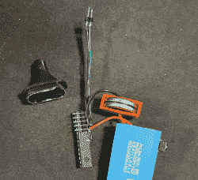

# 任何人都可以成为这个主锁保险箱的主人

> 原文：<https://hackaday.com/2022/06/05/anyone-can-be-the-master-of-this-master-lock-safe/>

[Etienne Sellan]得到了一个可爱的 5 美元的逻辑分析仪。就像任何闪亮的新工具一样，他开始寻找可以用来调查的东西，然后他的目光落在一个岗哨保险柜上。从表面上看，这个配备键盘的保险箱在特权分离方面设计得很体面。你可以把键盘板拿下来，接触到它的背面，但是键盘不做任何决定，它只是把数字发送到嵌在保险箱门后的另一块板上。螺线管连接的板接收 PIN，验证它，然后控制打开保险箱的螺线管。

[Etienne]将一个逻辑分析仪连接到通信线上，结果是一个 UART 通道，并记录键盘通信数据包—用于密码输入和密码更改。然后，他编写了一些 Arduino 代码来手动发送相同的数据包，这产生了奇迹。然而，由于螺线管控制器的速率限制，暴力破解是不可行的。一些事情引起了他的注意——如果你想更改密码，键盘要求你输入工厂代码，每个保险箱都有独特的代码，并在使用手册中提供。该代码条目是与“更改密码”不同的一种数据包。

休息后更多…

配备了能够发送模仿键盘产生的数据包的 Arduino，【Etienne】发现了一个严重的错误——发送密码更改命令实际上并不需要首先发送工厂代码包。通过发送一个数据包说“请将代码更改为 00000”，PIN 码将被重置。你所需要的只是一个注入串行数据包的 MCU，而[Etienne]正是这样做的，将 ATmega 电路嵌入到标记器的外壳中，用两针插头替换尖端。

如果你想黑掉这样一个保险箱，你只需要拆下键盘，取下标记器的盖子，用两个针触碰键盘板上的测试点，然后按下一个按钮，向保险箱发送一个数据包——[，如【Etienne】](https://twitter.com/etienne_sellan/status/1495714698397986816)的一段视频所示。这种标记有点像适合詹姆斯·邦德的工具，只要你能在野外找到一个安全的岗哨，它会在需要的时候给你一把枪，或者一沓现金。

显然，这是非常糟糕的——考虑到这种保险箱的广告是用来存放贵重物品和枪支的。该公司被告知该问题，但从未回应。然而，如果你有一个受到影响的保险箱，[艾蒂安] [设计了一个替代的螺线管板](https://github.com/H4ckd4ddy/fix-sentry-safe)，它不容易受到任何恶意数据包的影响。所有的设计都是开源的，这是黑客的最佳传统。有了这个板，你的保险箱的安全是一个 PCB 订单。似乎[Etienne]的工作必须更酷，他还编写了一个固件，为这个板添加了 OTP 代码支持，所以你也可以使用你最喜欢的 2FA 应用程序来打开这个保险箱。

我们向[Etienne]致敬，他发现了这个错误，做了一个很酷的概念验证，然后甚至创建了一个修复程序——面对制造商直接忽略这个问题。我们经常看到硬件黑客[升级他们的保险柜](https://hackaday.com/2022/04/18/gun-safe-made-safer-with-lithium-battery-upgrade/)或者[撬开保险柜](https://hackaday.com/2019/10/03/pistol-safes-poor-design-means-biometric-sensor-bypassed-in-seconds/)，很高兴看到一个项目成功做到了这两点。

> 嗨[@ sentry safe](https://twitter.com/SentrySafe?ref_src=twsrc%5Etfw)&[@ master lock us](https://twitter.com/MasterLockUS?ref_src=twsrc%5Etfw)，
> 
> 我刚刚在你的电子保险箱固件中发现了一个软件漏洞，它允许在没有密码的情况下打开保险箱。我做了一个袖珍有效载荷注射器作为 PoC。
> 是否可以与您讨论提供详细信息并帮助修复？
> 
> cc[@ lockpickinglwr](https://twitter.com/LockPickingLwyr?ref_src=twsrc%5Etfw)【pic.twitter.com/B4A75Ws1OG】T2
> 
> —艾蒂安·塞兰(@艾蒂安 _ 塞兰)[2022 年 2 月 21 日](https://twitter.com/etienne_sellan/status/1495714698397986816?ref_src=twsrc%5Etfw)