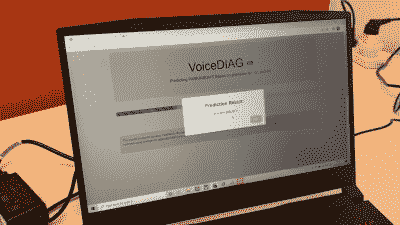

# 应用程序通过音频检测帕金森病和新冠肺炎

> 原文：<https://hackaday.com/2022/11/28/app-detects-parkinsons-disease-and-covid-19-via-audio/>

诊断疾病的挑战之一是早期识别疾病。在这个阶段，迹象可能是模糊或混乱，或难以识别。早期诊断往往与最好的治疗结果联系在一起，因此有很多激励因素来以这种方式改进方法。

在这方面，一种新的基于声音的疾病诊断方法可能会被证明是卓有成效的。它依靠机器学习技术来检测患者何时可能患有某些疾病。

## 让我听你说/a/

长期以来，语音模式和患者的总体语音质量一直是医生的重要诊断工具。它们与神经疾病特别相关。如果大脑或神经系统功能不正常，语言就会受到影响。

A simple smartphone app is used to capture audio samples from the patient. The system can deal with background noise levels in a typical doctor’s office, and prompts the patient on the correct sounds to make for diagnosis. Credit: [Youtube – IEEE Spectrum](https://www.youtube.com/watch?v=stL3BSSgwp0)

皇家墨尔本理工大学(RMIT)的研究人员开发了一种方法，利用病人的声音来检测疾病的细微迹象。这个想法是使用机器学习算法来确定病人对某些声音的发音是否预示着疾病。主要目标是通过对一个说几种正常英语发音的病人进行采样来确定帕金森病的存在。尽管人与人之间的声音存在自然差异，但这项研究必须实现这一目标。36 名帕金森病患者和 36 名健康志愿者参加了这项研究。

根据[发表的研究，](https://ieeexplore.ieee.org/stamp/stamp.jsp?tp=&arnumber=9887934)研究参与者被要求发出三个音素-/a/、/o/和/m/。那是分别在“car”、“oh”和“mmmm”中间的声音。这些音素需要使用喉咙、嘴巴和鼻腔来发出声音。一个机器学习算法被训练来确定帕金森病患者和健康志愿者之间这些声音的差异。该算法旨在用于典型的临床环境，旨在处理使用普通智能手机从患者那里采集的音频样本，背景噪音水平合理。一个应用程序被用来收集数据，并被用来指导病人用正确音素的声音样本来创造正确的声音。

Voice samples are analysed for features that could be indicative of disease. An illness can affect parameters like vocal strength or pitch stability, or introduce a wavering quality to a phoneme. Credit: YouTube – IEEE Spectrum

在测试中，它能够 100%地识别帕金森病患者。发现对来自所有三个音素的特征组合的分析是最可靠的检测方法。测试仅限于来自一个地理区域的患者，并且只使用一种型号的智能手机，还有其他限制。然而，它表明，利用现成的智能手机硬件捕捉音频样本，并用应用程序处理它们，可能有潜力开发出一种帕金森病的诊断方法。

在印尼的一项研究中，同样的技术后来被用于诊断新冠肺炎患者。在这种情况下，除了/a/、/o/和/m/之外，用于分析的音素扩展到包括/e/、/i/和/u/声音。[该研究](https://ieeexplore.ieee.org/document/9895437)历时 22 天，涉及 40 名新冠肺炎住院患者。48 名健康受试者组成对照组。在这种情况下，当在住院三天内捕获时，对/i/声音的声音特征的分析被确定为最具指示性。该方法有 94%的准确率。对于所使用的低技术方法来说，这更令人印象深刻。声音样本是以 8 kHz 的采样率采集的，以代表低技术含量的 2G 和 3G 手机的功能。

 [https://www.youtube.com/embed/stL3BSSgwp0?version=3&rel=1&showsearch=0&showinfo=1&iv_load_policy=1&fs=1&hl=en-US&autohide=2&wmode=transparent](https://www.youtube.com/embed/stL3BSSgwp0?version=3&rel=1&showsearch=0&showinfo=1&iv_load_policy=1&fs=1&hl=en-US&autohide=2&wmode=transparent)

这项工作表明，由于患者言语中的明显变化，各种疾病都有可能被诊断出来。当然，在这些方法成为主流之前，还需要更严格的研究。此外，虽然这种方法可以指示疾病，但发声技术不太可能成为大多数疾病的唯一金标准诊断。更直接、更不主观的[化学诊断](https://hackaday.com/2022/09/14/new-parkinsons-test-smells-success/)更可取，而不是依赖更多黑盒机器学习系统的直觉。然而，对于难以诊断的疾病，拥有一个提供一些指示性指导的系统可能是至关重要的。期待这些技术变得更加完善，成为现代医学向前发展的主要部分。