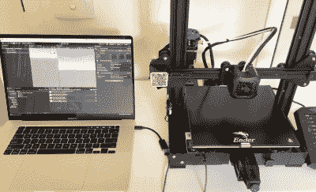

# Apple II 在现代的帮助下与 3D 打印机对话

> 原文：<https://hackaday.com/2021/02/21/apple-ii-talks-to-3d-printer-with-a-little-modern-help/>

控制大多数桌面 3D 打印机就像通过串行连接向它们发送 g 代码命令一样简单。正如你所料，需要一台相对快速的机器才能足够快地发出高质量的打印命令。但是如果你不那么挑剔呢？如果速度不是问题，你可以使用的计算机类型的实际限制是什么？

为了回答这个问题， [[Max Piantoni]着手用一个真正的苹果 IIc](https://www.youtube.com/watch?v=oPYJGzOXLO4) 来控制他的 Ender 3 打印机。事情变得简单了一些，因为他真的只想将打印机用作 2D 绘图仪，所以他可以忽略代码中的第三维度。他所需要做的只是想出一个基本程序，让他在苹果上创建一些简单的几何图形，并将其转换成可以通过计算机的串行端口发送出去的命令。

Unity controlling the Ender 3

不幸的是，[Max]遇到了某种语言障碍。虽然苹果在生成 Ender 的控制器可以理解的 g 代码方面没有问题，但两个设备无法就适用于它们的数据速率达成一致。3D 打印机喜欢以 115，200 波特的速度快速前进，而苹果则以 300 波特的速度缓慢前进。很明显，需要有人来解释。

[Max]提出的解决方案当然不会是我们的首选，但是用你所知道的来工作还是有好处的。他很快在 Macbook 上的 Unity 中创建了一个程序，该程序可以接受来自 Apple II 的 300 波特的输入命令，建立一个健康的缓冲区，然后将它们发送到 Ender 3。正如你在休息后的视频中所看到的，这种 Mac 在中间的方法最终让这些不太可能的朋友交谈起来。

我们想起了几年前的一个项目，该项目旨在用 20 世纪 80 年代的技术建造一台全功能的 3D 打印机。它将由 20 世纪 80 年代的 Commodore PET 控制，它也很难与打印机的电子设备进行足够快的通信。将现代笔记本电脑融入其中可能有点欺骗，但至少它表明这个概念是合理的。

 [https://www.youtube.com/embed/oPYJGzOXLO4?version=3&rel=1&showsearch=0&showinfo=1&iv_load_policy=1&fs=1&hl=en-US&autohide=2&wmode=transparent](https://www.youtube.com/embed/oPYJGzOXLO4?version=3&rel=1&showsearch=0&showinfo=1&iv_load_policy=1&fs=1&hl=en-US&autohide=2&wmode=transparent)

