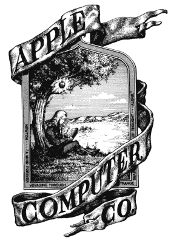

# 苹果推出了我们期待已久的产品

> 原文：<https://hackaday.com/2018/10/30/apple-introduces-what-weve-all-been-waiting-for/>

本周最大的新闻来自苹果。有一款新的 Mac Mini(新闻报道称它是一个很棒的数字标牌平台，但我们会坚持使用我们的 Raspberry Pis)，一款售价 1900 美元的巨型 iPad，MacBook Air 的显示屏水平分辨率超过 900 像素。这是个大新闻，但这不是来自库比蒂诺的最大新闻。[Aki-Baidya]报道称[苹果公司将老派的彩虹标志带回苹果公园游客中心出售的 t 恤上](https://www.reddit.com/r/VintageApple/comments/9rzz5m/apple_has_brought_back_the_old_school_designs_to/)。这一举动是在苹果商标[今年早些时候更新彩虹标志](https://9to5mac.com/2018/02/20/apple-rainbow-apple-logo/)之后。

o . g . rainbow 苹果标志并不是苹果的第一个标志——这一荣誉属于 1976 年由[乔布斯]和[罗纳德·韦恩]设计的‘牛顿木刻’标志。[Wayne]最出名的是以 800 美元出售他在苹果公司的 10%股份。“彩虹苹果”出现在 1977 年，当时乔布斯委托罗布·詹诺夫根据苹果本身设计一个标志。牛顿当然从这个标志中消失了，但是他对科学的贡献——运动定律和光学——在彩虹苹果中被提及。

随着最初的 Bondi Blue iMac 的发布，彩虹苹果标志在 1998 年被逐步淘汰，并逐渐取代了苹果所有四条电脑线上的标志。彩虹标志最后一次出现在苹果笔记本电脑上是在华尔街 II / PDQ Powerbook 上，1999 年 5 月被 Lombard PowerBook 取代。在台式机上，最后一个彩虹徽标出现在米色的 G3 塔上，于 1999 年 1 月被蓝白相间的 G3 取代。

尽管彩虹苹果标志在二十年前就已经停止使用，但它一直是最受欢迎的公司标志之一。直到今天，你仍然可以在旧沃尔沃的背面找到彩虹苹果标志贴纸，并把它钉在办公室的窗户上。它是 80 年代和 90 年代设计的主要部分。彩虹苹果标志 t 恤在苹果公园游客中心礼品店独家发售，价格为 40 美元。