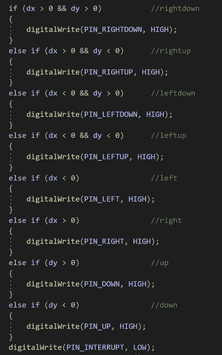

# Arduino 将 USB 鼠标引入自制电脑

> 原文：<https://hackaday.com/2021/10/18/arduino-brings-usb-mouse-to-homebrew-computer/>

当建立自己的自制电脑，一切都是一个挑战。最终，这就是问题的关键。如果你不想真的弄脏你的手，你一开始就不会建造它。举个例子，为了在他们的 6502 机器上支持标准的 USB 鼠标，T2【rehsd】愿意做的事情。

Code for mapping mouse movement to digital output.

早期的想法是利用现有的 Arduino 库来连接标准的 USB 鼠标，具体来说，硬件将采用带有 USB 主机屏蔽的 Arduino Mega 2560 的形式。有大量的代码和示例显示了如何从 Arduino 读取鼠标位置和点击次数，但[rehsd]仍然必须找到一种方法将这些信息输入 6502。

最后，[rehsd]将 Arduino 的一个数字引脚连接到计算机的 W65C22 通用接口适配器(VIA)上的一个中断引脚。然后，又有 11 个数字引脚连接到计算机，每个引脚代表鼠标和按钮的一种状态，例如 MOUSE_CLICK_RIGHT 和 MOUSE_LEFT_DOWN。

不可否认，[rehsd]说鼠标操作远非完美。但正如你在休息后的视频中看到的，它至少是功能性的。虽然代码可能会更严格，但在电气接口方面显然还有一些改进。移位寄存器的使用可以减少 Arduino 和 VIA 之间的电线数量，这将是一个开始。也有可能使用 CH375 这样的芯片，将微控制器完全排除在外。

从经典的试验板构建到一些[令人印象深刻的实用便携式机器](https://hackaday.com/2017/08/21/this-6502-computer-project-is-a-work-of-art/)，这些年来我们已经看到了 6502 台计算机的公平份额。尽管在这些自制系统中发现了令人难以置信的变化，但有一点是相同的:它们是由一些最有激情的人建造的。

 [https://www.youtube.com/embed/FMOCs9LEkKQ?version=3&rel=1&showsearch=0&showinfo=1&iv_load_policy=1&fs=1&hl=en-US&autohide=2&wmode=transparent](https://www.youtube.com/embed/FMOCs9LEkKQ?version=3&rel=1&showsearch=0&showinfo=1&iv_load_policy=1&fs=1&hl=en-US&autohide=2&wmode=transparent)

谢谢吉姆的提示。]