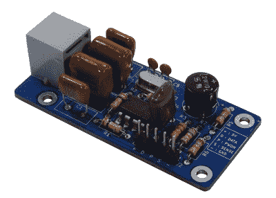

# Arduino 来电显示总比不显示好

> 原文：<https://hackaday.com/2021/08/20/arduino-caller-id-display-is-better-late-than-never/>

众所周知，固定电话的时代正在慢慢结束。截至 2020 年，据估计不到一半的美国家庭仍然订阅普通老式电话服务(POTS)。但是当然，这仍然意味着数百万的用户可能会从这个由[Dilshan Jayakody] 开发的 [Arduino 来电显示中得到乐趣。](https://hackaday.io/project/181203-arduino-telephone-caller-id-unit)

The completed HT9032D board.

说实话，直到这一点，我们还没有真正考虑过来电显示系统是如何工作的。但是正如[Dilshan]解释的那样，你实际上可以拿起一个专用的 IC 来解码通过电话线发送的来电数据。在这种情况下，他使用的是 Holtek HT9032D，采用通孔 DIP-8 封装，价格约为 2 美元。该芯片需要一些无源器件和一个 3.58 MHz 晶体来帮助它完成任务，但除此之外，它实际上只是从输出引脚读取解码数据。

为了显示来电者的信息，[Dilshan]使用了 Arduino Uno 和普通的 16×2 HD44780 LCD。作为一个很好的接触，当你错过一个电话时，代码甚至会闪烁 Arduino 的板载 LED。作为概念证明，没有人试图压缩硬件或抛弃试验板，但不难想象，如果你想要更持久的东西，所有组件都可以装入一个漂亮的 3D 打印外壳中。

我们在以前的项目中已经看到过收集来电显示数据，但是[他们使用了 USB 调制解调器和软件方法](https://hackaday.com/2015/10/11/see-whos-calling-with-caller-pi-d/)。我们真的很喜欢用廉价的专用 IC 来实现这个想法，尽管我们承认这个演示在十年前可能会更令人兴奋。

 [https://www.youtube.com/embed/x8n6yKQ5ZnQ?version=3&rel=1&showsearch=0&showinfo=1&iv_load_policy=1&fs=1&hl=en-US&autohide=2&wmode=transparent](https://www.youtube.com/embed/x8n6yKQ5ZnQ?version=3&rel=1&showsearch=0&showinfo=1&iv_load_policy=1&fs=1&hl=en-US&autohide=2&wmode=transparent)

