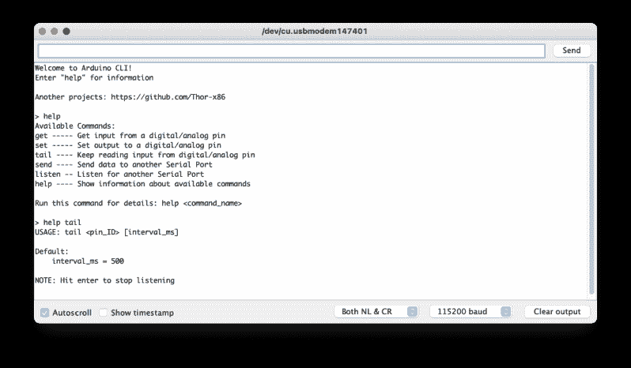

# 用于 I/O 引脚测试的 Arduino CLI

> 原文：<https://hackaday.com/2021/03/21/arduino-cli-for-i-o-pin-testing/>

需要快速切换或读取一些逻辑信号，而无需编写快速程序？[Thor_x86]，又名[Eric]，构建了一个 [Arduino sketch](https://hackaday.io/project/178188-ready-to-use-arduino-sketch-for-io-testing) 来做这个——他还加入了发送(或接收)串行消息的能力。这是一个巧妙的想法——有点像简化的公交车海盗。

我们应该警告你，这是一个早期版本，有一些小问题，我们相信[Eric]会很快解决。我们发现函数`strtol()`在`cmd_send.cpp`中被拼错了，还有一些配置`#defines`需要在文件`parsePin.cpp`中整理，这取决于你运行的是哪个 Arduino 模块。我们让它在最快的 Arduino Leonardo 上运行，因为它支持`Serial1()`。

不要因为 rev 0 部署中的这些小故障而气馁——[ Eric]在这里确实是一个非常好的工具。检查他的 [GitHub 库](https://github.com/Thor-x86/arduino_cli)的更新(或者自己提交修改)。总而言之，它是你的数字工具箱的一个很好的补充。在一个完全不相关的说明中，我们真的很喜欢[Eric]的带有直角微型连接器的 USB 电缆，尽管它可能很破旧。

除了标准工具，如 Bus Pirate、GreatFET、FTDI 模块等。，有没有你喜欢用的类似的工具进行位敲打和串行测试？请在下面的评论中告诉我们。