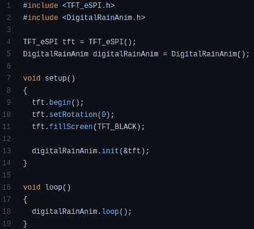

# Arduino 图书馆让数字雨像 1999 年一样

> 原文：<https://hackaday.com/2021/11/17/arduino-library-makes-digital-rain-like-its-1999/>

下个月将有一部新的 *Matrix* 电影在影院上映，你知道这意味着什么:我们将看到全新的一代人痴迷于该系列标志性的“数字雨”效果。由于现代广告技术，预计很快就会看到一行行闪闪发光的文字从广告牌到汽油泵等一切东西的显示屏上倾泻而下。

Doesn’t get much easier than that.

对于我们中那些一直在寻找借口摆脱旧的*矩阵*屏幕保护程序的人来说，你也可以使用[这个用于 ESP8266 和 ESP32 的方便的 Arduino 库。](https://github.com/0015/TP_Arduino_DigitalRain_Anim)由【埃里克·南】开发，它可以让你在 TFT_eSPI 库支持的显示器上启动数字暴雨，就像运行`digitalRainAnim.loop()`一样简单。

你甚至可以通过 Arduino IDE 安装这个库，只需打开库管理器，搜索“数字雨”就可以开始了。你仍然需要将显示器连接到你的微控制器上，但是拜托，[Eric]不能为你做所有的事情。

看看这些例子，似乎动画的各个方面，比如颜色和速度，都可以通过用不同的值初始化库来配置。不幸的是，我们在这个项目的文档中没有看到太多，但是通过比较不同的例子，你应该能够得到高分。

虽然我们的第一选择[肯定是一面绿色字母数字 LED 显示屏](https://hackaday.com/2019/12/20/movie-style-hacking-with-a-wall-of-glowing-hex/)，但我们不禁对这个项目如何轻松地在工作台上旋转自己的一小块*矩阵*印象深刻。

 [https://www.youtube.com/embed/i6gGK4L4Yv8?version=3&rel=1&showsearch=0&showinfo=1&iv_load_policy=1&fs=1&hl=en-US&autohide=2&wmode=transparent](https://www.youtube.com/embed/i6gGK4L4Yv8?version=3&rel=1&showsearch=0&showinfo=1&iv_load_policy=1&fs=1&hl=en-US&autohide=2&wmode=transparent)

