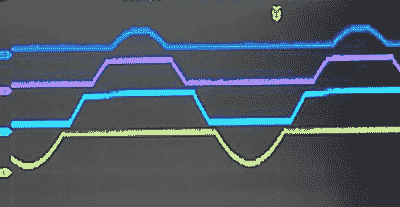

# Arduino 使用量化器测量 20V 信号

> 原文：<https://hackaday.com/2021/09/03/arduino-measures-20v-signals-using-quantizer/>

加拿大电子极客和新生的 YouTuber [Technoyaki]想要在他的 Arduino 上测量 20 伏信号。人们通常可以使用分压器将它们降至 Arduino 10 位模数转换器的 5 伏范围。但他不是一个采取传统方法的人。[Technoyaki]决定用十六个电阻、四个运算放大器和一个独立的 6 VDC 电源构建一个[模拟电路，而不是使用两个电阻。](https://www.youtube.com/watch?v=YMzNQB_zIZk)

什么是量化器？在通常意义上，量化器将模拟信号(具有无限可能的值)转换成更小(且有限)的数字值集合。模数转换器是量化器的一个完美例子。[Technoyaki]，稍微延伸一下定义，用这个术语来描述他的电路，基本上就是一个电压限幅器。它将 20 V 信号分解成四个独立的 5 V 频段。当然，只需使用一个 Arduino Due 就几乎可以实现这一点，它有一个 12 位模数转换器(几乎如此，因为它的基准电压较低，为 3.3 V)。但那就没那么有趣了。

为什么要使用所有这些额外的组件？显然，减少器件数量和电路复杂性不是[Technoyaki]的目标之一。正如他所描述的，原因是为了避免传统分压器固有的 A/D 分辨率损失。作为一个语义问题，我们想指出的是，使用分频器时不会损失任何位的分辨率，更准确地说，使用量化器这样的电路时，您会获得位的分辨率。对于精密模拟电路来说，这并不奇怪，[Technoyaki]指出还有一些问题有待解决。即使这个电路最终被证明是不切实际的，这也是一个值得探索的好概念。看看休息时间下面的视频，他很好地解释了这个设计和他的实验。

尽管目前这还不是一个完全剪切粘贴的电路解决方案，但它确实展示了另一种处理大信号并同时获得一些分辨率的方法。我们在[之前写过类似的方法，用于将 Arduino](https://hackaday.com/2018/05/07/double-the-resolution-from-an-arduino-adc/) 的 A/D 分辨率提高一倍。如果您有测量更高电压和/或提高模数转换器分辨率的技术，请告诉我们。

 [https://www.youtube.com/embed/YMzNQB_zIZk?version=3&rel=1&showsearch=0&showinfo=1&iv_load_policy=1&fs=1&hl=en-US&autohide=2&wmode=transparent](https://www.youtube.com/embed/YMzNQB_zIZk?version=3&rel=1&showsearch=0&showinfo=1&iv_load_policy=1&fs=1&hl=en-US&autohide=2&wmode=transparent)

