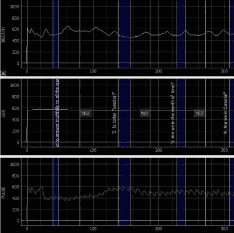

# Arduino 测谎仪展示了它是如何做到的

> 原文：<https://hackaday.com/2019/12/25/arduino-polygraph-shows-how-its-done/>

 有时候，一个项目的出现会为任何从事类似工作的人提供一个很好的参考设计。在这个特殊的例子中，[是一个由【Juangg】](https://juangg-projects.blogspot.com/2019/06/usb-polygraph.html)制造的类似于 DIY USB 测谎仪的机器，在硬件方面使用 Arduino 和传感器，以及用于数据可视化的 Python 前端。它甚至配有 3D 打印外壳和传感器元件。

[Juangg]设计它使用三个传感器:一个脉搏传感器，一个呼吸传感器，一个测量皮肤电反应(GSR)。脉搏传感器使用压在指尖上的压电元件来检测血流引起的压力变化。它可能对位置很挑剔，但找到最佳位置可以产生非常好的读数。呼吸传感器的工作原理类似，但使用 3D 打印的固定装置将传感器固定在皮带和受试者的胸部之间，这样就可以检测到呼吸。GSR 传感器是一个分压器，用于测量皮肤电导率的微小变化。这一切运作得有多好？这取决于你想从中得到什么，但是如果有人想要类似工作的参考，可以从[项目页面](https://juangg-projects.blogspot.com/2019/06/usb-polygraph.html)和[GitHub 知识库](https://github.com/Juan-Gg/USB_Polygraph)获得文档和设计文件。

测谎仪可能有一个混合的名声，但它是一个很好的项目，从工程的角度展示了生物识别技术可以有多混乱。如果你错过了，这里有一个提醒:神奇女侠和测谎仪的共同点比你可能意识到的要多得多。