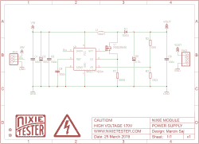

# Arduino Shield 让驾驶 Nixies 变得简单

> 原文：<https://hackaday.com/2019/04/04/arduino-shield-makes-driving-nixies-easy/>

谢妮电子管因其温暖的光芒而受到世界各地黑客的崇拜，这让人想起了痛苦的核对峙和无休止的代理战争的时代。然而，它们不是最容易驱动的东西，需要高电压，可能会吓到微控制器。谢天谢地，[有可能获得一个 Arduino 盾，它可以帮你完成繁重的工作。](https://hackaday.io/project/164583-nixie-thermometer-hygrometer-shield-for-arduino)

The HV supply is the heart of any Nixie driver.

shield 使用 HV5812 驱动器来处理事物的高压侧，这是一个更常用于驱动真空荧光显示器的部分。还有一个用于温度和湿度测量的 DHT22 和一个 DS3231 实时时钟。它设计用于 IN-12 和 IN-15 电子管，器件选择取决于您是要制作时钟还是组合式温度计/湿度计。还有一个外壳选项，由双色激光蚀刻部件组成，这些部件咬合在一起，形成一个相当光滑的成品外观。

对于那些想自己旋转的人来说，[代码可以在 Github 上找到](https://github.com/marcinsaj/Nixie-Clock-Thermometer-Hygrometer-Arduino-Shield)和[原理图也可以找到。](https://hackaday.io/project/164583-nixie-thermometer-hygrometer-shield-for-arduino/details)当然，你必须创建自己的 PCB，[但有些指南可以帮助你走上这条道路。如果你正在寻找一个快速的谢妮项目来让你的脚沾湿，这可能正是你需要开始的。当然，你可以直接进入硬模式](https://hackaday.com/2016/09/21/creating-a-pcb-in-everything-introduction/)[，尝试功能性的谢妮手表](https://hackaday.com/2017/01/20/plus-size-watch-with-a-pair-of-tiny-nixies/)。休息后的视频。

 [https://www.youtube.com/embed/hhaExmLppew?version=3&rel=1&showsearch=0&showinfo=1&iv_load_policy=1&fs=1&hl=en-US&autohide=2&wmode=transparent](https://www.youtube.com/embed/hhaExmLppew?version=3&rel=1&showsearch=0&showinfo=1&iv_load_policy=1&fs=1&hl=en-US&autohide=2&wmode=transparent)

狭槽