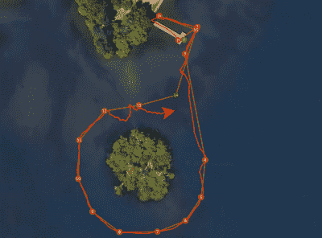

# ArduRover 船使用浴盆漂浮

> 原文：<https://hackaday.com/2019/08/18/ardurover-boat-uses-to-float/>

没有什么比看到一个塑料盒绕着湖欢快地航行更能象征自主机器人的入门是多么容易。我们写这个项目并不是因为技术上的卓越，而是纯粹因为观看一个自动塑料盒独自在湖中航行令人惊讶地引人注目。[rctestflight]建造这艘飞船的原因是为了测试 ArduRover 的能力。当然，ArduRover 是非常流行的开源 ArduPilot 的一个版本，在这种情况下，它是在 Pixhawk 上运行的。

硬件本身故意尽可能简单:它只需要两个带有遥控汽车电子稳定控制系统的小马达、一个全球定位系统、一些电源管理和一个遥测模块。遥测模块允许在飞行中更新课程/任务，并向家里发送诊断数据。最初，这种设置表现不佳；低 GPS 精度与高频率控制回路相结合，驾驶惯性很小的设备会导致非常不稳定的路径。但是在对 GPS 进行一些过滤之后，这种情况得到了显著的改善。

尽管设置简单，但它也不能避免缺陷。道具中的海藻是一些紧张观看的原因，更不用说逆风航行所需的动力不足了。在这些问题导致船只偏离航线经过附近的浮桥后，公众的视线范围从非法的警用无人机到头上有灯的狗。

如果你想把你的自主船用于吓唬公众之外的其他目的，我们已经写了一些用于[绘制海床深度](https://hackaday.com/2015/05/25/project-sea-rendering-autonomously-renders-sea-bottoms/)、[跟踪飞机](https://hackaday.com/2016/09/07/tracking-airplanes-from-an-autonomous-boat/)、[甚至穿越大西洋](https://hackaday.com/2013/07/08/an-autonomous-boat-across-the-atlantic/)的船只。

 [https://www.youtube.com/embed/PlUmG3CFadw?version=3&rel=1&showsearch=0&showinfo=1&iv_load_policy=1&fs=1&hl=en-US&autohide=2&wmode=transparent](https://www.youtube.com/embed/PlUmG3CFadw?version=3&rel=1&showsearch=0&showinfo=1&iv_load_policy=1&fs=1&hl=en-US&autohide=2&wmode=transparent)

