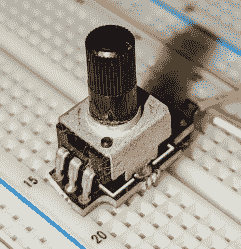

# Arm 通过 Mbed 和电位计提高音量

> 原文：<https://hackaday.com/2022/04/19/arm-pumps-up-the-volume-with-mbed-and-a-potentiometer/>

上次，我[告诉过您如何使用 Mbed OS 开始使用“Black Pill”STM 32 f 411 板](https://hackaday.com/2022/04/13/arming-with-an-os/)。不可否认，这个示例程序没有使用操作系统的许多功能，除非你把 USB 串口驱动程序在幕后使用的功能也算进去。然而，这一次，我们将制作一个实用的玩具，让你用一个锅来调节电脑的音量。

[](https://hackaday.com/wp-content/uploads/2022/04/bp.jpg)

The Black Pill module on a breadboard.

对于这种应用，黑色药丸是一个很好的选择，因为它有模拟输入，可以充当 USB 键盘。事实上，Mbed OS 拥有各种 USB 设备的驱动程序。我们已经看到了串行端口，但你也可以看起来像一个大容量存储设备或鼠标，例如。为了练习，我们将创建两个执行线程。其中一个将读取 pot 并向另一个线程发送消息。该线程将作为 USB 键盘与 PC 通信。任何能识别键盘上媒体键的电脑都应该能与该设备配合使用。

## 线

创建线程非常简单。在许多情况下，您只需定义一个不带参数的 void 函数，并将其用于一个线程对象:

```
readknobThread.start(vol_thread);
```

当然，函数不应该返回，除非你希望线程结束。正如我在上一篇文章中提到的，你可以带着`ThisThread::sleep_for`电话睡觉。如果你只是想放弃一段时间而不睡一段时间，还有一个`yield`调用。

您还可以创建一个函数，如果在空闲时间没有线程准备好执行，该函数会返回并让它执行。调用`rtos_attach_idle_hook`来设置该功能。如果不提供，默认情况下会导致处理器休眠。

您可以通过改变线程的堆栈大小和优先级来丰富线程。Thread 对象的 join 方法允许您等待线程终止。您可以在对象的构造过程中设置线程的名称。然而，要做到这一点，您还必须指定所有其他选项。这在你调试的时候很方便，所以你可以很容易的区分不同的线程。方法如下:

```

Thread readknobThread(osPriorityNormal,OS_STACK_SIZE,nullptr,"KNOB");
Thread keyboardThread(osPriorityNormal,OS_STACK_SIZE,nullptr,"KBD");

```

不过，通常情况下，您可以坚持使用默认的构造函数。您随时可以在以后更改优先级。您还可以在项目的`json`文件中设置默认堆栈大小(通常为 4 kB ),只要您希望所有线程使用相同的默认值。

## 卷

让黑色药丸看起来像一个 USB 键盘并发出比如说降低音量的命令有多难？简单:

```

USBKeyboard kbd;

...

kbd.media_control(KEY_VOLUME_DOWN);

```

这可能是一个非常简单的程序。然而，我想用多线程来玩一些，所以我把它做得有点难。这个程序有两个线程。人们观察电位计并决定它是否向上或向下移动了设定的量。然后，它使用邮箱向另一个线程发出命令。

[](https://hackaday.com/wp-content/uploads/2022/04/usbk.png)

USB classes, including USBKeyboard, share many base classes.

另一个线程等待邮件到达，并通过发送媒体密钥来处理邮件。这也有点过头了，因为线程之间实际上只共享一部分数据。但是邮件机制可以传输任意结构，所以了解它是很有用的。

## 多线程通信

Mbed OS 提供了多种功能来帮助线程协作:

*   condition variable–一种机制，用于一个线程向其他线程发出条件发生变化的信号。
*   event flags——类似于条件变量，但是允许一个线程等待多个事件。您可以等待一组标志中的任何一个发出信号，也可以等待所有标志发出信号。
*   队列–队列允许一个线程加载另一个线程使用的指针。
*   邮件——这类似于队列，但是存储发送的数据而不是指针。
*   互斥体——互斥体是一种一次只能由一个线程拥有的资源。这允许线程在不互相干扰的情况下协作。
*   信号量——它类似于互斥体，但是有一个与之相关的计数。您不能在中断处理程序中使用互斥体，但可以使用信号量。

对于这个简单的例子，假设我们想使用线程，我们几乎可以使用任何这些机制。一个全局变量加上一个条件变量、一个事件、一个互斥体或一个信号量就可以了。

排队也可以，但我决定使用邮件。发送者只需在邮箱上调用`try_alloc`来为新条目分配空间。然后填充新条目并调用 put。

接收者执行一个`try_get`操作，当处理完数据后，在邮箱上调用 free，将内存释放回池中。

## 一个问题

该设计的唯一问题是，pot 不是光学编码器。它将在 0 欧姆左右停止，也在最大值处停止。这意味着锅会被卡住。例如，如果设备启动时，锅已经完全放下，则不能将音量降低到比启动时更低。如果你把音量调小，而其他人用不同的方法把音量调大，你也会遇到问题。

[](https://hackaday.com/wp-content/uploads/2022/04/pot.jpg)

Pots on a breadboard can be handy.

为了解决这个问题，代码使用黑色药丸的按钮作为静音按钮。此外，当您静音或取消静音时，它会重设锅的位置。所以如果你卡住了，你可以按照静音的程序，大致将锅居中，然后取消静音。

诚然，这将是一个编码器更好的地方，但我想做模拟输入，我碰巧有一些[试验板安装锅](https://hackaday.com/2015/08/24/breadboards-go-to-pot/)。

## 结果呢

结果代码在 [GitHub](https://github.com/wd5gnr/MbedMediaVolume) 上。我想对模拟输入进行过采样，因为线路上有相当多的噪声，所以我创建了 AnalogInOversample 类:

```

#ifndef __ANALOGINOVERSAMPLE_H
#define __ANALOGINOVERSAMPLE_H

// Simple class to read 16-bit counts from ADC and average N samples
// Up to you not to overflow 32-bits!

class AnalogInOversample : public AnalogIn
{
protected:
   uint8_t N; // # of samples
public:
// constructor assumes 16 samples, or set your own
   AnalogInOversample(PinName pin, uint8_t n=16,float vref=MBED_CONF_TARGET_DEFAULT_ADC_VREF)
     : AnalogIn(pin,vref) { N=n; }
// access N
   uint8_t get_N(void) { return N; }
   void set_N(uint8_t n) { N=n; }
// Here's the meat of it
   unsigned short read_u16(void)
     {
     uint32_t samples=0; // 32 bits for 16-bit samples
     for (int i=0;i&lt;N;i++) samples+=AnalogIn::read_u16();
     return samples/N;
     }
};

#endif

```

## 还有更多

当然，你还可以用这些板做更多的事情。您还可以将我们讨论过的 Mbed 应用于任何受支持的[主板](https://os.mbed.com/platforms/)。如果你需要终极控制和性能，也许你会喜欢不那么抽象的东西。但是，如果您需要一个简单的 RTOS，您可以花时间了解 Mbed。

也就是说， [STM32Duino](https://stm32duinoforum.com/forum/wiki_subdomain/index_title_Black_Pill.html) 项目也非常健壮，如果你对 Arduino 有经验，你可能会更喜欢它。无论你去哪里，这些板都是物有所值的，而且很容易使用。