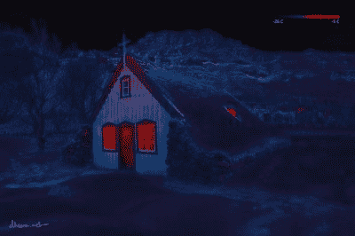

# 艺术与科学在冰岛寒冷的荒地相遇

> 原文：<https://hackaday.com/2019/07/17/art-meets-science-in-the-cold-wastelands-of-iceland/>

虽然冰岛现在是一日游自拍爱好者的热门目的地，他们租了一辆 4×4 的车，把它开出公路，开上脆弱的生态系统，然后在警察到来时拍摄随后的救援，但仍然有一些真正的摄影师准备投入大量的时间和精力在他们的艺术上。[ *Dheera Venkatraman* 是后者之一，[使用相对低分辨率的热感相机](https://petapixel.com/2019/07/13/shooting-high-res-thermal-photos-of-iceland-to-show-nature-at-work/)和 DIY 云台拍摄合成照片。

虽然我们没有确切的细节，但我们认为，由于使用的 [Seek Reveal Pro 相机](https://www.thermal.com/reveal-series.html)的分辨率为 320 x 240，【Dheera】每次全景拍摄至少需要拍摄 20 张照片。在后期处理中，这些照片被精心重组成令人惊叹的风景照片，这对任何对摄影感兴趣的人来说都是一个真正的灵感。

如果你真的去冰岛，你可能会发现传统食物对那些不是在那里长大的人来说有点挑战，你也不会去那里参加单身派对，因为啤酒贵得惊人。但是，如果你喜欢不适宜居住的、荒凉的、引人注目的风景，对于摄影师来说，从崎岖的、冻结的熔岩流到外星的“火星”陨石坑，有很大的可能性，如果你知道在哪里可以找到它们的话。

Dheera 的博客包含了更多关于他在冰岛摄影的信息，还有一个 [Github 的专栏](http://github.com/dheera/iceland-thermal)。如果你买不起 699 美元的 Seek Reveal Pro，也许可以试着自己做一个。