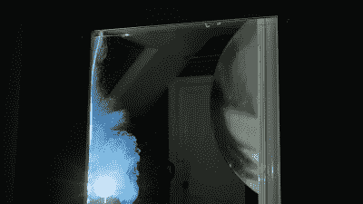

# 通过旧卫星天线的“人造太阳”照明

> 原文：<https://hackaday.com/2020/11/13/artificial-sun-lighting-via-old-satellite-dishes/>

真正的阳光是一件美好的事情，但由于地球轨道和当地天气系统的变化无常，它并不是一直都可用。[Matt]认为这还不够好，于是着手建造一个尽可能接近太阳光线的装置。

Rayleigh scattering is emulated by passing the light through a glass chamber filled with soapy water – taking advantage of the Tyndall effect.

太阳和地球之间的巨大距离意味着从我们当地的有利位置来看，太阳光线基本上是平行的。复制这一点，以及蓝天的舒缓自然，是[Matt]这个项目的主要目标。为了实现这一点，一个旧的碟形卫星天线被压制成抛物面反射器，涂上镜面乙烯基条。在焦点处安装了一个具有良好显色指数的 500 瓦白色 LED，并配备了水冷系统来散热。当点光源位于焦点时，抛物面反射器反射光线，使光线平行，给人一种光源来自无限远处的感觉。为了实现蓝天效果，光线穿过一个装满肥皂水的玻璃室，利用[廷德尔效应散射光线。](https://en.wikipedia.org/wiki/Tyndall_effect)这模仿了地球大气中的[瑞利散射](https://en.wikipedia.org/wiki/Rayleigh_scattering#:~:text=Rayleigh%20scattering%20(%2F%CB%88re%C9%AA,the%20wavelength%20of%20the%20radiation.)。

最终的结果是惊人的，[马特]拍摄的镜头看起来像是在真正的白天拍摄的——尽管是在晚上或雨天拍摄的。他的另一个特点是使用菲涅尔透镜和蓝色胶片，可以以更便宜和紧凑的形式实现缩减。[我们以前介绍过[Matt]的日光实验，](https://hackaday.com/2019/08/17/great-artificial-daylight-via-broken-tvs/)尽管我们对达到的新水平感到惊讶。休息后的视频。

 [https://www.youtube.com/embed/6bqBsHSwPgw?version=3&rel=1&showsearch=0&showinfo=1&iv_load_policy=1&fs=1&hl=en-US&autohide=2&wmode=transparent](https://www.youtube.com/embed/6bqBsHSwPgw?version=3&rel=1&showsearch=0&showinfo=1&iv_load_policy=1&fs=1&hl=en-US&autohide=2&wmode=transparent)

