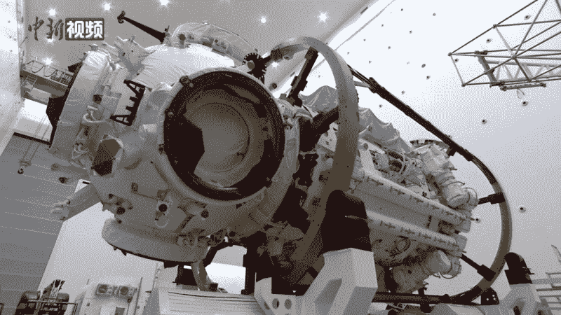
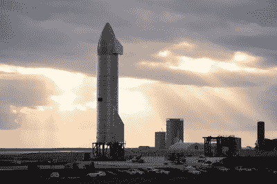

# 随着中国的车轮接触火星的土壤，印度的宇航员走向发射台，我们能期待另一场太空竞赛吗？

> 原文：<https://hackaday.com/2021/07/12/as-chinese-wheels-touch-martian-soil-and-indian-astronauts-walk-towards-the-launch-pad-can-we-hope-for-another-space-race/>

如果你出生在 20 世纪 60 年代或 70 年代初，很可能在你童年的某个地方就有成为宇航员的愿望。一旦尤里·加加林环绕地球飞行，尼尔·阿姆斯特朗在月球上漫步，数百万孩子想象着他们有一天也会爬进太空舱，加入勇敢的探险者精英队伍。当你是一个五岁的孩子时，任何事情似乎都是可能的，但当然现实仍然是只有极少数人曾经到过太空。

## 你曾经梦见过星星吗？

The Soviet cosmonaut Yuri Gagarin in Finland in 1961\. Arto Jousi, [Public domain](https://commons.wikimedia.org/wiki/File:Yuri_Gagarin_(1961)_-_Restoration.jpg).

然而，对于几十年后的年轻人来说，情况可能会有所不同，90 年代的孩子有梦想成为明星吗？大概不会。那么，当航天飞机和和平号空间站的工作人员经过头顶时，发生了什么变化呢？

答案是，从 20 世纪 50 年代到 70 年代主导外星探索的美国和苏联之间的太空竞赛已经冷却下来，尽管国际空间站的建设令人印象深刻，但它缺乏像 Sputnik，Vostok 或阿波罗那样打动公众的能力。对我们这样的人来说，这是非常酷的，但普通公众被其他事情分散了注意力，他们的政治领导人不再准备批准没有金钱目标的预算。我们去过太空，除了偶尔出现的亮点，比如太空望远镜或漫游者在火星上行走，仅此而已。热门电视喜剧系列*《生活大爆炸》*甚至有一个故事情节，其中一个在国际空间站执行任务的角色在返回时完全被忽略了。

几年前，我当时所在的黑客空间的一位中国朋友真的很惊讶，我竟然知道杨利伟的名字，他是神舟五号(神舟五号)的宇航员，也是他的国家发射到太空的第一人。他是中国的民族英雄，但在多雨的欧洲边缘却不是这样。在那里，中国的太空计划尽管取得了进展，但在杨的任务后大约 10 年，除了一些太空观察家和黑客空间的爱好者之外，还没有引起轰动。但这种情况可能会开始改变。

## 似乎每个人都在发射火箭

The Tianhe core module for the Chinese Tiangong space station, before launch. 中国新闻网, [CC BY 3.0](https://commons.wikimedia.org/wiki/File:Tianhe_before_launch_02.png).

随着神舟五号发射 20 年的临近，中国的太空计划似乎很少远离新闻。去年在月球上，他们正在进行的嫦娥系列探测器[成功地取回了表面样本并将其发送回地球](https://www.msn.com/en-us/news/technology/china-s-chang-e-5-returns-to-earth-loaded-with-moon-rocks/ar-BB1bz1sl)，同时展望未来，他们已经与俄罗斯[签署了一项协议，在 21 世纪 30 年代合作建设载人月球前哨](https://www.theguardian.com/science/2021/jun/25/russia-china-team-up-build-moon-base)。

在地球轨道上，天河模块将成为天宫系列空间站的下一个核心[接收了第一批乘员](https://www.bbc.com/news/science-environment-57504052)，在接下来的一年里，将有更多的模块补充。与此同时，在火星上，他们的朱荣月球车在田文一号任务中降落在红色星球上，[一直在用其着陆点的照片让我们惊叹，并且有雄心勃勃的样本返回任务和](https://hackaday.com/2021/06/30/chinas-mars-rover-goes-exploring/)[最终在 21 世纪 30 年代载人存在的计划。](https://interestingengineering.com/china-sending-first-humans-mars-2033)

这些并行任务的种类和速度立即让人想起冷战时期的太空竞赛，乍一看，似乎比西方的同类项目更加雄心勃勃，但当然，中国项目不是唯一一个将火箭指向天空的项目。俄罗斯航天局 Roscosmos 在 2025 年后将不再参与国际空间站，而[将把它几十年的经验带到自己的轨道前哨站](https://www.onmanorama.com/news/india/2021/06/28/first-uncrewed-mission-of-gaganyaan-in-december-isro.html)的建设中，而印度 ISRO 机构将继续其成功的 Maangalyaan 火星轨道飞行器和 Chandrayaan 月球计划，而[正在继续测试计划](https://www.onmanorama.com/news/india/2021/06/28/first-uncrewed-mission-of-gaganyaan-in-december-isro.html)，计划在 2022 年让宇航员乘坐 Gaganyaan 飞船进入轨道。如果我们认为双管齐下的太空竞赛是令人兴奋的，那么一场有四个甚至五个参与者的竞赛应该比以往任何时候都更能点燃世界的兴趣！

那么，考虑到可能会有一系列飞船从中国、印度和俄罗斯飞向天空，从 Hackaday 总部所在的星球的角度来看，它会是什么样子呢？我们已经看到了足够多的关于国际空间站的报道，以及为其运送船员和物资的各种竞争者，美国国家航空航天局火星探测器和其他科学飞行器，知道美国和欧洲的太空探索努力正在蓬勃发展。但是如果我们在太空竞赛中，他们的未来和其他人相比会怎样呢？为此，这种特殊的调味汁有两种形式:阿耳忒弥斯计划(T1)形式的国际合作，以及将成为该计划一部分的私营公司的工艺和零件。它的崇高目标是在 2024 年前让人类重返月球，它的第一次任务将在今年 11 月用 SLS 火箭发射一个未经审查的测试舱绕月飞行并返回家园。

## 也许你不需要成为一个民族国家就能进入太空

The SpaceX Starship SN9 on the launch pad. Jared Krahn, [CC BY-SA 4.0](https://commons.wikimedia.org/wiki/File:Starship_SN9_Evening_Rays.jpg).

与此同时，关于埃隆·马斯克的火星计划还有很多炒作，它至少满足了我们可能不得不看到原型巨型火箭坠入德克萨斯州乡村的任何需求。除了亿万富翁之间对终极太空玩具的争夺，SpaceX、蓝色起源(Blue Origin)和他们的许多竞争对手的到来标志着这场太空竞赛的一个新的、前所未见的方面，这在 50 年前是不可能发生的。在未来几年，小型卫星发射市场很可能会转向私营部门，但在太空探索领域，这将增加民族国家以外的参与者数量。几十年来，美国航天器部件一直由私人航空承包商制造，但这项工作是在美国宇航局的支持下完成的，而不是由一家公司完成的。例如，杰夫·贝索斯和埃隆马斯克之间的太空竞赛会有什么影响？是反乌托邦式的企业噩梦，还是对其他国家的新的、充满活力的竞争？时间会证明一切，但有一件事是肯定的:将会有很多供太空观察者消费。

据说，在 20 世纪 70 年代，随着对太空探索的热情逐渐消退，人类的下一站仍然牢牢地停留在轨道上，而不是火星地平线上，阿波罗时代的宇航员和宇航员团队成员感到幻灭。他们中的一些人仍然活着，见证了一场新的太空竞赛的开始，这是合适的，这颗种子将在世界各地的孩子们身上播下，这将使他们中的一些人在本世纪末从事推动太空探索的职业。到现在，我们中的大多数人可能都太老了，不想成为宇航员，但是如果上一次太空竞赛是过去的话，我们将作为观众享受这次竞赛。

标题图片:L-BBE， [CC 乘 3.0。](https://commons.wikimedia.org/wiki/File:Space_monument_-_panoramio.jpg)