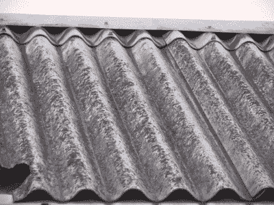
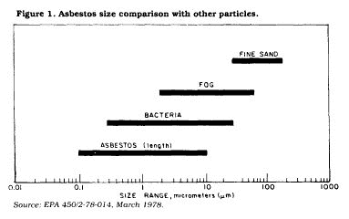
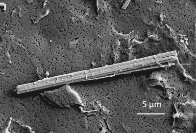

# 石棉:我们最可怕的噩梦中的奇迹矿物

> 原文：<https://hackaday.com/2022/12/05/asbestos-the-miracle-mineral-of-our-worst-nightmares/>

在 19 世纪和 20 世纪的大部分时间里，石棉的开采和使用几乎持续增长，几乎所有用于建造房屋、办公室、船只、道路网络和工业的材料都以某种方式展示了这种神奇的矿物。这些材料中的一些只含有百分之几的石棉矿物作为粘合剂，而其他的大部分或全部由石棉组成。

几千年前开始主要是作为一种好奇心的东西，现在正在变成帮助推动人类进入一个空前繁荣和技术进步的时代的材料。似乎只要添加一点点石棉就能让房屋防风雨、防火，让混凝土和沥青几乎坚不可摧，给瓷砖和室内装饰增加一点点活力，也给今天的塑料的前身[胶木](https://en.wikipedia.org/wiki/Bakelite)增加一点刚性。

“[Damaged asbestos roof](https://en.wikipedia.org/wiki/File:Wellasbestdach-233-3354_IMG.JPG)” by Harald Weber

作为一种纤维材料，石棉还可以在任何地方用于隔热目的，以及在锅炉、蒸汽管和任何其他保温热稳定性能非常有用的地方使用。然而，我们都知道这个故事是如何发展的:到 20 世纪 70 年代，很明显，人类几乎是在不知不觉中走进了一场噩梦，每栋房子、每一个表面和地下室都是潜在的死亡陷阱。

随着乌克兰战争将整个城市夷为平地，欧洲在面临能源危机的情况下寻求振兴其布满石棉的战后住房存量，这种风险现在比以往任何时候都更加真实。那么我们是如何走到这一步的，我们能做些什么呢？

## 历史珍品

石棉的早期用途是以 T2 石棉陶瓷的形式出现。这些基本上是陶器，不同程度地混合了粘土和石棉矿物。以这种方式制造的高石棉(90%)产品具有很高的耐热性，这与其他形式一起显示出曾用于金属加工的证据。这种耐热性能在铁器时代和青铜时代可能会非常有用。

此外，纤维绳使得制造比纯粘土陶器更轻更坚固的石棉制品成为可能。在后来的历史中，古希腊人称石棉为“amiantos”，现代希腊语、法语和其他拉丁语言中也保留了这一说法。由于罗马博物学家老普林尼在他的自然历史手稿中犯了一个错误，日耳曼语和英语最终以希腊语“石灰”(ἀσβεστος，即石棉)结束，这是指完全不同的东西。

由于这一时期石棉的大部分使用仅限于整合在陶瓷和类似材料中，从而限制了对不可见石棉纤维的接触，直到 19 世纪随着工业规模的开采和使用这种矿物，其不利影响才变得不可否认。尽管在罗马时代[报道了](https://jamanetwork.com/journals/jama/article-abstract/330445)一些观察到的由[斯特拉波](https://en.wikipedia.org/wiki/Strabo)和小普林尼处理石棉的不良影响。在当时和 19 世纪，最明显的迹象通常出现在直接接触石棉的工人身上。早在 1898 年，检查员就注意到了[石棉相关疾病](https://en.wikipedia.org/wiki/Asbestos-related_diseases)的迹象，但直到 20 世纪 70 年代才采取一致行动。

直到 20 世纪 90 年代和 21 世纪初，才开始大规模禁止含石棉材料和石棉本身的一般用途，目前已有 60 多个国家这样做了。在许多国家——包括俄罗斯、中国和哈萨克斯坦——石棉仍然被开采、出口到许多国家并被用于各种材料中。这包括石棉水泥(AC)等建筑材料，这种材料在西方的建筑和工棚中仍然很常见。

尽管存在明显的危险，但即使是加拿大(加拿大是前最大的石棉出口国之一)也只是从 2018 年开始实施禁令，而美国(T2)仍然只是部分禁止石棉。例如，尽管存在已知的风险，只有华盛顿州将石棉刹车片列为非法( [1986 年环保局视频](https://www.youtube.com/watch?v=X4DXZ78uAo8))。这凸显了全球对石棉的拼凑方法以及为禁止石棉而进行的斗争。

## 只是针刺

考虑到石棉是一种被假定为生化惰性的矿物质( [Kuroda et al.](https://pubmed.ncbi.nlm.nih.gov/17680684/) ，2008)，它对人体有什么危害？如果我们观察石棉矿物本身，我们可以看到它是一种[硅酸盐矿物](https://en.wikipedia.org/wiki/Silicate_mineral)，在[角闪石](https://en.wikipedia.org/wiki/Amphibole)中发现的我们称之为“石棉”的主要成分如下:

*   直闪石
*   钠闪石(“蓝石棉”，或“青石棉”)
*   脆硫石棉/铁石棉(“棕色石棉”，或“铁石棉”)
*   阳起石/透闪石

 在蛇纹石亚群中我们发现[温石棉](https://en.wikipedia.org/wiki/Chrysotile)，也就是俗称的“白石棉”。蛇纹石石棉的一个特点是，它的纤维更卷曲，而闪石中的纤维看起来更像锯齿状的尖刺。在这些石棉矿物中，温石棉是最常用的，其次是所谓的“蓝色”和“棕色”闪石。

尽管外表不同，但它们的共同点是对身体的影响。由于它们的小尺寸和针状形状，纤维不仅可以通过气道进入体内，而且还可以很容易地停留在肺部深处。

不列颠哥伦比亚省工人赔偿委员会( [WorkSafeBC](https://en.wikipedia.org/wiki/WorkSafeBC) )制作的以下 PSA 视频形象地展示了吸入石棉纤维的基本过程:

 [https://www.youtube.com/embed/jifoNSXvTuQ?version=3&rel=1&showsearch=0&showinfo=1&iv_load_policy=1&fs=1&hl=en-US&autohide=2&wmode=transparent](https://www.youtube.com/embed/jifoNSXvTuQ?version=3&rel=1&showsearch=0&showinfo=1&iv_load_policy=1&fs=1&hl=en-US&autohide=2&wmode=transparent)

巨噬细胞试图清除纤维，[最终没能完成](https://journals.plos.org/plosone/article?id=10.1371/journal.pone.0014647)的清除，导致[肺纤维化](https://en.wikipedia.org/wiki/Pulmonary_fibrosis)，这是一种叫做[石棉沉滞症](https://en.wikipedia.org/wiki/Asbestosis)的疾病的一部分。除了因肺部疤痕组织形成而导致的呼吸急促等症状外，肺部血管硬度增加和直径减小意味着心脏右心室需要克服的压力增加，从而导致[肺动脉高压](https://en.wikipedia.org/wiki/Pulmonary_hypertension)。这往往会导致心力衰竭。

Electron micrograph of asbestos. Amosite, obtained from the Japan Association for Working Environment Measurement (Tokyo, Japan), observed by field emission scanning electron microscopy. (Source: Akio Kuroda, 2021)

除了由于局部炎症损伤而增加肺癌的风险之外，石棉纤维还可以[穿透肺部并到达间皮](https://genesenvironment.biomedcentral.com/articles/10.1186/s41021-021-00215-0)，间皮是胸壁内衬以及肺部和其他器官外部的组织。这是导致[间皮瘤](https://en.wikipedia.org/wiki/Mesothelioma)的最常见原因(超过 80%)，间皮瘤是一种高度侵袭性的癌症，即使接受治疗，其[的 5 年](https://www.cancer.org/cancer/malignant-mesothelioma/detection-diagnosis-staging/survival-statistics.html)[生存前景也非常差](https://www.mesothelioma.com/mesothelioma/prognosis/survival-rate/)。

由于间皮瘤和石棉暴露之间的高度相关性，这种类型的癌症被用于衡量数十年石棉暴露的全面健康影响，正如最近由 [Furuya 等人(2018)](https://www.mdpi.com/1660-4601/15/5/1000) 在 *E* *环境研究和公共卫生中发表的一篇论文中所详细描述的。*

石棉纤维的一个有趣而可怕的方面是，它们不一定需要被吸入才会产生不良影响。尽管世卫组织的[饮用水指南](https://www.who.int/publications/i/item/9789241549950)没有将摄入的石棉视为致癌物，但最近的研究( [Ciaula 等人](https://pubmed.ncbi.nlm.nih.gov/27919155/) (2016 年)、 [Totaro 等人](https://pubmed.ncbi.nlm.nih.gov/31887736/) (2019 年))提供了证据，表明间皮瘤病例与意大利托斯卡纳地区饮用水中的高含量石棉(700，000 纤维/升)有关。

Kjaerheim 等人 (2005)证实了这一点，他们提供了饮用石棉水泥水管中的水的灯塔看守人患胃肠道癌症增加的证据。由于这种石棉水泥水管目前在大多数国家使用，使用寿命为 50-70 年，这似乎是一个相关的问题。使这个问题特别难以确定的是，石棉暴露的后果可能需要几十年才能变得明显，如间皮瘤。

## 活着

由于含石棉材料基本上无处不在，而且在某些地区(例如希腊的 [Metsovo](https://en.wikipedia.org/wiki/Metsovo_lung) )石棉可以从地面上铲下，我们能做些什么呢？至少对于美国石棉材料协会来说，我们有一个指导方针，那就是石棉禁令实施之前的任何建筑材料都可能含有石棉。也有许多图库为寻找什么提供了有益的指导，例如英国健康与安全执行局[图库](https://www.hse.gov.uk/asbestos/gallery.htm)，以及它们附带的[石棉调查指南](https://www.hse.gov.uk/pubns/books/hsg264.htm)，其中详细概述了许多类型的含石棉材料。

简言之，这些含石棉材料包括:

*   石棉绝缘材料。
*   喷涂石棉涂层。
*   隔热(例如锅炉周围)。
*   石棉绝缘板(AIB)。
*   石棉纸、毛毡和纸板。
*   石棉纺织品。
*   石棉垫圈、垫圈和细绳。
*   石棉水泥板和瓷砖。
*   模制石棉水泥产品(管道、水箱、水槽等。).
*   纹理涂层(如[阿特克斯](https://en.wikipedia.org/wiki/Artex) & [爆米花天花板](https://en.wikipedia.org/wiki/Popcorn_ceiling))。
*   沥青(屋面和隔音)产品。
*   聚氯乙烯(乙烯)地砖
*   石棉增强塑料、树脂和摩擦(制动)产品。
*   金属-石棉复合材料(如烧柴炉烟道)。
*   墙壁接缝胶带和填充物。

甚至像石膏板这样无害的材料也可能含有石棉，T2 的砖块和砂浆也可能含有石棉。在过去的几十年里，[玻璃棉](https://en.wikipedia.org/wiki/Glass_wool)和[矿棉](https://en.wikipedia.org/wiki/Mineral_wool)已经取代石棉用于大多数绝缘和纤维增强应用，还有玻璃纤维织物产品如 [Zetex](https://en.wikipedia.org/wiki/Zetex_(fabric)) 。然而，肉眼很难也不可能明确区分含石棉材料和无石棉材料。直到今天，唯一可靠的鉴别 ACM 的方法是采集样本，把每一个样本放在电子显微镜下观察样本中的纤维是什么样的。

## 加热

在[石棉消除](https://en.wikipedia.org/wiki/Asbestos_abatement)的过程中，小心地移除含石棉材料，使用负气压区、水或类似物质来防止灰尘、PPE(全面罩式呼吸器和防护服)和 HEPA 过滤器，以防止纤维释放到环境中或危及工人。清除含石棉材料的确切范围将取决于前面的调查结果，有释放纤维风险的材料排在处置清单的首位，而材料(如树脂)中完全含有的含石棉材料通常留在原地，除非目标是完全拆除一个结构。

虽然大多数含石棉材料废物通常存放在专门的垃圾填埋场，目的是防止石棉泄漏到周围环境中，但有可能通过 1000 摄氏度至 1250 摄氏度的热处理( [Gualtieri 等人](https://www.sciencedirect.com/science/article/abs/pii/S0955221999002903) (2000 年))或微波热处理( [Leonelli 等人](https://www.sciencedirect.com/science/article/abs/pii/S0304389405007454?via%3Dihub)，2005 年)来中和石棉纤维，尽管这两种方法迄今似乎都没有多大吸引力。在英国只有一家公司([热回收](https://www.thermalrecycling.co.uk/))似乎是这个市场的积极参与者。

可以想象，要处理的含石棉材料的绝对数量会使热处理不切实际，但这是各国必须考虑的问题，因为处理这种废物的需求不断增加。对于像乌克兰这样的国家来说，面对无数被战争摧毁的苏联时代建筑，识别和安全处置任何含石棉材料都是一项非常艰巨的任务，而重建人们家园的迫切需要更是雪上加霜。

在其他国家，已经逐步淘汰了新的石棉建筑，但正在处理用石棉填充到阁楼的房屋，在升级供暖系统、安装光伏太阳能电池板取代窗户和增加隔热材料的过程中，存在暴露于石棉的各种风险。非常清楚的是，这不是一个会自行消失的健康风险，即使今天的暴露成本要到几十年后才会变得清晰。

专题图片:NAVFAC 的两次袋装石棉。缩略图:“T2”直闪石石棉扫描电子显微镜(SEM) 由美国地质调查局。