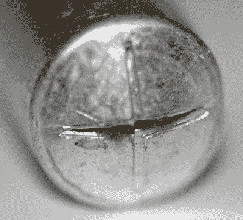

# 问黑客日:电容器故障的经验

> 原文：<https://hackaday.com/2019/04/12/ask-hackaday-experiences-with-capacitor-failure/>

Hackaday 的老读者对旧电子产品非常了解，无论是放在其他示波器堆里的旧示波器，还是苏联集团国家制造的非常罕见的老式计算机，总有人知道如何修理它。这些旧电子产品的最大问题之一是电容器。如果不是电池没电了，漏得到处都是，那就是电池盖要么不合格，要么已经爆炸了。

这些机器可以起死回生，最近几个月和几年，我们已经看到 restomods 的数量上升，达到黑客日提示线。如果你有烙铁和耐心去做，任何机器都可以起死回生。

## 你的老式机器可能已经没电了

为 ByteCellar 写作，[Blake Patterson]提出了一个有趣的问题:[老式电脑爱好者对枯竭的电容器有什么体验？](https://bytecellar.com/2019/04/07/lets-talk-about-capacitor-failure/)

似乎几乎每周，Hackaday 都会收到另一个关于硬件维修或修复的提示。总有两个问题。第一，电池漏得到处都是。在这一点上，这几乎是可以预期的，如果你非常小心，非常好，由 AA 电池或奇异的备用锂电池造成的损坏可以修复。

老式电脑爱好者面临的第二个主要问题是漏盖。这是一个比电池漏液更微妙的故障。首先，不是每个电容器都会泄漏，或者变坏。它可能会超出规格，并使整个系统随之崩溃，但这并不意味着它会全面泄漏。第二，不是每个电容器都会坏。陶瓷圆盘式电容就可以了，SMD 电容可以忽略，钽电容可以打也可以不打。不知何故，较大的电解质似乎比较小的电解质更坚固，一切都完全取决于计算机的型号和存储方式。如果你在一个四季温度剧烈波动的谷仓里发现了一个准将，你可能就不走运了。如果你是从壁橱后面拿出来的，你可能会没事。令人费解的是，新老库存电子产品——如仍在包装中的任天堂电源系统——通常都没问题。

## 电容器瘟疫的乐趣

但电容问题可能会出现在不如经典 Amiga 或 Tandy 经典的设备中。在 2000 年代中期到后期，[电容器瘟疫](https://en.wikipedia.org/wiki/Capacitor_plague)是许多消费电子产品故障的原因。电容器瘟疫是 1999 年至 2007 年间制造的有缺陷的电解电容器的结果，第一个问题出现在 2002 年左右。症状很容易诊断:如果这个时代的设备不起作用，看一看电源。如果你的盖子周围有一些粘性物质，或者盖子裂开了，你就有电容器瘟疫了。这意味着消费电子产品，从液晶显示器到电脑，被大量丢弃。事实上，我们知道的最酷的黑客利用电容器瘟疫和收集液晶显示器，从家得宝买了一些螺纹管，更换了盖子，建立了一个令人敬畏的*矩阵-* 风格的多显示器战斗站。

A blown-up capacitor. [Image source]("https://commons.wikimedia.org/wiki/File:Blown_up_electrolytic_capacitor.jpg)

电容器瘟疫的起源来自于 90 年代末开发的水基电解液。水基电解质被宣传为低阻抗、低 ESR 和高纹波电流，所有这些特性都非常适合电源设计。不幸的是，这些水基盖帽在与盖帽“罐”反应时产生氢氧化铝，并反应产生氢气。这种氢气在电容器中积累，直到盖子顶部印有“通气孔”的地方破裂。

虽然这种故障的起源可以追溯到 20 世纪 90 年代末，但直到 2000 年代中期，电容器瘟疫才真正开始；这些雷管会通过初步测试，而这些雷管需要数百或数千小时才能失效。甚至在 2012 年，[我们就看到了更换计算机设备中坏盖子的教程](https://hackaday.com/2012/01/17/tutorial-replacing-bad-capacitors/)，对于一些人来说，这成为了装备计算机实验室的一种非常有趣且有点有利可图的方式。

## 坏电容有多普遍？

在修复和翻新各种电子遗产方面，没有哪个社区比我们更专业。在这里，人们把旧的视频游戏控制台改造成新的便携式控制台，把字面上的垃圾变成属于博物馆的物品，修理已经使用了几十年的重要设备。

您对破损、报废和滥用的电容器有什么体验？在 2006 年左右，你对一大堆显示器感兴趣吗？你从死亡中带回了什么，如果有的话，你对今天的硬件设计师有什么建议？

不幸的是，我们将永远不得不使用瓶盖，当然，制造商将永远使用最便宜的瓶盖。死亡和即将死亡的电容器将在未来伴随着我们，由我们来维护几十年前和今天建造的设备。

(Banner image[Lincoln phi PPS](http://www.openmutual.org/resources/borked/)，只是成千上万个悲剧中的一个。)