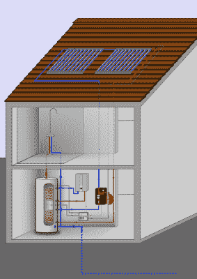

# 问 Hackaday:你如何在家里储存能量？

> 原文：<https://hackaday.com/2022/08/16/ask-hackaday-how-can-you-store-energy-at-home/>

在关于电网级储能解决方案的讨论中，人们往往很容易忘记储能也可以在单个房屋或建筑的层面上进行。这里的优势是不需要电网管理，存储(电力、热能等。)在能量变得可用时吸收能量，并在需要时释放能量。这简化了问题的规模，从而显著降低了相关成本。

这种系统最常见的例子可能是太阳能集热器和相关的热水储箱，当然还有电池。最近，使用电池电动汽车(BEV，“电动汽车”)作为家庭存储解决方案的一部分的想法也越来越受欢迎，特别是在电网连接因风暴或类似紧急情况而失败的紧急情况下。但总的来说，我们没有看到家庭级储能的很多选择。

## 网格存储问题

Bath County Pumped Storage Station (Credit: CHA)

不久前，我们研究了网格级存储背后的动机，包括[当前](https://hackaday.com/2022/04/06/grid-level-energy-storage-and-the-challenge-of-storing-energy-efficiently/)和[未来](https://hackaday.com/2022/04/13/the-future-of-energy-storage-on-both-sides-of-the-meter/)技术。包括光伏太阳能和风力涡轮机在内的间歇性、不可调度的电网能源越来越多，促使人们越来越关注长期存储。由于这些产生高度波动的能量水平，储存多余的能量以备后用是有用的，而且可以说是必要的。

不幸的是，结论是电网级别的存储规模足以在整个国家的水平上存储和时移如此大量的能量是不可行的。这里值得注意的是，今天和未来几乎所有新生产的电池容量都将进入 bev，这就是 Vehicle2Grid (V2G)作为潜在电网级存储的想法，我们[也研究了](https://hackaday.com/2022/03/08/grid-batteries-on-wheels-the-complicated-logistics-of-vehicle-grid-integration/)，发现从经济和实用的角度来看它是不够的。

大部分问题可归结为高波动的能源供应量，以及供应和需求之间越来越不匹配，越来越多的间歇性能源被添加到电网中。例如，屋顶太阳能电池板接入电网加剧了这一问题，每当一个地区阳光充足时，就会导致当地电力激增，即使更多地区正在削减甚至取消上网电价。这导致公用事业提供商和房主都面临成本增加和(财务)收益减少的问题。

当然，所有这些都只与电力有关。家庭、办公室和工业也需要供暖、热水和例如用于工业过程的蒸汽。在这种情况下，本地选项似乎很有意义，例如，区域供热不是一个选项。通过使用现有的解决方案，例如热泵和热水储存箱，看起来至少存在直接的解决方案。

## 能源

虽然也可以给电池充电，并从本地电网加热热水储箱中的水以备后用(例如，在非高峰时段)，但另一种容易获得的能源是太阳能。在屋顶上增加太阳能集热器作为太阳能热水解决方案的一部分可能是划算的，这取决于太阳辐照度水平(单位面积的功率)。这里的有效性主要由回收期决定，回收期可以在 4 年到近 20 年之间。

这里一个重要的考虑因素是是否需要防冻功能。虽然在温暖的气候条件下，一个完全被动且相当便宜的系统会很好，但如果冬季温度下降到 0°C 以下，采取措施是必不可少的。这可以包括向系统中的水中添加防冻剂，在这种情况下，还需要更昂贵的闭环系统。

除了来自太阳辐射的热量，来自太阳的能量也可以通过光伏太阳能电池板转化为电能。目前，大多数屋顶光伏太阳能装置没有本地存储，也不考虑自我消耗，主要的商业模式是将生产的电力出售给当地公用事业公司。

一些地方可能也有其他能源的空间，如(小型)风力涡轮机，但当其他能源(如水电)不可用时，太阳能集热器和光伏太阳能电池板可能是主要的能源来源。

## 存储解决方案

Hot water storage setup using solar thermal collectors as well as resistive heating using (PV) electricity.

如上所述，加热水是一种非常常见的获取和储存太阳热能的方式。许多房子都有一个热水储水箱，里面的水保持在特定的温度，以备不时之需。主要区别在于这些水箱中的水是如何加热的。通常使用矿物燃料，如矿物油或天然气，而在其他地区，电(电阻)加热更常见。当在太阳能集热器和/或 PV 太阳能电池板可用的环境中使用时，水也可以完全由这些来源加热。

这种系统的优点是它提供了一种潜在的成本有效的热水来源，这往往是一种更加能源密集型的用途。当光伏太阳能电池板不用于给电池充电时，它还能有效利用光伏太阳能电池板的电能。

这导致了另一种明显的存储解决方案，即大型电池存储，如特斯拉的 Powerwall 和竞争对手的类似产品。最近，[布劳顿等人(2021)](https://www.scirp.org/journal/paperinformation.aspx?paperid=111481) 详细阐述了南加州住宅太阳能用户的电池存储的经济性。

在加利福尼亚州，上网电价多年来一直在下降，目前的 NEM 3.0 计划减少了为电网生产光伏电力的财政激励。毫不奇怪，随着 NEM 2.0 计划引入分时电价(TOU)，家庭用户安装电池存储的数量已经显著增加。

然而，布劳顿等人的结论是，安装一个特斯拉 Powerwall 2 系统和一个光伏太阳能系统的投资回收期太长，不具备任何财务意义。在电网电力不可靠的情况下，安装这样的电池存储是有意义的，这种情况在加州越来越多。

这就提出了用(屋顶安装的)光伏太阳能装置为 BEV 充电的论点，并有一个能够转换能量流的充电器，这样 BEV 就可以作为应急电池为房屋供电。即便如此，当一个人生活在一个由公用事业提供电力的地区时，全屋电池存储的经济性似乎还不太好。

## 包扎

当浏览最近关于家庭能量存储和相关领域的研究时，这里的一般主题似乎是，当涉及加热热水存储箱中的水时，大量存储能量可能是经济的。当条件合适时，这里的投资回收期可以相当短，甚至增加一个光伏太阳能电池板来电阻加热水也可能有经济意义，这取决于当地的因素。

电池存储解决方案也是如此。考虑到一辆 BEV 的主要成本来自电池组，像特斯拉 Powerwall 这样的东西和一辆 BEV 的成本差不多也就不足为奇了。在这里，人们可以计算一下运行大量(密封)铅酸电池是否会使数字更接近财务意义。

不管怎样，家庭能源储存的话题不会很快消失。即使一个人的意图不是脱离电网，也有许多其他的激励因素会让他考虑这些选择。无论是为了节约成本，还是在过去几年我们在世界各地看到的滚动停电时有一个备份选项，都有许多理由来看看可用的存储选项。但我们只是没想出太多。

你在这方面有什么经验和想法？由于 Hackaday 社区往往有许多修补者，毫无疑问，你们中的一些人已经实现了这些生成和存储系统中的任何一个，或者至少已经查看了成本图。如果你有一个全屋电池系统和/或太阳能热水系统，它是如何为你工作的？