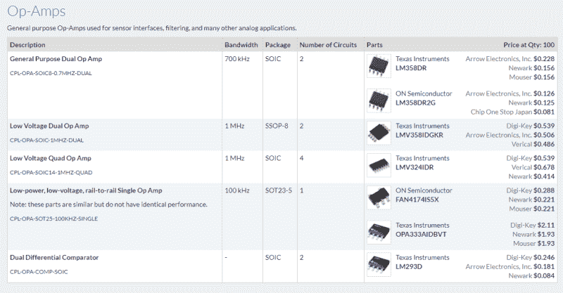

# 问 Hackaday:有没有通用的机械零件库？

> 原文：<https://hackaday.com/2018/08/08/ask-hackaday-is-there-a-common-mechanical-parts-library/>

像许多故事一样，这个故事从屋顶开始。这个特殊的屋顶位于密歇根州，可以阻挡雨雪进入底特律的黑客空间。作为一座古老的工业建筑，屋顶上的东西可能会开始吱吱作响，当它在风中旋转时，一个屋顶通风口开始发出刺耳的声音，该小组的协调员之一内特知道是时候做点什么了。

先前试图用通常的烈酒让女妖安静下来的努力失败了，所以内特爬上去用真正的轴承进行了适当的修复。他挖到单位，测量轴承，下来订购正确的项目。这时他突然想到:我应该订购多少？毕竟，[轴承是有用的设备](http://hackaday.com/2018/02/14/mechanisms-bearings/)，不仅仅是用来修复不稳定的通风口，而且在黑客空间里尤其方便，它们可以有各种用途。多余的轴承会得到很好的利用吗，还是会被搁置在架子上积满灰尘？

就在那时，内特给我们写了一封短信，问了一个问题，这个问题引发了一些有趣的可能性，也是一个我们无法立即回答的问题:有没有一个现成的常见机械零件在线图书馆？

## 不是所有的部分

对于内特的问题，我的第一反应是，“当然有——它叫做[麦克马斯特-卡尔目录](http://hackaday.com/2017/09/13/noobs-guide-to-mcmaster-carr/)”大量的金色和绿色枯树版本及其在线等价物是任何和所有机械的有价值的参考。但麦克马斯特的股票实际上代表了更多的部件，而不是一个明确定义的共同指定的部件列表。如果一个部件存在，它很可能在目录中，但是仅仅因为它存在并不意味着它通常是有用的。俏皮话到此为止。

原来 Nate 有更有趣的想法，更多的是基于他订购电子零件的经验。他正在考虑类似于 Octopart 的[通用零件库](https://octopart.com/common-parts-library)，Macrofab 的[房屋零件库](https://factory.macrofab.com/parts)，或者 Seeed Studio 的[开放零件库](https://www.seeedstudio.com/opl.html)的东西。这些存储库允许设计者看到哪些组件当前正被用于各种应用。目的是通过将选择限制在几个广泛可用的部分来简化设计过程。从那里开始，如果你的一些需求没有得到满足，那就扩展开来，只在真正需要的部分上花额外的时间。

假设你正在研究一个电路，需要一个运算放大器。搜索所有可用的运算放大器可能是一项艰巨的任务。将器件分为几大类，列出一份简明的清单，有助于确保在设计限制不太严格的情况下，不会陷入器件选择的困境。选择你的带宽，选择你的套餐，然后继续前进。对于合同制造商，额外的好处是您不需要为生产采购零件，他们对零部件的熟悉有助于避免在取放机器启动时出现问题。

Pick an op-amp, any op-amp. Source: [Octopart CPL](https://octopart.com/common-parts-library#OpAmps)

一个等价的机械零件库对所有设计者来说都是一个福音。电子和机械设计之间的界限一直很模糊，随着越来越多的产品通过伺服系统、步进器和致动器与现实世界进行交互，指定机械组件只是电子设计师工作的另一部分。简化这一过程对设计师和供应商来说都是一种胜利，他们将通过快速简单的一键订购获得业务。

## 我们在哪里可以找到常见的机械零件？

然而，据我所知，没有这样的通用机械零件库存在。当然，我可能是错的，如果读者知道任何这样的服务，我们很乐意听听他们的意见。但我们也想集思广益，看看这样一个库会是什么样子，以及它将如何执行。在我看来，我会从麦克马斯特-卡尔目录开始，因为如果他们没有，你就不需要它。我们必须假设他们的目录有一个 API 毕竟，Fusion 360 有一个可搜索的零件目录，因此[您可以将 McMaster 零件的 CAD 图纸直接放入您的机械设计中](http://hackaday.com/2018/01/23/3d-printed-desk-harnesses-the-power-of-fusion-360-and-mcmaster-carr/)。不过，稍微搜索一下就会发现这个 API 是私有的。

你觉得怎么样？一个通用的机械零件库有用吗？已经有了吗？你希望从这样的产品中看到什么样的特性？请在下面的评论区发表意见。

感谢 Nate 在这方面的提示和有用的讨论。