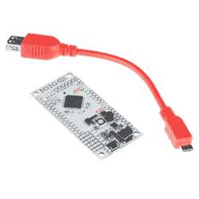

# 问黑客日:为什么我们不窃听手机？

> 原文：<https://hackaday.com/2018/10/18/ask-hackaday-why-arent-we-hacking-cellphones/>

当一个项目无法使用小型微控制器时，几乎每个人都会使用单板计算机 Raspberry Pi 就是典型代表。但是这样做会让你陷入一个无头的 Linux 服务器:一个装在罐子里的大脑，而你想要的是一把瑞士军刀。

如果它有一个屏幕，那会有趣得多，当然市场上有很多这方面的选择。接下来是设计人性化界面的问题:如今触摸屏风靡一时，那么为什么不买一个带有触摸界面的屏幕呢？音频输入和输出将非常好，其他随机外设也是如此，如加速度计、WiFi，甚至可能是超出 WiFi 范围的蜂窝无线电。也许蓝牙？哦，见鬼，让我们扔在一个摄像机和高功率 LED 只是为了好玩。听起来像是树莓派杀手！

这个开发平台应该是便宜的，或者更好的是免费的。免费的，就像那些堆在我壁橱里的“黑我”盒子里的旧手机一样，而不是在项目中工作。当我用 Pi 零和蹩脚的 TFT LCD 屏幕拼凑项目时，这些手机的高级功能落满了灰尘。我并不孤单。

这是为什么呢？为什么我们看不到更多基于旧手机使用的项目？它们数量丰富、价格低廉、功能丰富且功能强大。对我来说，有两个巨大的障碍需要克服:硬件和软件。我将追查我所看到的使用手机作为黑客工具的问题，但是我希望被证明是错误的。因此有了“问问黑客日”:为什么我们看不到更多重复使用智能手机的项目？

## 硬件遭遇智能手机

简单地将一些电线连接到一个强大的微控制器的引脚上，这种便利是绝对不可能超越的。我承认，即使在今天，在这个低电压逻辑的时代，我也喜欢手头上有一些具有 5 伏兼容 GPIOs 的芯片。拥有一个在引脚上提供 20 mA 电流的微控制器非常方便(根据数据手册，实际上可能更多)。将一些项目迁移到 Raspberry Pi 已经是一个很小的麻烦，在这里你必须小心 3.3 V 输入和稍微弱一点的输出缓冲器。但这没什么大不了的:直接连接到任何能讲 I2C 或 SPI 的东西，或者只需要一根线上的逻辑电平信号，都是轻而易举的事情。只需将引脚连接到引脚，就可以了。

然后我看着我的手机。我要把我的马达控制器插到哪里？有音频插孔和 USB，就是这样。我不会将我的 Hello World LED 插入任何一个端口并期待成功。

Sparkfun and Ytai Ben-Tsvi’s IOIO

一个解决办法是花钱解决这个问题，买一个 USB 转接板。用树莓 Pi 和 SD 卡的价格，你可以买一个 IOIO 开发套件，它似乎支持你想要的几乎所有东西。Numato Labs 有一个[八针 GPIO 扩展器](https://numato.com/product/8-channel-usb-gpio-module-with-analog-inputs)，它通过将自己作为串行设备呈现给手机，避开了整个 Java API 的混乱——稍后会详细介绍。这意味着你需要学习它的命令语言。不久前，摩托罗拉甚至考虑发布超级昂贵的“ [Mods 开发包](https://hackaday.com/2016/08/15/turn-your-motorola-android-phone-into-a-raspberry-pi/)”，但除了新闻稿，我没有听到更多的消息。Android 或 iOS 是否支持 FT232H 芯片？如果是这样，你可以很容易地按下其中一个按钮。

但是，如果目的是通过重复使用旧手机来节省开支，这些选择在经济上是没有意义的。我们可以自己动手做一些更便宜的东西吗？WiFi 和蓝牙跃入脑海，事实上，你可以用几个当地货币单位就能买到使用其中任何一种的模块。例如，HC-05 型蓝牙模块是一个廉价而愉快的 USART 到手机的桥梁。你所要做的就是将你选择的微控制器连接到 HC-05 上，然后编写固件。或者使用 WiFi，使用 ESP8266 或 ESP32 进行同样的操作。同样，您不得不编写 WiFi 到 GPIO 的代码，但这应该是一次性成本。所以我四处寻找，想在网上的某个地方找到这些显而易见的项目，结果一无所获。有人吗？

但是那个音频插孔呢？你可以把你的数据编码成音频，就像我们过去在拨号调制解调器时代所做的那样。这可以在小型微控制器上很容易地完成，例如，一个完整的 ATtiny85 音频引导程序可以放在 1 kB 的中。现在，您只需添加 GPIO 驱动固件。

最终，这些选择都是可行的，但是它们都需要做。也就是说，在手机上安装物理 GPIOs 本身就是一个项目。在你开始考虑对手机进行编程来执行你的命令之前，你必须弄清楚你的硬件端 API。因为它本身就是一个项目，你必须真正重视智能手机带来的额外功能，以保证克服硬件障碍。

## 软件需要让它全部工作

但是让我们假设你正致力于购买或构建一个 GPIO 适配器，如果软件需要在手机上运行，你如何开始你的项目的开发呢？我们的 Adam Fabio [在 2015 年](https://hackaday.com/2015/09/10/want-a-low-cost-arm-platform-grab-a-prepaid-android-phone/)回顾了 Android 的情况。(苹果乡亲们，你们的情况怎么样？)

足以说明的是，Android 的[应用程序开发并不简单](https://developer.android.com/docs/)，但至少有大量的文档可以帮助您入门。即使你是一个 Java 高手，但我不是，你仍然希望确保你想要集成到你自己的软件中的其他软件组件在 Android 上是可用的。这是画面变得更明亮的地方。例如，如果你打算利用相机和丰富的计算机视觉处理能力，你会很高兴地知道 [OpenCV 已经移植到 Android](https://docs.opencv.org/3.4/d9/d3f/tutorial_android_dev_intro.html) ，CMU[pocket sphinx 语音识别器](https://cmusphinx.github.io/wiki/tutorialandroid/)也是如此。

但是爪哇咖啡不是我喜欢的。几年前，我用 SL4A——Android 的脚本语言——编写了一些简单的手机应用程序。这非常令人愉快，我能够在一个下午的时间里拼凑出一个 Python 脚本，将照片上传到 Imgur，然后将结果 URL 粘贴到系统剪贴板中。让 Python 在手机上运行真的很棒——感觉就像一台小电脑。现在， [SL4A 似乎不再支持](https://en.wikipedia.org/wiki/Scripting_Layer_for_Android)。有什么新的热点？

就像硬件障碍一样，利用手机内部的处理能力看起来好像我必须花几个小时来学习 Java 和 Android 操作系统的工作方式。当我把它与在树莓派上完成类似事情的容易程度进行比较时，它是一个节目停止器。

## 放弃？

面对这些硬件和软件障碍，你可能会退回到友好的 Raspberry Pi 环境，或者下载无数应用程序中的一个，将你的手机变成一个荣耀的遥控器。惭愧的是，我承认这就是我所做的，但是我真的想改变。如果你已经把一部手机黑进了一个项目，请告诉我们！如果你像我一样，尝试过却失败了，告诉我们你在哪里遇到了困难。