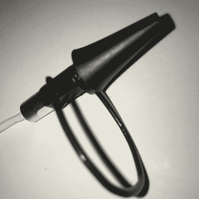

# 辅助技术开关是使用你的耳朵肌肉启动的

> 原文：<https://hackaday.com/2020/01/02/assistive-technolgy-switch-is-actuated-using-your-ear-muscles/>

由于每个用户的独特需求和商业解决方案的高成本，辅助技术是黑客发挥作用的极其肥沃的土壤。[Nick]一直在研究 [Earswitch](https://hackaday.io/project/169110-earswitch-assistive-technology-switch-new-hci) ，这是一种创新的辅助技术开关，可以通过中耳肌肉的随意运动来驱动。

 大多数人不知道他们可以收缩他们的中耳肌肉，技术上称为鼓膜张肌，但当打哈欠或紧闭双眼时，他们会识别出这是一种隆隆的声音或听觉的消音效果。它的功能实际上是保护你的听力免受高声尖叫或咀嚼的影响。[Nick]进行了一项调查，发现 75%的人可以有意识地收缩鼓膜张肌，17%的人可以在没有其他运动的情况下做到这一点。使用一个便宜的 USB auroscope(一个耳用相机[，就像【Jenny】在 11 月](https://hackaday.com/2019/11/11/review-ear-wax-cleaning-cameras-as-cheap-microscopes-we-take-a-closer-look/)评论的那种)，他能够使用 iSpy，一个用于视频监控的开源软件包来检测运动。iSpy 的输出用于控制 Grid3，这是一个商业辅助技术软件包。[Nick]还设想将这项技术通过耳机用作消费电子产品的控制接口。

随着概念验证的完成，[Nick]正在寻找使这项技术更实用的方法，可能是在标准降噪耳机中安装 CMOS 摄像头模块。反射率或飞行时间等更简单的光学传感器也是正在研究的选项。如果您有关于或可能的用例的建议，请访问项目页面。

辅助技术总能创造出有趣的黑客。我们最近看到了一个帮助人们自己进食的机器人手臂，2017 年的 Hackaday 奖有一个完整的舞台专注于 T2 辅助技术。