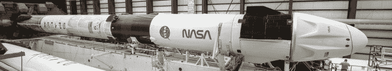
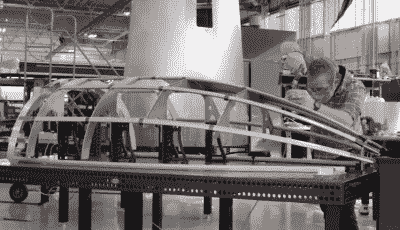

# 阿斯特拉的节俭设计导致了最近不寻常的失败

> 原文：<https://hackaday.com/2022/02/23/astras-frugal-design-leads-to-latest-unusual-failure/>

我们都听说过这句话，值得重复一遍:进入太空很难。但实际上，你的助推器越小，难度就越大。这是因为火箭的结构、发动机、航空电子设备和有效载荷只占其发射质量的一小部分，而其余部分则用于达到轨道速度所必须消耗的推进剂。这就是为什么重达 549，054 公斤(1，207，920 磅)的猎鹰 9 号只能发射 22，800 公斤(50，265 磅)的有效载荷——大约是其起飞重量的 4%。

正如你可能想象的那样，有一个下限，在这个等式中，根本没有足够的质量来建造一个功能齐全的火箭所必需的硬件。但是极限在哪里呢？这正是航空航天新人 Astra 试图找到的答案。他们的火箭 3 是有史以来最小的轨道助推器之一，在尺寸和质量上更接近二战中的德国 V2，而不是 SpaceX 或蓝色起源正在建造的高耸的车辆。即使是火箭实验室电子，本身是一个非常苗条的火箭，也要大得多。

他们试图建造这样一个小火箭的原因当然很简单:小意味着便宜。假设你有一个足够轻和紧凑的有效载荷来安装在他们的发射器上，Astra 说他们可以花大约 250 万美元把它送入轨道；不到火箭实验室的电子专用飞行费用的一半，与 SpaceX 的“rideshare”计划具有竞争力。这样低的票价在十年前是不可思议的，并且有望撼动竞争已经非常激烈的商业发射市场。但自然地，在我们庆祝这个新的航天里程碑之前，Astra 必须让这个东西可靠地飞行。

他们最近的任务以运载工具和有效载荷的完全损失而告终。在从佛罗里达州卡纳维拉尔角航天站完美升空大约三分钟后，上面一级失控坠落。对于一个新的轨道助推器来说，这样的问题并不罕见，历史上很少有火箭进入常规服务而没有丢失一两个有效载荷。但是这次在互联网上直播的失败是相当不寻常的:由于 Astra 小型火箭的非传统设计，在有效载荷整流罩未能完全打开后，上面一级似乎卡在了助推器*内。*

## 轻微的第二阶段

为了理解这一失败，我们必须后退一步，看看常规多级火箭的设计。虽然过于简化，但公平地说，上面级通常只是第一级的缩小版。它的长度会更短，直径可能会更窄，发动机也更少；但从根本上来说，它的设计将与更大的同类相似。有效载荷安装在末级的顶部，末级又被一个空气动力整流罩或鼻锥包围。

The first and second stages of the Falcon 9, separated by the black interstage, are the same diameter.

但是 Astra 的火箭 3 是独一无二的，因为它的第二级看起来一点也不像第一级。它的设计更像卫星，而不是光滑的火箭；暴露在外的坦克和骨架结构无法在稠密的低层大气中生存。由于这一级将穿过稀薄的高层大气，阻力不是问题，Astra 决定将其剥离到最基本的部分以减轻其质量。

[A rare look at the Rocket 3’s satellite-like upper stage](https://www.youtube.com/watch?v=NVJX_gmO08E), partially tucked inside of the conical interstage.

这种设计的缺点是脆弱的上面级必须被盖住，直到火箭达到相当高的高度。因此，整个第二级需要被封闭起来，而不是仅仅将有效载荷放入一个保护性的空气动力整流罩。第二级的下部被塞进中空的级间，一个细长的整流罩确保有效载荷和它的太空之旅在飞行的早期阶段不会暴露在超音速气流中。

## 代价高昂的妥协

这种设计的美妙之处在于，用于建造有效载荷整流罩的材料，通常是碳纤维或玻璃纤维，重量特别轻。即使考虑到所需的额外整流罩长度，总重量最终也比第二级采用更传统的刚性机身要轻。也就是说，如果你想建造最便宜的火箭，这种方法有一个明显的问题:[生产这些轻质有效载荷整流罩非常昂贵](https://hackaday.com/2018/02/26/spacex-joins-in-the-long-history-of-catching-stuff-from-space/)。

Assembling Rocket 3’s aluminum payload fairing.

事实上，[在 2020 年接受 *Ars Technica*](https://arstechnica.com/science/2020/02/at-astra-space-failure-is-an-option/) 采访时，Astra 联合创始人克里斯·坎普承认碳纤维整流罩的天文数字般的成本迫使公司放弃它们，转而使用铝作为火箭 3 的整流罩。Kemp 说，Astra 的团队能够在内部生产它们，只需 2500 美元，而不是花费 25 万美元。对于这样一辆低成本的汽车来说，这是一个巨大的成本节约，但代价是新的金属整流罩比原来的重 20%。

切换到更重的铝有效载荷整流罩意味着阿斯特拉独特的第二级设计的质量节省并不像最初打算的那样实质性。在实践中，这可能导致对飞行器总有效载荷能力的打击，但从成本角度来看，这仍然被认为是正确的选择。但是考虑到最近的失败，也许这种变化有更大的影响，只是现在才变得明显。

## 被卡住了

[查看 2 月 11 日发射](https://www.youtube.com/watch?v=8jlQmW7mnYM)的现场视频，我们可以清楚地看到导致上面级失去控制并最终未能进入轨道的一系列事件。在飞行几乎整整三分钟时，有效载荷整流罩明显颤抖，但未能打开。四秒钟后，第二级由一个装有弹簧的机构向前推进，撞向整流罩，但未能将其撞松。最后，在任务进行到 3 分 11 秒时，第二级的发动机在级间点火。这种压力的积累吹掉了整流罩，但不幸的是也破坏了第二级的稳定性，使其翻滚。

 <https://hackaday.com/wp-content/uploads/2022/02/astrastage_video.mp4?_=1>

[https://hackaday.com/wp-content/uploads/2022/02/astrastage_video.mp4](https://hackaday.com/wp-content/uploads/2022/02/astrastage_video.mp4)

我们可以清楚地看到*发生了什么*，但是 Astra 现在的任务是找出*为什么*会发生。总部位于加利福尼亚州阿拉米达的公司[仍在努力通过联邦航空管理局(FAA)](https://astra.com/news/post-launch-investigation-what-were-doing/) 的调查，截至目前尚未发布任何公开声明，说明有效载荷整流罩在被命令时没有正确打开的原因。

但这并不意味着我们不能作为纸上谈兵的工程师进行推测。由于铝的质量增加，用于分离有效载荷整流罩的机制需要变得更强吗？人们还想知道，一旦第二级撞上了较轻的碳纤维有效载荷整流罩，它是否会垮掉，从而挽救这项任务。无论如何，有一件事是肯定的:阿斯特拉的低成本火箭似乎有以不寻常的方式失败的诀窍。