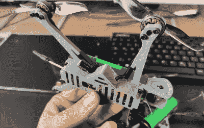

# 飞行的攻击 19 世纪 60 年代

> 原文：<https://hackaday.com/2021/03/03/attack-of-the-flying-18650s/>

当有人建造四轴飞行器的明确目的是让它飞得尽可能快和有侵略性时，当他们最终撞上一个坚硬到足以打破东西的不可移动的物体时，这并不奇怪。事实上，这更像是一种成年礼。这就是为什么许多严肃的飞行员会在家里有一台 3D 打印机来快速打印替换零件。

avid first person view(FPV)flier[David cle don]将这一概念发挥到了极致，设计了一个 [3D 可打印四轴飞行器，比一个 18650 电池多一点，还附有一些马达](https://www.thingiverse.com/thing:4769576)。由于两件式框架可以在标准的桌面 3D 打印机上用不到 1 美元的细丝在两个多小时内生产出来，所以撞车的压力会小得多。一周花几个小时打印框架，周末你会有很多东西要销毁。

 虽然【大卫】说这种小型四轴飞行器的整体性能并不算出色，但我们认为他报告的单块 18650 电池 10 分钟的飞行时间还是相当不错的。虽然在无线电和视频设备上仍然有相当大的花费，但这种设计看起来可能是一种非常实惠的进入 FPV 飞行的方式。

当然，有人可能会说，这种细长的四轴飞行器比更大的商业化产品更有可能在撞击中被摧毁。考虑到框架的狭窄性质，还需要大量的近距离焊接。因此，虽然建造一架这样的鸟的总成本可能对新手有吸引力，但它可能是最好留给那些已经在路上打卡几个小时的人的项目。

这些年来，我们已经看到了相当多的 3D 打印四轴飞行器框架，但肯定没有一个像大卫在这里创造的那样优雅。这是一个极简主义的实验，真正拥抱了低成本桌面 3D 打印提供的可能性，我们不会惊讶地看到它成为衡量未来设计的标准。