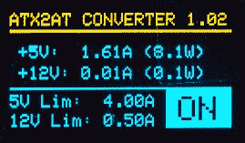

# ATX2AT 让逆向计算更安全，走向 Kickstarter

> 原文：<https://hackaday.com/2019/11/25/atx2at-makes-retrocomputing-safer-heads-to-kickstarter/>

在现代计算中，很容易将电源视为理所当然，但为老式硬件供电并不总是如此简单或无忧。旧电子产品的电源本身就是老式的，被供电的硬件可能非常珍贵。电源问题很容易导致元件烧毁和电路板上的烧痕。正如[结核医生]所观察到的，当你听到噼啪声时，已经太晚了。

为了解决这个问题，【Doc TB】设计了 [ATX2AT 智能转换器](https://x86.fr/atx2at-smart-converter/)作为开源项目，最近决定[通过 Kickstarter 活动](https://x86.fr/atx2at-smart-converter-live-kickstarter/)提供。ATX2AT 是一种安全可靠地用标准 PC ATX 电源取代一些老式电源的方法，并增加了大量保护功能，如电流监控和过流保护的可编程反应时间。所有这些都有助于防止电脑爱好者的珍贵硬件在出现问题时受损。这不仅仅是为了给已知良好的硬件供电；在测试或修复可能处于未知状态的硬件时，这是非常宝贵的。

当我们第一次看到[Doc TB]的 ATX2AT 项目时，我们意识到这是一款针对特定领域的制作精良的设备，并且做得很好。评估风险不仅要考虑问题发生的概率，还要考虑如果 T2 真的发生了，事情会有多糟糕。如果您的旧硬件足够珍贵，需要额外的保护，或者您正在维修或评估旧硬件，那么 ATX2AT 可能正是您所需要的。你可以在下面的视频中看到它的运行。

 [https://www.youtube.com/embed/3eRXQ0c1YZg?version=3&rel=1&showsearch=0&showinfo=1&iv_load_policy=1&fs=1&hl=en-US&autohide=2&wmode=transparent](https://www.youtube.com/embed/3eRXQ0c1YZg?version=3&rel=1&showsearch=0&showinfo=1&iv_load_policy=1&fs=1&hl=en-US&autohide=2&wmode=transparent)

