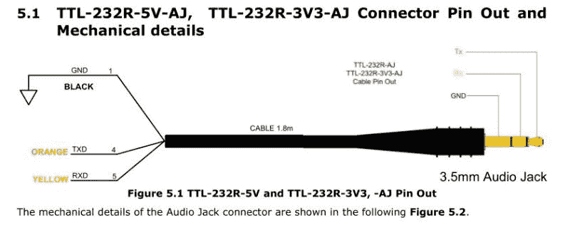

# 使用 FTDI USB 至 TRS 电缆通过 UART 输出音频

> 原文：<https://hackaday.com/2021/02/24/audio-out-over-a-uart-with-an-ftdi-usb-to-trs-cable/>

将音频从 WAV 文件转换为线路级格式，以便插入 HiFi 音频设备(或便携式扬声器)的放大器的最简单方法是什么？正如[康拉德·贝克曼] [在 Twitter](https://twitter.com/kbeckmann/status/1363295086029733890) 上展示的那样，你真正需要的只是一个 UART、一根电缆和一个 TRS 唱机插头。在这种情况下，基于 FTDI FT232R IC 的 USB-TTL 适配器: [TTL-232R-3V3-AJ](https://ftdichip.com/products/ttl-232r-3v3-aj/) 适配器，一端是 12 Mbps USB，另一端是 3 Mbps UART。

[Konrad]已经在 GitHub 上发布了基于 C 的代码[。本质上，它接受 PCM 编码的文件(例如 WAV)。作为一个演示项目，它要求输入 PCM 文件具有特定的采样速率，如自述文件中所列，使样本与 UART 的波特率相匹配。之后就是对音频文件进行编码，并编译`uart-sound`二进制文件。](https://github.com/kbeckmann/uart-audio)

输出文件是原始音频数据，以 PDM 或[脉冲密度调制](https://en.wikipedia.org/wiki/Pulse-density_modulation)编码。与脉冲编码调制( [PCM](https://en.wikipedia.org/wiki/Pulse-code_modulation) )不同，这种编码方法不编码绝对样本值，而是使用二进制脉冲，其密度对应于信号电平。通过沿 UART 的 TX 线发送 PDM 数据，另一端将接收这些位。如果所述接收设备碰巧是具有 ADC 的音频接收器，它将愉快地接收和回放作为音频的 PDM 信号。正如人们可以在推文中嵌入的视频中听到的那样，最终结果相当不错。

如果我们查看 TTL-232R-3V3-AJ 适配器电缆的[数据表](https://www.ftdichip.com/Support/Documents/DataSheets/Cables/DS_TTL-232R_CABLES.pdf)，我们可以看到它是如何连接的:

 当我们将其与[标准音频 TRS](https://pinoutguide.com/Audio-Video-Hardware/Tele35s_pinout.shtml) 插孔的接线进行比较时，我们可以看到两条接线中的接地匹配，TX(接收设备上的 RX)将与左声道匹配，右声道未使用。这里还需要注意:这是 3.3V 适配器版本，其典型输出高电压为 2.8V，在[线路电平](https://en.wikipedia.org/wiki/Line_level)输入的容差范围内。然而，并不是所有的输入都能承受同样高的电压。

将随机配备 TRS 的设备插入一个人的 HiFi 设备、电话或音箱中，最好是在确定不会造成损坏之后。注意安全，享受音乐。