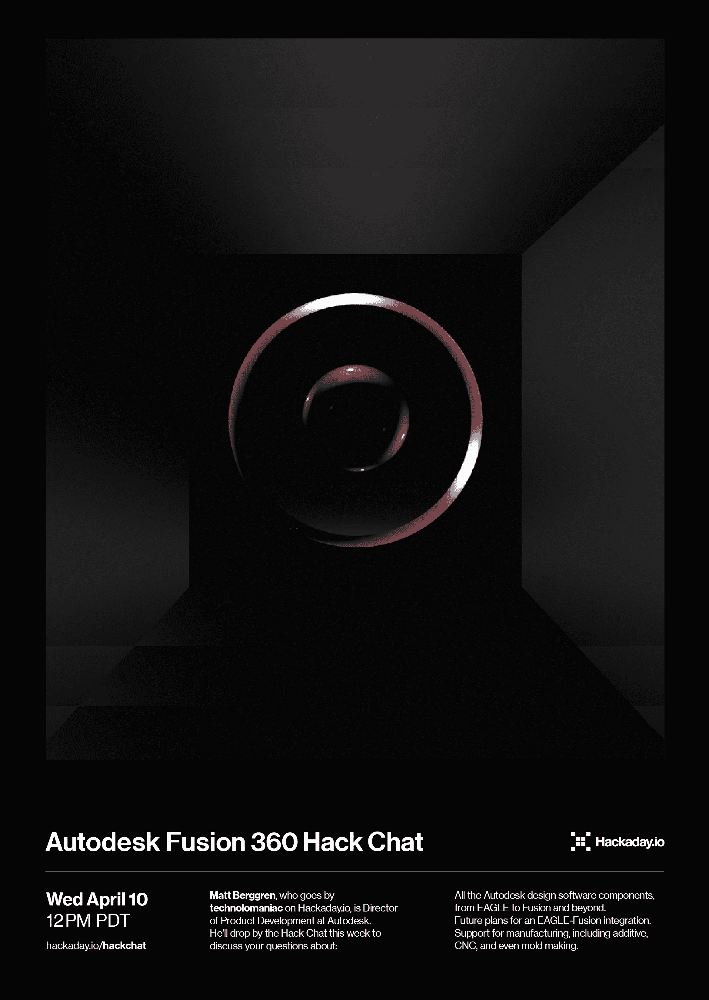

# Autodesk Fusion 360 黑客聊天

> 原文：<https://hackaday.com/2019/04/08/autodesk-fusion-360-hack-chat/>

太平洋时间周三中午，加入我们的[Autodesk Fusion 360 Hack Chat](https://hackaday.io/event/164374-autodesk-fusion-360-hack-chat)！

我们大多数人都有一套工具，用于我们每天面临的各种机械、电子和制造任务。但是，如果让你说出一个跨越所有这些领域的工具，Autodesk Fusion 360 肯定会跃入脑海。从 3D 打印部件的临时设计师到商业 CNC 机械商店，每个人都将其作为端到端的设计解决方案，任何在过去一年左右使用过它的人都知道 Fusion 中的功能集正在快速扩展。

马特在 [Hackaday.io](http://hackaday.io/) 上被称为[技术狂人](https://hackaday.io/hacker/8-technolomaniac)，他是欧特克公司 EAGLE、Tinkercad 和 Fusion 360 的产品开发总监。他将在本周顺便访问 Hack Chat，讨论您关于以下方面的问题:

*   所有的 Autodesk 设计软件组件，从 EAGLE 到 Fusion 等等
*   鹰-聚变一体化的未来计划
*   支持制造，包括添加、CNC，甚至模具制造
*   会不会有“一个设计工具可以统治一切？”

当然，我们鼓励你在讨论中提出自己的问题。您可以在[Autodesk Fusion 360 Hack Chat](https://hackaday.io/event/164374-autodesk-fusion-360-hack-chat)页面上发表评论，我们会将其放入 Hack Chat 讨论的队列中。

 我们的黑客聊天是 [Hackaday.io 黑客聊天群发消息](https://hackaday.io/messages/room/2369)中的社区直播活动。本周我们将在太平洋时间 4 月 10 日星期三中午坐下来。如果时区让你心烦意乱，[我们有一个方便的时区转换器](https://www.timeanddate.com/countdown/generic?iso=20190410T12&p0=224&msg=Autodesk+Fusion+360+Hack+Chat&font=cursive)。

点击右边的那个发言气泡，你会被直接带到 Hackaday.io 上的黑客聊天群，不用等到周三；随时加入，你可以看到社区在谈论什么。

