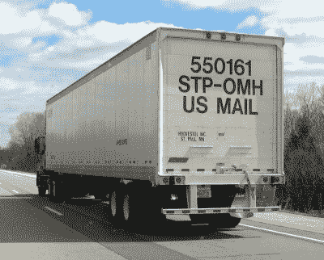

# 自动化货运:自主交付成为主流

> 原文：<https://hackaday.com/2019/06/17/automate-the-freight-autonomous-delivery-hits-the-mainstream/>

毫不奇怪，我们 Hackaday 是自动驾驶汽车等自主系统的大力支持者。这并不是说我们没有一定程度的怀疑，事实上，“自动化货运”系列的全部要点是，经济力量将为公司创造强大的激励，让它们在有能力利用对自动驾驶乘用车的需求之前建立自动化交付系统。有一条通往美好一天的道路，你可以在上班的路上(安全地)小睡一会儿，但这条道路将由航运和物流公司铺设，这些公司的财力将远远超过普通通勤者。

因此，我们饶有兴趣地看到了最近流行媒体上关于自动送货的一系列公告。每一个都不值得太多关注；公司总是想方设法让自己被视为引领未来趋势，并经常炫耀华丽、过度制作的视频和精心制作的新闻稿，以此作为一种轻松定位自己和测试市场的方式。但同时看到三个公告是不寻常的，可能表明制造商普遍认为自动化交付指日可待。此外，每个故事都突出了“自动化货运”文章专门涉及的领域中的进步，因此这似乎是一个回顾它们并展示一下我们自己的绝佳时机。

## 我们为您送货

在美国最受诽谤的公共部门机构的短名单上，邮政服务可能会出现。可悲的是，许多损害是由受损的官僚机构自己造成的，但总的来说，USPS 的男男女女做得很好，那些唱衰邮政服务的人应该记住，在美国这样大的国家提供普遍递送并不是一件容易的事情。

美国邮政卡车在配送中心之间进行转运是美国公路上常见的景象。[图片来源:[哈斯基的博客](http://harsky.blogspot.com/2010/03/us-mail-trucks.html)

在庞大的国家分发中心和较小的地区设施之间运送大量邮件的半卡车构成了整个大陆邮政网络的主干。这些卡车是美国州际公路上的常见景观，按照时钟一样有规律的时间表在固定的路线上来回行驶。如果美国邮政总局的试点项目取得成果，这些卡车可能很快就会实现无人驾驶。

[据路透社](https://www.reuters.com/article/us-tusimple-autonomous-usps/self-driving-trucks-begin-mail-delivery-test-for-u-s-postal-service-idUSKCN1SR0YB)报道，美国邮政总局已经与自动驾驶卡车初创公司 [TuSimple](https://www.tusimple.com/) 合作，本月在凤凰城和达拉斯之间的大宗邮件路线上测试自动驾驶卡车。这辆卡车上有一名安全司机和一名工程师，将进行 5 次 2000 英里(3200 公里)的往返行程。正常情况下，行程需要 45 个小时完成，需要使用车队司机。付钱让一个司机开车，而另一个司机在睡觉变得很昂贵，而且在美国司机短缺，通常很难配备员工。这条路线也是一个完美的试验台——漫长、孤独的高速公路，能见度良好，沿途有大量的服务。

看看这个实验会变成什么样，以及它在完全取代长途司机方面会走多远，这将是一件有趣的事情。图森未来声称拥有仓库到仓库的能力，不像一些自动驾驶卡车公司只在公路部分实现无人驾驶，让碳基司机处理路面街道。下面的视频在这一点上非常有说服力——在恶劣的天气下，不亚于——如果他们最终开始在没有安全司机的情况下运营，USPS 和其他人可能会开始看到自动卡车运输的一些真正好处。

 [https://www.youtube.com/embed/teMXT-j6jns?version=3&rel=1&showsearch=0&showinfo=1&iv_load_policy=1&fs=1&hl=en-US&autohide=2&wmode=transparent](https://www.youtube.com/embed/teMXT-j6jns?version=3&rel=1&showsearch=0&showinfo=1&iv_load_policy=1&fs=1&hl=en-US&autohide=2&wmode=transparent)

## 近距离空中支援

几年前，亚马逊推出了一些非常乐观的计划，通过无人机在同一时间交付订单，引起了轰动。该公司因其炫目的视频和精心设计的送货场景，因其愿意扔向问题的似乎无穷无尽的各种无人机，以及为像[这样的愚蠢事情申请专利，一个可以变成降落伞的运输标签](https://hackaday.com/2017/06/05/amazon-gets-a-patent-for-parachute-labels/)，受到了很多嘲笑。

但似乎亚马逊和其他对快速送货感兴趣的公司可能会笑到最后。世界上最大的物流公司德国邮政 DHL 已经开始了它在城市环境中的第一次常规无人机递送服务。中国广东省的东莞市是一个有点有限的测试现场，在一条专为 DHL 客户创建的送货路线上。这两个设施相距仅 8 公里(5 英里)，但城市交通和蜿蜒的道路使送货卡车 40 分钟的行程。这架无人机，一架披着 DHL 制服的 [EHang Falcon](http://www.ehang.com/bat/) 商用无人机，从一个看起来有点像易拉罐集装箱的自动化机库起飞。它在两个设施之间自主飞行只需要八分钟。

再一次，这是一个有限服务的人为路线，但 DHL 能走这么远完全是咎由自取。在美国和欧洲，无人驾驶飞机在人群上空和安全飞行员视线之外的自动送货可能还有很长的路要走，但当他们到达这里时，这将是因为像 DHL 这样的机构从这样的实验中学到了什么。

 [https://www.youtube.com/embed/-gKHvUepybA?version=3&rel=1&showsearch=0&showinfo=1&iv_load_policy=1&fs=1&hl=en-US&autohide=2&wmode=transparent](https://www.youtube.com/embed/-gKHvUepybA?version=3&rel=1&showsearch=0&showinfo=1&iv_load_policy=1&fs=1&hl=en-US&autohide=2&wmode=transparent)

## 慢慢走

不管亚马逊怎么想，我们怀疑无人机直接交付给居民消费者是否有可能大规模发生。这意味着“最后 100 米”的问题需要得到解决，即从自动驾驶送货车的后面将包裹送到客户的门口。这是一个棘手的问题，撇开最近的愚蠢想法不谈，这个问题还没有得到认真解决。

这并没有阻止公司的尝试，就像福特汽车公司最近做的另一个奇特的两足送货机器人 Digit 的视频一样。作为敏捷机器人的产品，Digit 是一个有点拟人化的机器人，如果你忽略腿弯曲的错误方式(以及整个斩首的事情)。这个想法是，Digit 将坐在一辆自动驾驶的福特面包车的后座上，装满包裹，为等待的客户提供服务。当车辆到达时，Digit 自动展开，绕过障碍物自动导航到门口，包裹夹在它粗壮的手臂之间。

视频有点难以下咽，结尾的假拳头碰撞也很蹩脚。但就像汽车制造商如何推出有时会投入生产的愚蠢概念车一样(看着你， [PT Cruiser](https://en.wikipedia.org/wiki/Chrysler_PT_Cruiser) )，Digit 或类似的东西有朝一日可能会成为社区的常见景象。福特的场景看起来非常类似于我们不久前提出的，尽管我们仍然认为轮式机器人对于这样的工作会更有效率。

 [https://www.youtube.com/embed/WHWciIxNK2c?version=3&rel=1&showsearch=0&showinfo=1&iv_load_policy=1&fs=1&hl=en-US&autohide=2&wmode=transparent](https://www.youtube.com/embed/WHWciIxNK2c?version=3&rel=1&showsearch=0&showinfo=1&iv_load_policy=1&fs=1&hl=en-US&autohide=2&wmode=transparent)

无论如何，经济力量将把自治系统推进物流链。从挑选和包装订单，到将它们运过马路，并最终送到我们家门口，人们将从快递中消失，取而代之的是机器人。应对由此带来的后果将是一个挑战，但很难看到这个故事的其他结局。