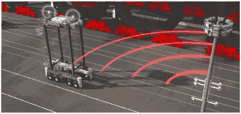

# 自动化货运:由机器人装卸工分拣集装箱

> 原文：<https://hackaday.com/2019/05/13/automate-the-freight-autonomous-stevedores-move-shipping-containers-so-humans-dont-have-to/>

Towering behemoths are prowling the docks of Auckland, New Zealand, in a neverending shuffle of shipping containers, stacking and unstacking them like so many out-sized LEGO bricks. And they’re doing it all without human guidance.It’s hard to overstate the impact containerized cargo has had on the modern world. The ability to load and unload ships laden with containers of standardized sizes rapidly with cranes, and then being able to plunk those boxes down onto a truck chassis or railcar carrier for land transportation has been a boon to the world’s economy, and it’s one of the main reasons we can order electronic doo-dads from China and have them show up at our doors essentially for free. At least eventually.As with anything, solving one problem often creates other problems, and containerization is no different. The advantages of being able to load and unload one container rather than separately handling the dozen or more pallets that can fit inside it are obvious. But what then does one do with a dozen enormous containers? Or hundreds of them?That’s where these giant self-driving cranes come in, and as we’ll see in this installment of “Automate the Freight”, these autonomous stevedores are helping ports milk as much value as possible out of containerization.

## 集装箱重量

可以相当肯定地说，每个人以前都见过海运集装箱，即使你不在遍布世界各地港口的大型集装箱码头附近。这是因为标准 ISO 集装箱是为多式联运承运人设计的，这意味着它们可以直接从船上转移到陆地承运人，而无需打开或转移。因此，即使在遥远的内陆，也可以看到成堆的集装箱穿梭于通往内陆配送中心的铁路上，或者在高速公路上被牵引车拖着移动。

然而，介于这两种运输方式之间的是港口管理者必须处理的物流问题:如何临时储存集装箱。将集装箱直接从船上装载到火车或卡车上，然后迅速运往最终目的地是不可行的，主要是因为集装箱船上的货物是混杂在一起的。尽管集装箱的尺寸是标准化的，但不同类型的集装箱经常被集中在船上洞穴般的货舱里。对于食物来说尤其如此，这些食物储存在冷藏集装箱中，在航行过程中需要电力。此外，危险材料需要隔离，负载需要平衡，以及十几个其他因素，所有这些因素都有效地随机安排了船内的集装箱。

 [https://www.youtube.com/embed/kj7ixi2lqF4?version=3&rel=1&showsearch=0&showinfo=1&iv_load_policy=1&fs=1&hl=en-US&autohide=2&wmode=transparent](https://www.youtube.com/embed/kj7ixi2lqF4?version=3&rel=1&showsearch=0&showinfo=1&iv_load_policy=1&fs=1&hl=en-US&autohide=2&wmode=transparent)

当集装箱从船上卸下来时，它们必须被分类，以便进行下一段旅程。这些集装箱是分段运输的，因为这一段的运输并不总是立即可用的，这就给港口管理者带来了问题。

## 把他们挤进去

容器占据了很大的空间。ISO 集装箱都是 8 英尺(2.44 米)宽，并以 TEU 或 20 英尺(6.1 米)当量单位来测量。因此，在任何给定的装载中，都会有 20 英尺和 40 英尺集装箱的组合，加上一些古怪的尺寸(因为标准并不总是标准的)。

这些箱子占据了地面上很大的空间，用于分类它们的院子往往很大。幸运的是，集装箱堆叠得很好，因此港口管理人员可以通过堆叠集装箱来节省一些空间。这需要称为跨运车的特殊车辆——基本上是可以跨在一堆集装箱上的移动式起重机，其高度足以将集装箱吊起并运走。

跨运车传统上由人类驾驶员操作，坐在离地面很高的驾驶室中，可以俯瞰整个车场。像其他重型设备操作员一样，这是一份需要技能和专注的工作，以免灾难发生。但是越来越多的跨运车被转换成自动驾驶车辆，比如在新西兰奥克兰的[港口使用的 27 个单元，将港口的吞吐量从每年 90 万标准箱增加到超过 170 万标准箱。](http://www.poal.co.nz/)

 [https://www.youtube.com/embed/4QOsSFaHZ3w?version=3&rel=1&showsearch=0&showinfo=1&iv_load_policy=1&fs=1&hl=en-US&autohide=2&wmode=transparent](https://www.youtube.com/embed/4QOsSFaHZ3w?version=3&rel=1&showsearch=0&showinfo=1&iv_load_policy=1&fs=1&hl=en-US&autohide=2&wmode=transparent)

这些自动驾驶庞然大物的精确定位大大增加了奥克兰港口的吞吐量，该港口因其位于大城市的中心而受到严重限制。

Straddle carrier with local position system. Source: [Konecranes](https://www.konecranes.com/).

能够将更多的集装箱挤进同一个空间依赖于 GPS 永远无法实现的位置数据，因此跨运车转而使用基于飞行时间的本地定位系统，该系统来自位于堆场周围电线杆上的一系列发射器。这允许跨运车实现 1 英寸(25.4 毫米)的位置精度。

集装箱码头环境是自动驾驶车辆的理想测试平台。环境是高度受控的，并且系统内每个运载工具(有人驾驶或无人驾驶)的确切位置是已知的。灯光是受控的，均匀的，路面是平坦光滑的，这个任务虽然巨大，但却定义明确，相当简单。这是自动驾驶汽车的完美环境，吞吐量的增加以及成本的降低足以证明货运自动化是正确的。

[精选图片来自[汤姆·斯科特关于奥克兰港口自动化的精彩视频](https://www.youtube.com/watch?v=kQ8WI3nc1l0)