# 使用 Node-RED(加上少量 MQTT)自动化您的生活

> 原文：<https://hackaday.com/2020/01/15/automate-your-life-with-node-red-plus-a-dash-of-mqtt/>

多年来，我们已经看到一些真正有趣的家庭自动化项目使用了节点红色的包。每一次，这些项目背后的黑客都对 Node-RED 赞不绝口，现在我也加入了他们的行列。

无论您是新手还是经验丰富的老手，这个基于图形的编码平台都可以让您快速地将有用的操作和图形用户界面(GUI)放在一起。您可以使用它来按计划切换您的互联网连接的灯，或者通过家庭网络中任何设备可用的网络应用程序按一下按钮。你可以把它作为一个信息仪表盘，一次显示天气预报、最新的黑客文章、公交时刻表或所有这些信息。一眼看去，它抽象出了编写 Javascript 的复杂性，同时也使深入底层并使用 1337 haxor 技能添加自己的代码变得简单。

您可以在不到一个小时的时间内安装并运行它，我将处理这个问题以及使用 MQTT、设置 web GUI 和写入日志文件的示例。为了让 Node-RED 在您的网络上持久化，您需要一个服务器，但是它足够精简，可以从 Raspberry Pi 运行而不会出现问题，它甚至默认安装在 BeagleBone 发行版中。本指南中所有示例的代码都可以在教程库中找到[。让我们开始吧！](https://github.com/Hack-a-Day/node-red-tutorial)

## 事实真相

[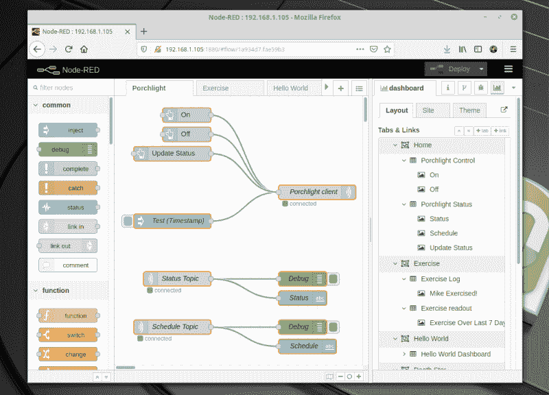](https://hackaday.com/wp-content/uploads/2020/01/node-red-overview.png)

Node-RED 是一种基于 Node.js 的图形化编程语言，它实现了一个服务器，并运行所谓的“流”:基于 Javascript 的程序。为什么要为您的程序运行服务器端 ide？因为 Node-RED 还可以非常简单地构建 web 应用程序，并将其用作您的在线信息和控制系统。

## 装置

为了让你的节点红程序持久化，你需要一个服务器，但是，如果你现在只想玩，你可以在本地运行。你的服务器可以简单到只需在你局域网上的一台 Raspberry Pi 或一台永远在线的计算机上安装平台。先决条件包括 Node.js 和 NPM(node . js 包管理器),它们在 Linux 系统上很容易安装。

```
sudo apt install nodejs
```

现在，我们可以安装 Node-RED，按照下面的示例，您还应该安装 dashboard 软件包:

```
npm install node-red
npm install node-red-dashboard
```

要在本地运行，你只需在终端输入`node-red`。然而，更有说服力的运行方式是作为一个`systemd`服务。将 nodered.service 文件中[的内容复制到`/etc/systemd/system/nodered.service`中，并更新该文件中的`User`、`Group`和`WorkingDirectory`变量，以匹配系统中的实际用户。准备就绪后，只需启用并启动服务。从现在开始，它将在崩溃或系统重启时重新启动。](https://github.com/node-red/linux-installers/blob/master/resources/nodered.service)

```

systemctl enable nodered.service
systemctl start nodered.service

```

现在，您只需在 web 浏览器中访问`localhost:1880`，就可以加载 Node-RED IDE。

## 你好世界

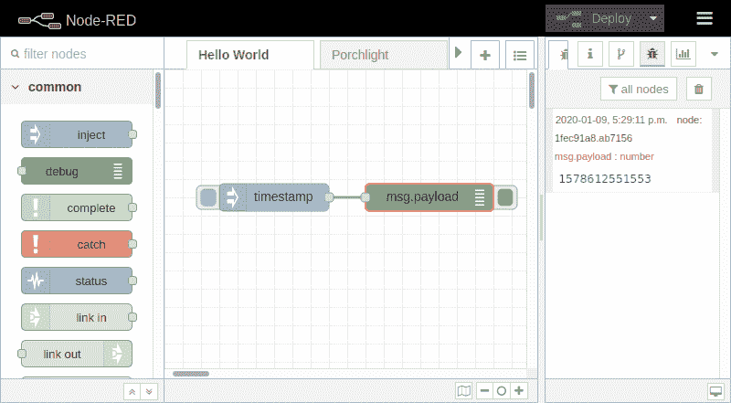

作为 Node-RED 中的第一个“流”,最简单的做法是:单击按钮，获取时间戳。为了制作上面的图像，我只不过是将“注入”和“调试”节点从左栏拖到中间，然后拖动连接这两个节点的线。您需要随时单击右上角的“Deploy”按钮，然后单击 inject 节点左侧的按钮(默认情况下有“timestamp”标签)来显示调试窗口中的时间。如果没有看到调试输出，请单击右窗口上方的 bug 图标。

这个例子不是很有用，但是这不是 Hello World 代码的要点。这充分展示了图形代码系统的威力。同样有趣的是，流可以导出为`json`文件。下面是这个 Hello World 的样子，它可以被导入到您自己的 Node-RED 安装中。

```
[
    {
        "disabled": false,
        "id": "ff177395.3cf468",
        "info": "",
        "label": "Hello World",
        "type": "tab"
    },
    {
        "crontab": "",
        "id": "1c6883be.759c24",
        "name": "",
        "once": false,
        "onceDelay": 0.1,
        "payload": "",
        "payloadType": "date",
        "repeat": "",
        "topic": "",
        "type": "inject",
        "wires": [
            [
                "1fec91a8.ab7156"
            ]
        ],
        "x": 200,
        "y": 140,
        "z": "ff177395.3cf468"
    },
    {
        "active": true,
        "complete": "false",
        "console": false,
        "id": "1fec91a8.ab7156",
        "name": "",
        "tosidebar": true,
        "tostatus": false,
        "type": "debug",
        "wires": [],
        "x": 370,
        "y": 140,
        "z": "ff177395.3cf468"
    }
]
```

## MQTT 快速入门

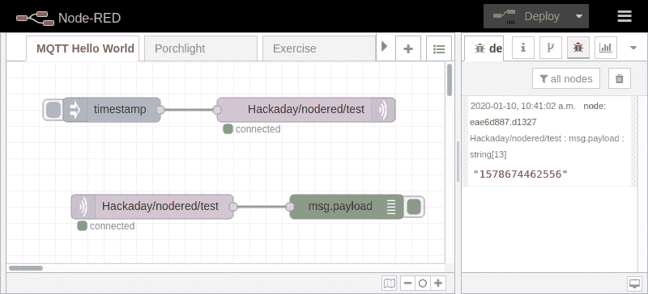

Node-RED 感觉像是专门为 MQTT 设计的，MQTT 是一种流行的物联网协议[，埃利奥特·威廉姆斯已经为它写了一本精彩的指南](https://hackaday.com/2016/05/09/minimal-mqtt-building-a-broker/)。之所以有这种感觉，是因为 MQTT 客户机是内置的，大多数节点都有“主题”和消息有效负载，这是与 MQTT 代理通信所需要的全部内容。

正如您在上面看到的，我正在做完全相同的注入/调试技巧，但是现在我已经从可能的节点的“Network”列中拖出了一个“mqtt in”和“mqtt out”节点。

 [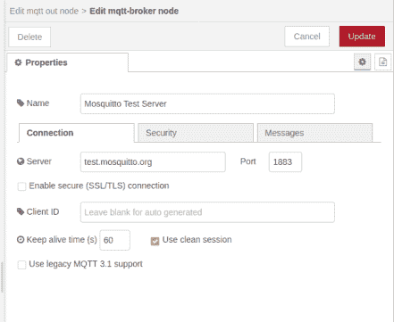](https://hackaday.com/2020/01/15/automate-your-life-with-node-red-plus-a-dash-of-mqtt/node-red-mqtt-server/)  [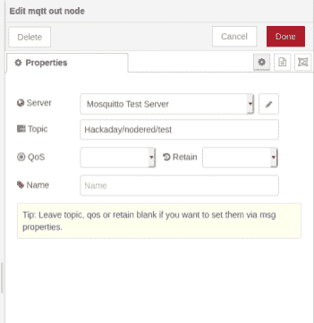](https://hackaday.com/2020/01/15/automate-your-life-with-node-red-plus-a-dash-of-mqtt/node-red-mqtt-node/) 

这里的设置稍微多一点，因为我们需要选择一个 MQTT 服务器，并选择一个主题来发布和收听。但是界面使这变得非常容易，只需双击其中一个 MQTT 节点。这里我使用 mosquitto 测试服务器(`test.mosquitto.org`)和主题`Hackaday/nodered/test`。只要意识到任何在服务器上查看消息的人都可以看到这一点，如果您使用完全相同的主题，您可能会看到其他读者发送测试消息。Node-RED [实际上也可以用作 MQTT 代理](https://flows.nodered.org/node/node-red-contrib-mqtt-broker)。

尝试双击注入节点并将有效负载从 timestamp 更改为 string，然后您就可以发送自己的定制消息了。在很大程度上，我发现在 Node-RED 中找到自己的路是很容易的，而且玩设置也很容易。只要确保点击部署按钮——您的更改实际上不会到位，直到您这样做。

## Web Gui Hello World

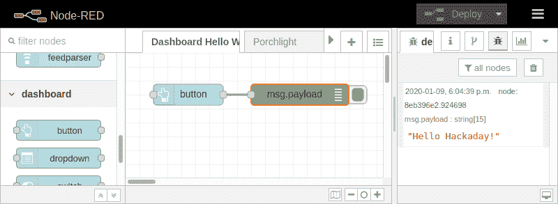

让我们来看看 Node-Red 真正令人兴奋的部分，即不费吹灰之力就能构建一个网络应用的能力。

在这里，您可以看到智能手机显示我们的应用程序。这里唯一真正有用的部分是按钮。点击它，你会得到“你好，黑客日！”在上面看到的 Node-RED 的调试窗口中。创建这个页面所要做的就是为 Node-RED 安装 dashboard 包，然后将一个按钮拖到画布上。部署后，您的 web 应用程序将位于`localhost:1880/ui`

软件包的安装非常简单，只有一行代码:

```
npm install node-red-dashboard
```

将按钮拖到画布上并将其挂接到调试节点也很简单，但是您只需要做一点配置。双击按钮节点可以改变有效负载，以影响发送到调试窗口的消息，但是您还需要设置一个组，并且在组编辑对话框中，您需要设置一个选项卡。这会影响 web 应用程序，组在 web 应用程序的每个页面上组织块，标签从左上角的汉堡菜单中选择不同的页面。您可以随意命名组和选项卡。

## 让我们建立一个 Web 应用程序！

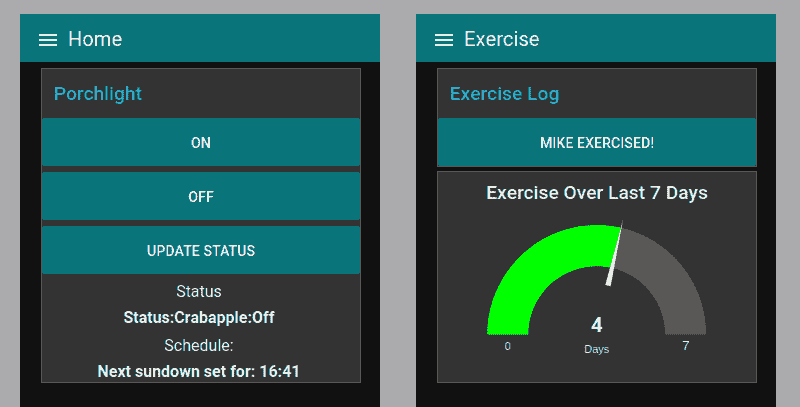

Hello World 代码已经说得够多了，让我们来构建一些有用的东西。我使用 Node-RED 大约一个月了，已经开发了几个有用的应用程序，一个与我的 MQTT broker 交互，以控制和监控我的前车灯，另一个我用作一个简单的按钮，以记录我锻炼的天数。让我们一点一点地构建练习应用程序，因为它不仅仅是来回发送 MQTT 数据包。

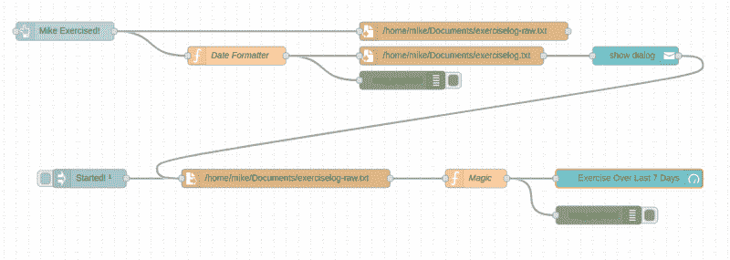

这是运动应用程序的当前状态，它包括一个将今天的日期记录到日志文件的按钮和一个读取日志文件的计量器，以显示过去七天中有多少天包含运动。让我们一步一步来。

### GUI 按钮写入文件

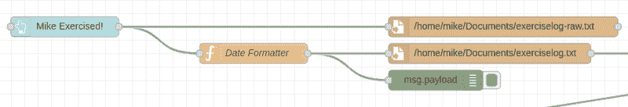

这是流动开始的地方。它由仪表板包中的一个按钮组成，单击该按钮时会发送一个时间戳。该消息将被记录到两个“文件”节点，第一个是`exerciselog-raw.txt`,它只是为每一行记录一个 UNIX 时间戳。这不是人类可读的，所以第二个文件节点有一个函数节点，它使用下面的 JavaScript 代码片段来翻译时间戳。这里面有一点魔力，可以确保月和日总是两位数。

```
var date;
date = new Date();
var year = date.getFullYear();
var month = date.getMonth();
month = (month < 9 ? '0' : '') + (month+1)
var day = date.getDate();
day = (day < 10 ? '0' : '') + day
msg.payload = year + '-' + month + '-' + day;
return msg;
```

### 添加用户通知

 [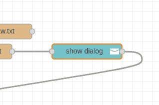](https://hackaday.com/2020/01/15/automate-your-life-with-node-red-plus-a-dash-of-mqtt/node-red-notification-node/)  [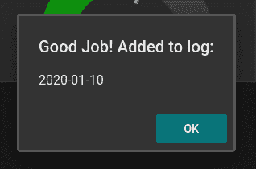](https://hackaday.com/2020/01/15/automate-your-life-with-node-red-plus-a-dash-of-mqtt/node-red-notification-dialog/) 

该按钮按预期工作，但是它没有给用户任何反馈。为了改进这一点，我从仪表板包中添加了一个通知节点。它在文件节点之后连接，以确认日期已经写入日志文件。

### 读取文件，显示数据，启动时刷新

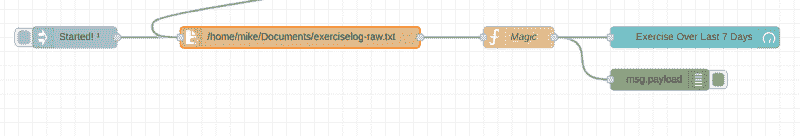

流程的最后一部分使用 tan“file in”节点从原始日志文件中读取 UNIX 时间戳，并将其显示在仪表板包的 teal“gauge”节点上。它由两个不同的触发器激活，一个在新日期写入日志文件后更新。另一个是 lavender“inject”节点，它有一个“n 秒后索引一次”选项，用于在 Node-RED 启动时填充初始数据。

该量表只是寻找一个数字来填充，这是由一个功能节点(我称之为魔术)提供的。下面的代码以数组的形式读入日志文件，计算出七天前的 UNIX 日期代码，然后遍历日志文件中的最后七个时间戳。

```
//Turn incoming timestamps log into an array:
var exercisearray = msg.payload.split("\n");
if (exercisearray.slice(-1)[0] === "") exercisearray.length = exercisearray.length-1

//Get timestamp for week ago to compare against
var thismorning = new Date()
thismorning.setHours(0)
thismorning.setMinutes(0)
thismorning.setSeconds(0)
thismorning.setMilliseconds(0)
var sixdays = 1000*60*60*24*6
var oneweekago = thismorning.getTime()-sixdays

//Iterate and count past week of exercise
var count = 0
var secondsinday = 60*24*7
for (var i=1; i<8; i++) {
  if (i>exercisearray.length) break;
  var testval = parseInt(exercisearray.slice(-i)[0]);
  if (testval >= oneweekago) ++count;
}

//Store our answer as the payload and pass along
msg.payload = count;
return msg;
```

## 试试 Node-RED 吧！

我对该平台的第一个担忧是版本控制，但这也是可行的。有一个名为 Node-RED projects 的内置 [git 集成，但它在默认情况下是不启用的。我不习惯使用 git 的 GUI，但是我也不习惯图形编程界面，所以尝试一些新东西不会有什么坏处。](https://nodered.org/docs/user-guide/projects/)

我在这里展示的例子只是冰山一角。环顾四周，你会发现对 Node-RED 的巨大热情，这转化为令人难以置信的流量和令人敬畏的网络应用。例如，我已经阅读 Scargill 的技术博客很多年了，在那里你会发现很多可以实现的例子。在这里，我们看到斯卡吉尔的恒温器控制面板有各种定制，给它一个特殊的外观。找到您喜欢的示例并不难，复制它们的代码甚至更容易。

你可以很容易地在一个下午拿起 Node-RED，最后得到一些有用的东西。对于那些想花更多时间的人来说，没有限制。如果你有任何类型的家庭自动化，这是你必须尝试的，因为它可以让局域网上的任何人在不安装应用程序的情况下访问信息和进行控制。你可以很容易地从抽屉里拿出一部废弃的智能手机，把它变成一个专用的控制面板，我在一款名为 Fully Kiosk Browser Lockdown 的 Android 应用程序的帮助下，为本文顶部的图片做了一些事情，这是一种真正的全屏浏览器体验，Chrome 或 Firefox for Android 都没有提供。用自己多余的装备试试吧！

* * *

#### 资源:

*   [示例代码库](https://github.com/Hack-a-Day/node-red-tutorial)