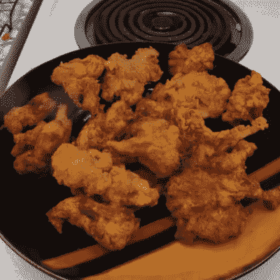

# 自动化蘑菇栽培产生美味的油炸食品

> 原文：<https://hackaday.com/2022/01/09/automated-mushroom-cultivation-yields-delicious-fried-goodies/>

[Kyle Gabriel]了解蘑菇，他多年的经验在他的自动化蘑菇栽培环境的[完整文档中真正闪耀，该环境尽可能使用现成的传感器和硬件创建。结果不言而喻，用一些美味的油炸平菇来证明！](https://kylegabriel.com/projects/2021/09/mushroom-cultivation-automation.html)

Fried oyster mushrooms, grown from scratch.

对蘑菇种植最有影响的条件是温度、湿度和二氧化碳浓度，为了自动处理环境条件，[凯尔]创建了[my code](https://github.com/kizniche/Mycodo)，这是一个开源系统，利用廉价的硬件和部件，同时还能够定期拍照以监视事物。

称[Kyle]的文档“全面”并不公平，他解决了从为工作区建立正压空气过滤系统到如何从采集的蘑菇中获得可用的培养物，一直到生长和收获的所有问题。他甚至附上了一份看起来很美味的油炸蘑菇食谱。没有比这更全面的了。

我们之前已经看过[凯尔]的早期作品,很高兴看到继续改进。在下面嵌入的视频中查看整个过程(或者[如果你想让自己饿，跳到 16:11](https://youtu.be/z41Wy5ZF4O8?t=971) )。)

 [https://www.youtube.com/embed/z41Wy5ZF4O8?version=3&rel=1&showsearch=0&showinfo=1&iv_load_policy=1&fs=1&hl=en-US&autohide=2&wmode=transparent](https://www.youtube.com/embed/z41Wy5ZF4O8?version=3&rel=1&showsearch=0&showinfo=1&iv_load_policy=1&fs=1&hl=en-US&autohide=2&wmode=transparent)

