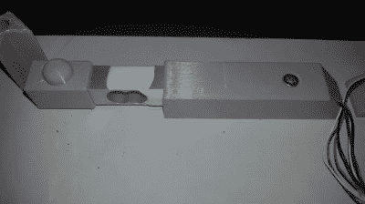

# 自动猫称重机知道它正在喂养哪只宠物

> 原文：<https://hackaday.com/2020/08/13/automatic-cat-weighing-machine-knows-which-pet-it-is-feeding/>

你试过给猫称重吗？就此而言，你有没有试过让猫做它们不想做的事情？我们的猫科动物同伴的任性独立是我们喜爱它们的很大一部分原因，自从古埃及人第一次有了被驯化的杂交野猫以来，这种独立性就一直存在

难怪照顾多只有不同饮食需求的猫如此困难。但是仅仅是给猫称重这一行为可能就是让它们的饮食自动化的关键，同时让它们可以选择何时进食。这是一项任务，[Psy0rz]已经用[me owton 破解了，这是一种称重机/喂食器组合](https://github.com/psy0rz/meowton/wiki)，旨在调节他的各种猫的饮食。

Cat scale uses a load sensor under each corner of the platform

这个多面系统包括一个称猫体重的秤、一个带分配器的食物漏斗和一个称食物碗的秤。猫必须站在秤上吃东西，自动售货机检测到这一点后会分发一些食物。它通过重量识别每只猫，并相应地控制分配的数量，以便在一天中分配给猫的食物。

在这一切的背后是一个 ESP32，它将统计数据传递到一个 web 界面，并使它们可以导入到数据库中。他发现了系统中的一个缺陷，两只体重相同的猫可能会导致错误识别。为此，他正在研发 RFID 阅读器，但这项工作仍在进行中。甚至还有[该单元在动作中的实时流](https://www.youtube.com/channel/UC91dBCCF5MRUt8zm8YhqT_g)。

我们是这里的猫迷，虽然各种各样的 Hackaday 猫提供了大量的陪伴和娱乐，但我们总是想得到更多。多年来，我们推出了大量的猫喂食器，但只有一个猫升降机。