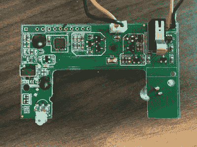

# 自动皂液机隐藏 Arduino 板

> 原文：<https://hackaday.com/2018/12/25/automatic-soap-dispenser-hides-arduino-board/>

如果你已经在 Hackaday 呆了一段时间，你肯定已经看到了一些基于将微型计算机放入其他电子产品外壳的概念的项目。事实上，在这一点上，这是一个笑话，当然，我们必须看到 Arduino 或 Raspberry Pi 被硬塞到每一种消费电子产品中。但是如果你认为这是标题中常见比喻的另一个例子，你可能会感到惊讶。

【zapta】没有把 Arduino 放在这个 GOJO LTX-7 皂液机里面，它一开始就已经在里面了。没错，显然我们已经达到了这样一个地步[甚至廉价的皂液机现在都可以在可编程微控制器](https://github.com/zapta/misc/tree/master/soap_dispenser)上运行。虽然我们不能责怪那些由于这种特殊的计算暴食而呻吟和/或翻白眼的人，但这确实意味着我们能够面无表情地报告一些坦率地说在前些年会被当作愚人节玩笑的事情:开源肥皂分配固件的开发。

那么如何上传一个新的 Arduino 草图到他们的 GOJO 皂液器呢？这东西边上又没有 USB 接口方便黑客入侵。正如[zapta]所解释的，它涉及到将分配器一直拆下来，直到电子板空闲下来，然后添加一个编程头，使随后的固件修改更容易一些。向 ATTiny48 供电的电路板写入新的固件将需要外部 ISP(Atmel AVRISP MKII 用于这次黑客攻击，尽管任何一个都应该工作)，但除此之外，这是非常容易的。

[zapta]在记录板上的不同组件方面做得非常出色，并对关键方面(如电机控制器和近程传感器)进行了足够的反向工程，以编写新的开源固件，该固件可以闪存到 GOJO LTX-7。除了允许你“开源所有的东西”，使用这个新的固件确实有一些实际的优势，因为你可以配置每次激活分配多少肥皂。更进一步，我们会特别感兴趣地听到任何人设法想出一个固件，使一些迄今为止不可能的肥皂分发欺骗。

我们已经看到了涉及各种类型分配器的黑客攻击，从[吐出糖果的万圣节游戏](https://hackaday.com/2018/08/15/arcade-inspired-halloween-candy-dispenser/)到[让狗得到自己的食物的小工具](https://hackaday.com/2017/07/27/dog-operated-treat-dispenser/)，但是皂液分配器黑客攻击对我们来说是真正的新事物。更多的证据表明，仍然有大量的硬件在等待被黑客攻击！