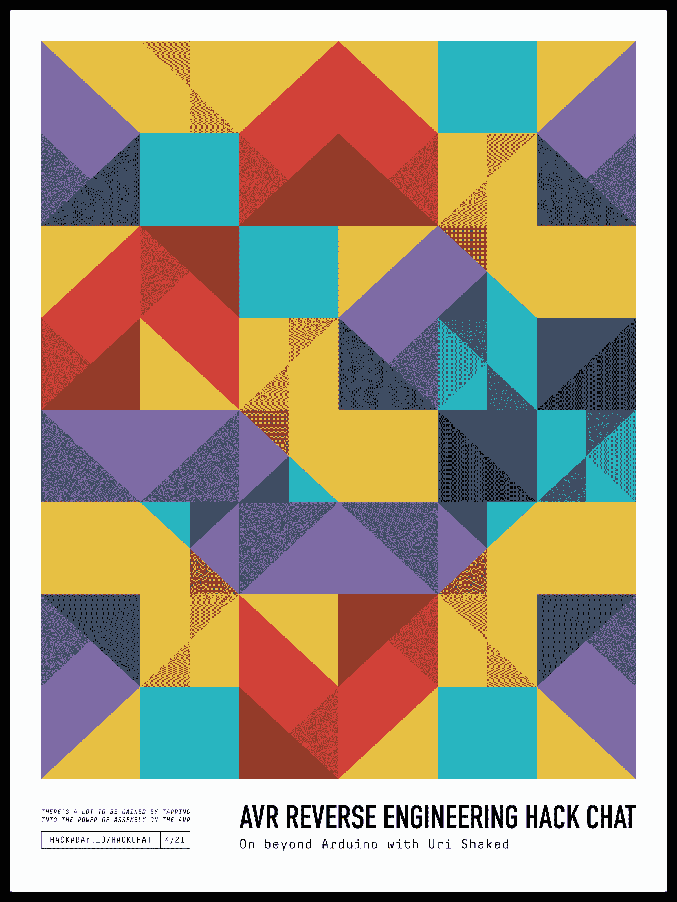

# AVR 逆向工程黑客聊天

> 原文：<https://hackaday.com/2021/04/19/avr-reverse-engineering-hack-chat/>

加入我们太平洋时间 4 月 21 日星期三中午的 [AVR 逆向工程黑客聊天](https://hackaday.io/event/178502-avr-reverse-engineering-hack-chat)与 [Uri Shaked](https://hackaday.io/urishaked) ！

到目前为止，我们都已经熟悉了 Arduino 生态系统，几乎可以轻而易举地创建一个快速项目，严格用代码实现其功能的几乎所有方面。它非常有用，但我们往往忽略了一个事实，即我们的 Arduino 草图代表了一个虚拟世界，在这个世界中，IDE 和大量的库抽象出了 AVR 微控制器内部发生的许多复杂情况。

虽然拥有一个能让您在几分钟内建立系统的环境确实很方便，但这还不是故事的结尾。利用 AVR 上汇编编程的强大功能，学习如何阅读数据手册并真正运行它，会有很多收获。这是 Uri Shaked 最近广受欢迎的关于 AVR 内部的 [HackadayU 课程](https://hackaday.io/course/176685-avr-architecture-assembly-reverse-engineering)的重点，它将构成这次黑客聊天的基础。话说回来，由于 Uri 在几周内也将在 HackadayU 上领导一个 [Raspberry Pi Pico 和 RP2040 课程](https://hackaday.io/course/178733-raspberry-pi-pico-and-rp2040-the-deep-dive)，我们可能最终也会讨论这个问题。或者我们可能会聊些完全不同的话题！鉴于 Uri 广泛的兴趣和专业知识，很难预测这种聊天会走向何方，但我们非常确定一件事:它不会无聊。确保您登录并加入聊天，它去哪里在很大程度上取决于您。

 我们的黑客聊天是 [Hackaday.io 黑客聊天群发消息](https://hackaday.io/messages/room/2369)中的社区直播活动。本周，我们将在太平洋时间 4 月 21 日星期三中午 12:00 坐下来讨论。如果时区束缚了你，我们有一个[方便的时区转换器](https://www.timeanddate.com/countdown/generic?iso=20210421T12&p0=224&msg=AVR+Reverse+Engineering+Hack+Chat&font=cursive)。

点击右边的那个发言气泡，你会被直接带到 Hackaday.io 上的黑客聊天群，不用等到周三；随时加入，你可以看到社区在谈论什么。

