# 斧头黑客:旋转旋钮和翻转开关

> 原文：<https://hackaday.com/2020/10/15/axe-hacks-spinning-knobs-and-flipping-switches/>

从吉他黑客的角度来看，我们感兴趣的两个主要部分是拾音器和音量/音调控制电路，让你在演奏时调整声音。今天，我将进入后一部分，仔细研究相关器件——电位计、开关和一些其它无源器件——并展示它们的工作原理、我们有哪些替代方案，以及我们如何重新利用它们。

从这个意义上说，是时候加热烙铁，拿出螺丝刀，取下拨片保护罩/打开后盖，继续我们对新电吉他声音的探索了。如果这种想法听起来不舒服，跳过烙铁，拿一些鳄鱼夹和面包板。这可能不是理想的环境，但会有用的。

## 当音乐遇到电子产品

如果你错过了我的上一篇文章，[我们讨论了电吉他的基础知识和它们音色的来源](https://hackaday.com/2020/09/22/axe-hacks-new-sounds-for-your-electric-guitar-beginning-from-what-makes-them-tick/)。概括一下:钢弦在拾音器的磁场中振动，产生电信号，该电信号由拾音器的所有内部特征形成。从这里，信号通过音量和音调控制电路传输到输出插孔，我们可以根据需要放大和改变声音。

在我开始之前，我想说几句你会在互联网上遇到的吉他接线图，以及吉他世界中电子术语的一般状态。由于一般的音乐家不一定精通电子，实际的原理图很少用于描述布线，最常见的是栩栩如生的图片，类似于 Fritzing breadboard 视图。这使得在实践中重建和实现布线本身变得更加简单，但实际上对其背后的电子器件并不了解。

此外，由于某种原因，“纳”似乎是一个禁忌词，因为电容值通常以微法表示，22 nF 电容通常被称为 0.022 uF，或简称为“0.022”电容，最差情况下可写成“. 022 mfd”。尽管皮法似乎也没问题，但 2.2 nF 电容就变成了 2200pF。

根据经验，吉他布线中的电容值很少高于 100 nF 或低于 100 pF，因此这应该有助于解读一些更奇特的术语。说完了，让我们开始吧。

## 音调和音量控制–第二步

[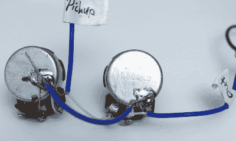](https://hackaday.com/wp-content/uploads/2020/10/removed-wiring_bright.png)

典型的音量控制电路由一个电位计组成，其一端是拾音器的信号，另一端是地，输出信号在其游标上。当它被设定为 10 时，游标具有最小的阻力和最大的音量，在 0 时，整个信号被丢弃。

另一方面，典型的音调控制是由另一个电位计和一个电容组成的低通滤波器。当设置为 10 时，电位计处于最大电阻，几乎可以忽略电容的任何影响。随着电阻的降低，电容器开始通过抑制高音来影响音调，直到它在位置 0 完全接合。电容值越高，总的高频被抑制得越多(或者说谐振峰值被移得更低)。

理论上讲了这么多，但实际上这里还有一两件事需要考虑。首先，电位计不会完全降至 0 欧姆，但总会有一点静止电阻，因此音量控制的存在会影响输出信号，尽管很小。

## 现代布线与 50 年代的设置

[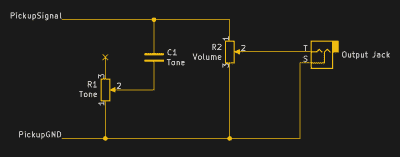](https://hackaday.com/wp-content/uploads/2020/09/schematic-modern-rethemed.png)

Gibson Les Paul Modern Wiring

此外，音量和音调控制不是两个孤立的系统，而是相互作用的。这样做的一个结果是降低音量时可能会轻微损失高音，这取决于布线的实际设置。

例如，Gibson 莱斯·保罗吉他(通过扩展，其他吉他的每个拾音器都有单独的音调和音量控制)可以有“现代接线”或“50 秒接线”设置，其中音调控制分别连接到音量控制的输入和游标。

[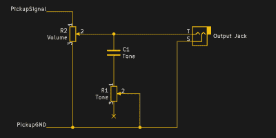](https://hackaday.com/wp-content/uploads/2020/09/schematic-50s-rethemed.png)

Gibson Les Paul 50s wiring

使用现代布线，您将体验到高音的轻微损失，而使用 50 年代布线，当降低音量时，音调基本不受影响。然而，因为一切都是相互关联的，所以也不是没有后果。形势已经逆转，现在音量控制将在音调控制启用时增加一些高音。如果你很少使用音调控制，这可能不会是一个问题，50 年代的布线可能是一个完美的选择，但如果你依赖于低音控制的黑暗泥泞，你可能不会太高兴。

## 高音出血

在不太影响音调控制行为的情况下，抵消高频损失的另一种方法是所谓的*高音泄放*电路，该电路本质上是在音量罐中添加了一个高通滤波器。最简单的形式是，它只是一个与输入端和游标并联的电容器，一些制造商甚至在他们的一些型号的库存布线中使用它。例如，依班娜使用 330 pF，T2 使用 200 pF，而 PRS 使用 180 pF。然而，超过 1 nF 可能会有获得非常刺耳、过于明亮的音调的风险，而没有留下多少低音。对于更多选项，存在使用并联或串联电阻的替代版本。

[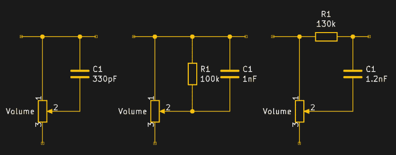](https://hackaday.com/wp-content/uploads/2020/09/all-the-treble-bleeds-rethemed.png)

A variety of treble bleed circuits

上面示意图中的值更多的是一个起点，可能需要一些实验来找到一个完美的匹配。控制的实际行为，包括高音出血行为，也取决于所使用的电位计，或者说是哪种锥度。

## 锥度？我几乎不认识她

[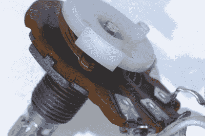](https://hackaday.com/wp-content/uploads/2020/10/pot-closeup_bright.png)

吉他控制中常见的电位计带有不同类型的锥形，即实际上引起电阻的部分。两种最常见的类型是线性和对数(或音频)锥形，其次是偶尔出现的反向对数锥形。顾名思义，它们的区别在于电阻值如何基于游标位置而变化，因此要么是线性的，要么是以指数方式增加(如果是反向对数，则是减少)。

在音量控制方面，设置为 5 的线性电位计(理想情况下)将具有一半的输出信号电平，但考虑到人耳的非线性音量感知，它不会等于一半的音量。出于这个原因，经常建议使用对数锥形来控制音量以匹配这种行为(因此他们的替代“音频锥形”名称)，但它也回避了一个问题:当设置为 5 时，吉他音量真的必须是其音量一半的吗？

嗯，要回答这个问题，主要取决于你如何使用音量壶，以及你希望它如何工作。有些人可能会保持在 10-6 的范围内，更喜欢变化明显但动作不大的变化，其他人则在 6 上无所事事，到处随意调高音量。一些人把放大器调到最大，像在旧电视或收音机上一样使用音量旋钮，而另一些人只是惊叹于其上形成的完美灰尘梯度。因此，毫不奇怪，关于线性或对数锥形是否是音量控制的正确选择的意见存在分歧，制造商也并不总是下定决心，尽管这很可能有经济原因。

[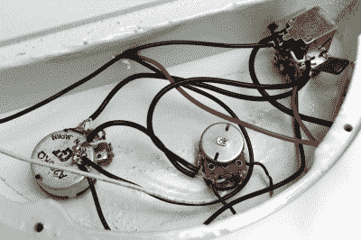](https://hackaday.com/wp-content/uploads/2020/10/wiring-inside-bass_bright.png)

这与音调控制的锥度选择类似，尽管大多数人似乎倾向于对数方向，因为它实际上会产生更一致的整体扫频。但是音调控制也是一个不同的故事，因为它们的较低设置仍然实用，甚至一直降到 0 也是一个有效的选项，并在一些风格中经常使用，不像音量控制，它在这一点上完全没有声音，任何低于 3 的设置也可能用途有限。尽管如此，这并不意味着线性锥形不能成为你的正确选择。与对数锥形相比，它突然陷入黑暗可能会给你一些你想要的基于色调的效果。

毕竟，所有这些都是为了修改吉他的音调行为，所以我们不要局限于任何看起来正常的控制方式。虽然锥形行为是电位计本身的固定特征，但它仍然只是一个电阻。你的音调设置为 0 会不会变得沉闷和浑浊？也许可以尝试串联一个额外的电阻，防止电阻一直下降到零欧姆。500 千欧的锅的声音对你来说太亮了，但是 250 千欧的锅缺少一些清晰度？也许一个 2.2 兆欧与 50 千欧并联可以使它变得更好。好吧，试试看会发生什么。

## 电位器加倍:混合，堆叠，双组

电位计有不同的锥度，当然也有不同的值。有些可能具有独特的定制锥度行为，或者是*空载电位计*，通过在该位置完全分离锥度来规避“即使在零点仍有轻微剩余阻力”的问题。虽然在这些问题上意见再次出现分歧，因为从拾音器获得原始的无掺杂信号是一件好事，但一旦锥形回到系统中，也会增加一点不自然的响应。

但是，除了外形尺寸和轴结构等物理特性外，电位计没有太多其他特性。那么把两个放在一个房子里怎么样？那么，我们可以选择一个*混合罐*或一个*堆叠式*(或*双组*)电位计。两者本质上都是两个相互堆叠的罐子，一根轴转动两个独立的锥体。单个电位计通常可以独立使用，因此每个电位计都有单独的连接器。

[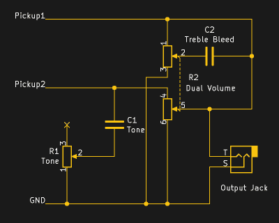](https://hackaday.com/wp-content/uploads/2020/09/dual-pot-schematic-rethemed.png)

Stacked potentiometer with tone control only for one pickup, and treble pickup for the other

我们以一把吉他上简单的单音量、单音控制接线，两个拾音器为例。也许亮桥拾音器可以偶尔在拾音器上旋转一下，而颈部拾音器就像现在这样完美，反正你也不喜欢颈部低通滤波器的浑浊声音。使用双组电位计和两个相同的电位计(例如线性 500 千欧)可以让您将每个拾音器连接到它自己单独的音量电位计，并且音调控制只连接到电桥的。也许增加一个高音出血电路，只影响颈部拾音。

或者，其中一个拾音器是单线圈，而另一个是亨巴克，分别具有 250 千欧和 500 千欧的双组电位计可以在单个控制中处理它们的差异。

例如，Fender 有一些 HSS Stratocasters(即，在桥上有一个 humbucker，通常在中间和颈部有两个单线圈的 Stratocaster)，后者还将 Strat 的两个音调控制分开，用于单线圈和 humbucker。由于电位计使用单轴，实际控制时不会有任何不同。

除非这是你想要的，在这种情况下，你也可以用一个*同心*电位计。它仍然是两个独立的，堆叠在一起，以适应单个电位计的空间，但这一次轴有一个内部和外部日志分别转动。

比方说，你想要吉布森式的方法，对吉他中的每个拾音器进行单独的音调和音量控制，但这并不是为此而设计的。当然，你可以拿出电动工具，但这肯定不是每个人都喜欢的——如果我们想到一个带有金属板和非常有限的控制腔空间的电视转播器，可能会有点困难。同心电位计来拯救！好吧，你需要一个特殊的旋钮来操作两个独立的轴，但你可以在一个电位计的空间内安装这两个轴，而无需任何其他激烈的修改。最初的 Fender Jazz Bass 实际上在他们切换到现在常见的两个单独的音量控制和单个主音控制的低音接线之前就有这样的配置。这让我们想到了混合锅。

[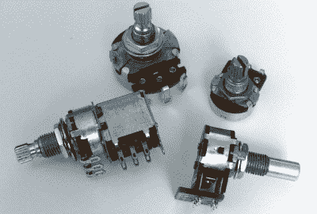](https://hackaday.com/wp-content/uploads/2020/10/pot-selection_bright.png)

混合盆是一种特殊的“一个外壳两个盆”，是音频放大器中的平衡控制，通常在中间位置有一个小凹口。理论上，您可以使用它们将两个拾音器混合在一起，而不是为它们提供两个单独的音量控制。然而，至少对于被动控制来说，这是一个听起来不错的想法，而不是什么有实用价值的东西。实际上，您可能既听不到纯粹的琴马拾音，也听不到颈部拾音，因为另一个声音总是略微渗入信号中，更糟糕的是，您可能会在中间位置出现明显的音量下降。(虽然也有可能我只是修补了自己的线路，或者应该使用不同的混合锅。)

请注意，还有另一种“混合控制电位计”布线，也是关于将拾音器混合在一起，但源于电视广播的早期，与刚才提到的混合电位计无关。不过，这个其实很酷，所以我一会儿再谈。

## 切换它

[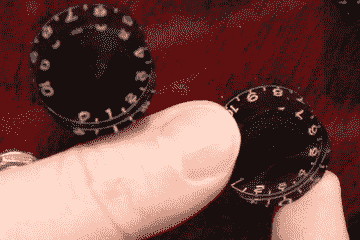](https://hackaday.com/wp-content/uploads/2020/09/push-pull-pot.gif)

Push-pull pot in action

常规电位计的一个有趣变化是安装了额外 DPDT 开关的*推挽式电位计*。开关本身与电位计完全分离，但开关机构是通过拉出和推入电位计轴来激活的。一个类似的品种是一个断路开关罐，它集成了一个瞬时 SPST 按钮开关，旨在通过将信号短路到地来暂时切断信号，以产生一种独特的效果(例如 Buckethead 过度使用)。

在破解吉他时，开关是一项非常有价值的资产，因为它们允许我们根据需要启用和禁用单独的修改，与固定线路相比，增加了吉他的整体音调变化，并开辟了更多选项，而单靠电位计无法让我们走得更远。比如，如果您可以同时使用 22 nF 或 47 nF 电容来进行音调控制，并根据自己的喜好在两者之间切换，为什么还要选择使用这两个电容呢？或者说，你在音盆上找到了一个惊人的最佳位置，而不是每次都乏味地试图再次找到它，而是使用一个开关，用一个确切值的固定电阻绕过音盆。为什么不完全绕过控制，获得原始拾音信号？更不用说我们可以在这里用皮卡做什么了，但我们不要超越自己。

在这里使用推拉式电位计的好处是，您不需要在吉他主体上钻任何额外的孔来添加开关，而只需用它替换现有的一个电位计，并保持所有原始控制不变。如果你愿意完全牺牲音盆，你可以用一个匹配尺寸的旋转开关更进一步，而不是在两个选项之间切换，从控制腔提供的最大开关的众多选项中选择一个。例如，B.B. King 在他的 Gibson ES-355 上有五个单独的过滤器(以及第六个旁路选项)可供选择，Gibson 现在将这种过滤器作为 *Varitone* 电路进行营销。

当然，如果你不介意对吉他主体做一些更重的修改，标准迷你拨动开关总是一个解决方案，如果你没有其他选择的话。另一方面，还有一个你可能不会想到的开关:拾音器选择开关。现在，是的，取消激活不同拾音器组合的选项可能看起来有点违反直觉，但让我回到我之前提到的 Telecaster 混合控制。

## 超出音调和音量控制的 Pots

早在 1950 年，芬德发布了他们的第一把电吉他 *Esquire* ，以单桥拾音器为特色。尽管只有一个皮卡，它仍然配备了一个 3 路选择器开关。那么这个开关当时做了什么，因为它显然没有在拾音器之间切换？它本质上选择了音调控制行为。

虽然音量控制始终处于活跃状态，但音调控制要么处于活跃状态，完全被旁路，要么被产生低沉低音的固定低通滤波器所取代。请注意，低音提琴几乎是当时唯一可用于演奏低音线的弦乐器，这是一件又大又笨重的家具，不能直接插入放大器。因此，将吉他的音色变暗到极致是一个不错的选择，直到一年后电贝司成为一种东西。

在 Esquire 推出后不久，第一台电视转播机发布了(当时的名称是 *Broadcaster* ),看起来就像 Esquire，只是增加了一个颈部拾音器。在这一点上，3 路开关可以被改变为我们今天所知道的拾音器选择器，但 Leo Fender 希望保留那个低沉的低音选项，所以开关位置保持不变(除了它现在使用更温暖、更暗的自然颈部拾音器)。然而，其他两个位置现在可以在带有常规音调控制的琴颈拾音器或带有音调控制的琴马拾音器(我们开始了)之间选择，音调控制变成了前面提到的混合控制。它所做的是逐渐将颈部拾音信号融合到琴马拾音信号中，从 0 处的仅琴马位置过渡到 10 处的“中间位置”，以及这两者之间的任何位置，从而创建一些独特的组合。

今天的电视节目主持人很少回头看那个混合控制——大多数播放器从来都不太喜欢那个低沉的低音，所以随着 3 路开关最终变成了一个常规的拾音器选择器，混合控制不再有实际的需要。不过 Stratocasters 可能偶尔会用，也有道理。如果我们记得，一个 Stratocaster 有三个单线圈，一个 5 路开关，不允许所有可能的组合，以及一个有点奇怪的音调控制设置，两个拾音器有单独的音盆，第三个没有。改变一个音调旋钮来控制整体音调，并将另一个旋钮变成混合控制，这将使您获得否则不可能实现的桥颈或三者组合(当然，除非您使用开关)，以及部分接合的拾音器的良好混合。

[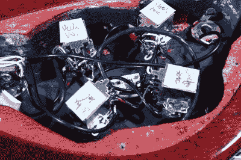](https://hackaday.com/wp-content/uploads/2020/09/wiring-inside-sg.jpg)

Still not rocket science, even with push-pull pots all the way down (more on that next time)

同样，下一次我将更深入地讨论拾音器布线，但同时先睹为快，对同一概念的一个有趣理解是，有一个 humbucker 可以暴露两个线圈的电线(这允许您将其用作两个单独的单线圈拾音器)，并对这两个线圈应用混合控制。因此，你可以将单个拾音器从单个线圈混合成一个完整的亨巴克，而不是将两个独立的拾音器混合在一起。事实上，Fender Jaguar HH(即 double humbucker)型号就配备了这种布线，无论如何，这都是一种有趣的布线工具。

## 我们才刚刚开始

如此图所示，电位计不仅可用于控制音量和音调，拾音器选择开关也不仅可用于选择拾音器，因此，还有其他选择来选择拾音器。除此之外，如何使用一些迷你拨动开关来单独启用和禁用拾音器(像[布莱恩·梅的*红色特别*例如](https://hackaday.com/2017/06/13/the-red-special-brian-mays-handmade-guitar/))并将拾音器选择开关变成变调风格的滤波器选择器？

既然如此，为什么不干脆放弃低通滤波器，代之以高通滤波器呢？我已经提到高音泄放电路作为一种选择，但常规的音调控制本身可以只是并联电容器，而不是通常的串联布线。因此，不是在转动音调旋钮时抑制高音，而是现在将被切断的低音。如果你有两个音频控制电位计(或者一个备用)，为什么不同时拥有两个选项呢？或者放一个电感，用带阻滤波器去掉中间部分，怎么样？正如我上次提到的，数学公式不会让你走得太远，所以你可以做一些实验，把一些东西(在一定程度上)随机扔在一起，看看会发生什么。

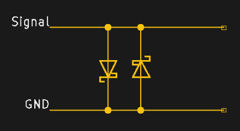

Schottky diodes for some crunch

更进一步说:二极管！在信号和地之间以相反的方向连接两个，可以通过抵消超过正向电压的信号，给你的声音增加一些美妙的嘎吱声。当然，这不会取代实际效果踏板，它仍然只是无源电子设备，像这样的修改会让你失去一些信号，但它仍然是一件有趣的事情。请记住，虽然平均拾音器只产生几百毫伏的信号，所以常规硅二极管的正向压降通常太高，使用锗或肖特基二极管会更成功。欲了解更多信息，以及如何使用它进入完全整流模式(而不是花费 30 多美元购买商业版)，[查看 Joe Beau 关于这个主题的指南](https://www.instructables.com/id/Passive-Guitar-Overdrive-Black-Ice/)。

这包括了我们在吉他中发现的各种电位计，以及我们如何使用它们和开关来调整音量和音调控制。这个主题当然没有完全穷尽，但我希望这给了你一些关于电吉他接线实验的新想法，最重要的是，当谈到这一点时，让你完全跳出框框思考。只要你不使用外部电源，也不要直接焊接拾音器线圈，你和你的吉他就不会有问题。

下一次，我们将带着同样的精神回到拾音器上，忘记我所说的关于“亨巴克是两个串联的单线圈”和“中间开关位置将两个拾音器并联在一起”的一切。