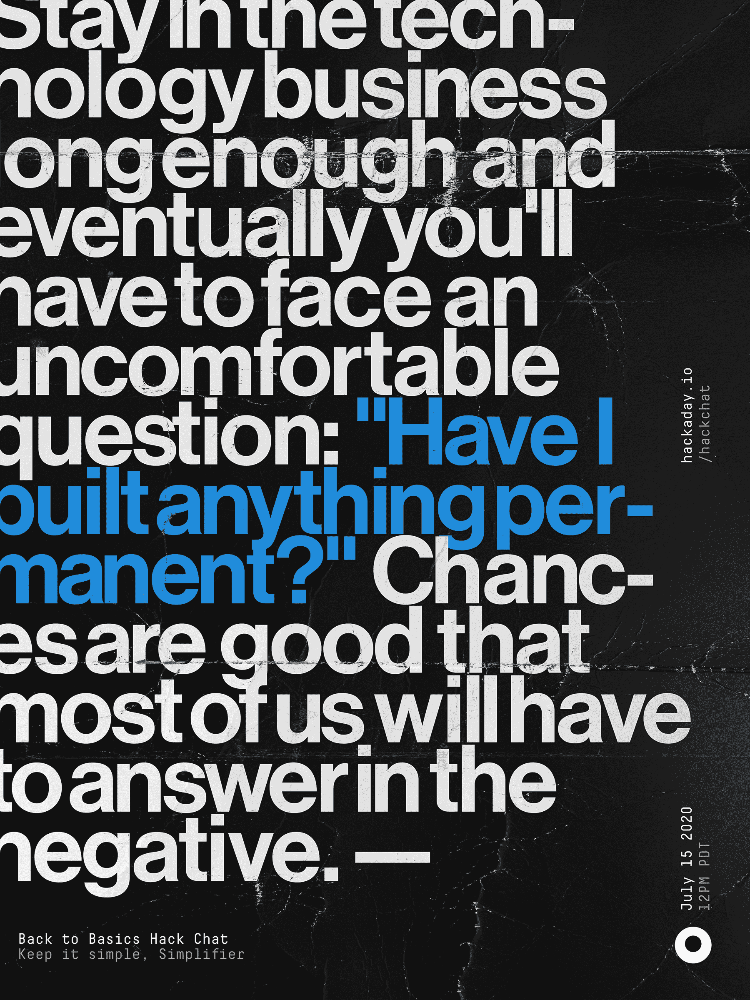

# 回到基础黑客聊天

> 原文：<https://hackaday.com/2020/07/13/back-to-basics-hack-chat/>

太平洋时间 7 月 15 日星期三中午，加入我们与[简化者](https://hackaday.io/hacker/870234-simplifier)的[回归基础黑客聊天](https://hackaday.io/event/173282-back-to-basics-hack-chat)！

在科技行业待久了，最终你会不得不面对一个令人不安的问题:“我有没有建立任何永久的东西？”很有可能我们大多数人将不得不做出否定的回答。对于我们在项目中投入的所有 flash 和 zazzle，以及我们试图应用到系统中的所有技术，所有这些都是建立在非常脆弱的硅基础上的，这种基础将在十年内过时，由一种语言中纤细的代码线结合在一起，这种语言在一年内可能会流行，也可能不会流行，甚至不会真正存在于任何比硬盘上的一系列磁畴更有形的东西中。

意识到你没有建造任何永久的东西，这相当于工程师的中年危机，对我们许多人来说，这引发了寻找我们创造力的出口，我们可以用它来制造比我们更持久的东西。一位只被称为“简化者”的黑客，将他对有意义表达的探索变成了通过让技术更易接近和理解来让技术变得更好的探索。他的网站本身就是简约的典范，记录了他对有用材料和方法的探索，以及他运用这些材料和方法的努力。他制造了从[自制真空管](https://hackaday.com/2016/05/04/home-brew-vacuum-tubes-are-easier-than-you-think/)到 [DIY 太阳能电池](https://hackaday.com/2018/01/26/home-brew-solar-cells-for-the-chemically-curious/)的各种产品，最近还凭借他的[碳棒麦克风](https://hackaday.com/2020/04/18/wood-and-carbon-rods-used-for-this-handsome-and-effective-microphone/)和[磁致伸缩耳机](https://hackaday.com/2020/05/21/brass-and-nickel-work-together-in-this-magnetostrictive-earphone/)涉足电信技术。

在这次聊天中，Simplifier 将回答你关于如何让科技时钟倒转来告诉我们我们要去哪里的问题。加入我们，探索构建我们习以为常的基础设施需要什么，并找出是否有一种简单的生活方式，同时享受科技丰富的生活。

 我们的黑客聊天是 [Hackaday.io 黑客聊天群发消息](https://hackaday.io/messages/room/2369)中的社区直播活动。本周，我们将于太平洋时间 7 月 15 日星期三中午 12:00 坐下来讨论。如果时区让你失望，我们有[一个方便的时区转换器](https://www.timeanddate.com/countdown/generic?iso=20200708T12&p0=224&msg=Linux+in+the+Machine+Shop+Hack+Chat&font=cursive)。

点击右边的那个发言气泡，你会被直接带到 Hackaday.io 上的黑客聊天群，不用等到周三；随时加入，你可以看到社区在谈论什么。

