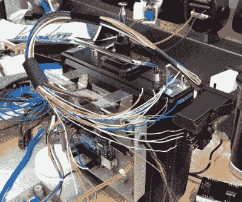

# 回到未来道具可以告诉它什么时候达到 88 英里每小时

> 原文：<https://hackaday.com/2022/08/17/back-to-the-future-prop-can-tell-when-it-hits-88-mph/>

显然，从《回到未来》到《T1》电影中最具代表性的虚拟硬件是多克·布朗的德罗林 DMC-12 时间机器。但是我们不得不同意 *CodeMakesItGo* 的【Jason Altice】的说法，第二令人难忘的小玩意是用于远程控制 DeLorean 的改进型双叶遥控器。现在，[多亏了他详细的建造指南](https://hackaday.io/project/186545-back-to-the-future-remote-control-build)，你可以建造你自己版本的时间机器控制器——包括工作速度读数。

现在要澄清的是，[杰森]并没有声称他的构建是特别准确的屏幕。事实证明，电影中用于道具的实际发射器 Futaba PCM FP-T8SGA-P 已经变得很难找到，而且很贵。但他认为，对于不经意的观察者来说，大多数老式双叶发射器在视觉上足够接近。更重要的部分是重现布朗博士在他的版本上安装的额外装置。

All but four of the display wires are fake.

为此，[Jason]能够采购一些 screen accurate 硬件来装备他的发射机，例如 Unibox 140 project box 和金属 9 V 电池夹。其他组件，如发光的 Molex 1820 开关，更难追踪。幸运的是，我们生活在廉价桌面 3D 打印机的时代，他能够毫不费力地打印出令人印象深刻的精确复制品。

当然，突出的特点是七段 LED 速度指示器。每个数字是一个独立的 25 毫米(1 英寸)SC10-21SRWA 显示器，它们与 TM1650 控制器一起安装在定制的 PCB 上。Unibox 140 内部的 Arduino Uno 驱动显示器，并使用远程 Reyax LoRa RYLR998 模块从汽车中的发射器接收速度数据。

[Jason]建造了一个配备 GPS 的“速度盒”,与电影版本非常相似，尽管有三个功能数字，而原始道具中只有两个。在内部，它使用了与发射器相同的 LED 显示屏、LoRa 模块和 Arduino Uno。我们喜欢让链路两端的硬件或多或少保持相同的方法，让事情变得简单而美好。

现在你当然不需要用一台 DeLorean 时光机来测试你完成的遥控器，但是我们很感激[Jason]不辞辛苦租了一台时光机来展示他的作品。最终的产品看起来很棒，[和复制的时间电路](https://hackaday.com/2015/10/24/back-to-the-future-alarm-clock-is-as-real-as-it-gets/)一起排在我们想要上架的 *BttF* 道具列表的前面。

 [https://www.youtube.com/embed/2WVG1N7rIgk?version=3&rel=1&showsearch=0&showinfo=1&iv_load_policy=1&fs=1&hl=en-US&autohide=2&wmode=transparent](https://www.youtube.com/embed/2WVG1N7rIgk?version=3&rel=1&showsearch=0&showinfo=1&iv_load_policy=1&fs=1&hl=en-US&autohide=2&wmode=transparent)

