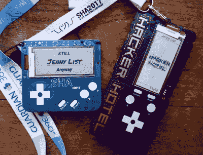
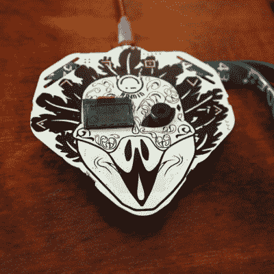
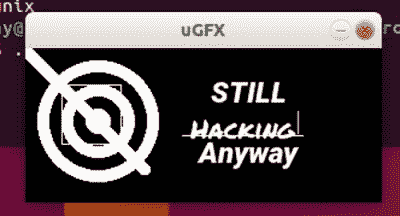

# 徽章。团队:徽章获得平台

> 原文：<https://hackaday.com/2019/02/20/badge-team-badges-get-a-platform/>

电子会议徽章现在已经成为我们社区命脉的一个公认部分，现在即使是最简单的活动也配有一台功能齐全的计算机，作为挂绳上引人注目的 PCB。活动时间表和应用程序都在上面，更复杂的应用程序有自己的应用程序库和支持开发社区。

麻烦的是，这些徽章经常无法实现他们的承诺，这背后的一个原因是徽章团队在现代徽章的固件方面面临的巨大任务。来自荷兰的一些有趣的消息可能会减少一些固件灾难， [badge.team](https://badge.team/) 是一个新推出的项目，它提供了一个现成的 badge 固件，承诺提供稳定性和长期支持。如果您正在使用 ESP32 制作徽章，甚至是一次性设备，这是一个值得一试的项目。

## 活动徽章团队的工作并不轻松

这种稳定的官方徽章流和来自#BadgeLife 社区的非官方徽章的蓬勃发展给了我们惊人的多样性，但代价是巨大的重复努力和大量承诺的徽章功能从未在最终项目中发挥作用。有大量的故事以会议徽章为特色，在非功能状态下交付给活动参与者，甚至有少数从未见过有效的固件更新。当倒计时开始的时候，制作一个徽章和在徽章上运行的软件是一项非同寻常的工作，即使是最有能力的团队也无法完成。

The SHA2017 and Hacker Hotel 2019 badges side by side.

如果您能指出问题的根源，可能是因为有太多完全不同的徽章平台，每个平台都使用不同的架构，并拥有自己的软件堆栈。减少了重用来自其他徽章的代码或硬件设计的可能性，增加了工作量，同时消除了从其他团队的错误修复工作中受益的可能性。

2017 年，[荷兰的 SHA 黑客营](https://hackaday.com/2017/08/25/shacamp-2017-a-personal-review/)推出了[一个特别成功的徽章](https://hackaday.com/2017/08/14/hands-on-with-the-shacamp-2017-badge/)，其核心是一个 ESP32 模块。它以其电子墨水显示屏和触摸按钮而闻名，但它也配备了工作固件和易于开发的 MicroPython 应用商店，它被称为孵化器，其中的应用被描述为鸡蛋。事实证明，这足以抵御来自营地参与者的恶意软件企图，并继续为各种可能的目的提供大量的鸡蛋。在集中营之后，许多剩余的和修复过的 SHA 徽章最终出现在欧洲黑客空间，他们在那里找到了配备[显示器的微控制器](https://revspace.nl/Wiki_infotag)(荷兰语，[谷歌翻译](https://translate.google.co.uk/translate?sl=auto&tl=en&u=https%3A%2F%2Frevspace.nl%2FWiki_infotag))和其他平凡的任务，固件也因此得到了持续的开发。

The Disobey 2019 badge has completely different display and interface, but shares the badge.team firmware.

2019 年，创造 SHA 徽章的同一个团队又参与了两项活动。来自荷兰的[黑客酒店](https://hackerhotel.nl/)营地徽章完全是他们的作品，而来自芬兰的[违抗 2019](https://disobey.fi/) 徽章则是使用他们的固件独立开发的徽章。这两个徽章带来了一个消息，即 SHA 固件已经发展成为一个稳定的徽章生态系统，旨在实现与所有 ESP32 平台的最终兼容性，而不仅仅是与特定类型的硬件或外围设备(如 e-ink 屏幕)的兼容性，并且它已经成为一个独立的项目。 [badge.team](https://badge.team/) 项目提供了现成的固件和孵化场，以及不断增长的现成蛋库、简单的 MicroPython 开发和长期的事后支持。一举，一个事件徽章团队可以专注于使他们的徽章硬件真棒，并停止担心其软件。

这是我们在 Hackaday 发现的一条令人兴奋的消息，原因有几个。首先，它大大降低了大大小小的活动的门槛，以生产一个廉价而强大的带有机载 WiFi 的徽章，然后它为非官方徽章创作者开辟了一个功能齐全的平台。突然，一个#BadgeLife 产品可以轻松地拥有应用程序(或彩蛋！)，而且那有极其令人兴奋的潜力。

## 徽章平台可以做的不仅仅是徽章

这个消息最令人兴奋的方面来自徽章之外的世界。他们所创造的是一个通用且易于开发的平台，具有稳定的用户界面，可用于任何应用程序。最低的硬件平台是一个裸露的 ESP32 模块，它可以使用软件完成普通的微控制器任务，但典型的配置可能有一个显示器和几个按钮。不难相信，它可能会成为一个社区发展的 PDA 的基础，或者有一个合适的连接模块，一部智能手机。以前可能需要更强大的单板计算机和全功能操作系统的设备突然变得可能只使用非常便宜的通用模块，从我们的角度来看，这是一个巨大的故事。

当然，这也不是完全没有弊端。ESP32 可能不符合每个人的口味，并且该平台的功能受到其硬件的限制。但在目前可用的微控制器中，它提供了处理能力和低价格以及板载无线功能的合理组合，因此它绝不是最糟糕的选择。

然后就是那些 app 对 MicroPython 的选择。这使得开发变得容易，但是解释型高级语言永远不会是最快的。badge.team 的人可能在这方面有一些想法，但是在与他们的非正式讨论中，他们提到了围绕动态链接来自 eggs 的编译代码库的想法，这导致了受欢迎的性能。

到目前为止，badge.team 的官方支持的 ESP32 平台是 SHA 和 Hacker Hotel badges 以及 undeady badge 和一个 ESP32 开发板。然而，他们正在尽可能快地包括尽可能多的其他 ESP32 板，最终目标是支持所有基于 ESP32 的设备。在 Hacker Hotel camp 与他们聊天时，他们考虑了将其扩展到其他架构的可能性，随着 ESP32 最终被取代，这给了它一个在未来芯片上进化的机会。

## 交给你:开发徽章的许多方法。团队彩蛋

A demo app running in the SHA badge emulator.

通过夏令营参与者将数千枚 SHA2017 徽章带回家，以及通过营后剩余电路板的分发，这是一个你们许多人已经拥有开发工具的平台。还有一个针对 Linux 发行版和 MacOS 的模拟器，但不是针对 Windows 操作系统的。支持通用 ESP32 模块的可能性将开发人员的机会扩展到几乎任何配备处理器的设备，事实上，我们希望看到 2017 年阿沙徽章克隆使用通用模块并运行官方固件[已经完成](https://hackaday.com/2017/08/19/make-a-badge-when-there-is-no-badge-yet/)。这些多种选择意味着，如果你想尝试徽章，就不必等待正式徽章落入你的手中。团队发展之水，你可以毫不费力地一试身手。

在撰写本文期间，我们回顾了我们的 SHA2017 徽章报道，其中最吸引我们眼球的是上一段中提到的自制徽章的文章结尾部分:

> *使用带有精心设计的外围设备和可靠固件的 ESP32 意味着这种设计很可能成为未来一些徽章的基础。[Artdanion]已经证明了克隆是多么简单，我们想大胆地预测，我们将在未来的活动中看到这个平台的更多发展。*

随着黑客酒店的到来，以及随后 badge.team 的推出，我们的预测似乎是准确的，我们非常期待该平台未来的发展方向。