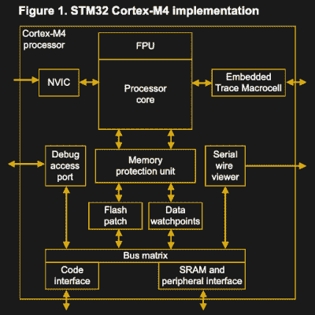
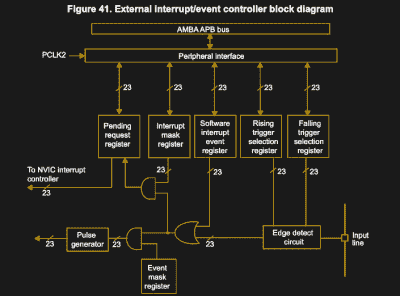
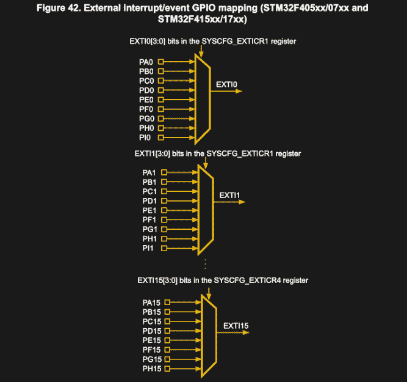
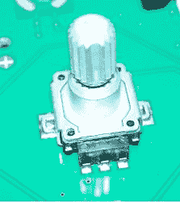
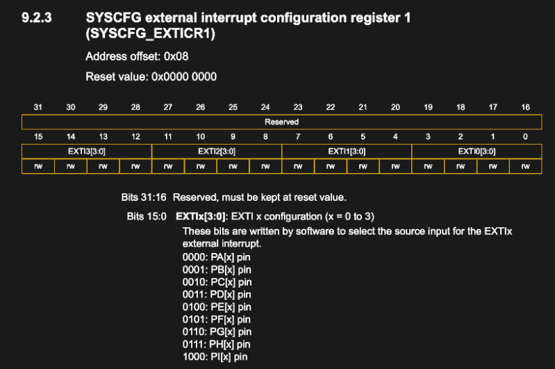

# 裸机 STM32:请注意中断事件

> 原文：<https://hackaday.com/2021/03/26/bare-metal-stm32-please-mind-the-interrupt-event/>

干扰不仅仅是我们日常生活中的常见现象。它们对于让计算机系统正常工作也至关重要，因为它们允许系统立即对事件做出响应。虽然在台式计算机上，这些中断没有以前那么突出，当时我们仍然必须使用 ISA 卡上的拨动开关手动设置新硬件的 [IRQ](https://en.wikipedia.org/wiki/Interrupt_request_(PC_architecture)) ，但如果使用得当，IRQ 和 DMA(直接内存访问)传输仍然使系统对用户来说显得敏捷。

在像 STM32 这样的微控制器系统上，中断甚至更重要，因为这是允许 MCU 以[硬实时](https://en.wikipedia.org/wiki/Real-time_computing)响应(外部)事件的原因。尤其是在工业过程或现代汽车中，每当处理器轮询寄存器时，有许多事件根本无法处理。除此之外，中断以及中断处理程序提供了一种方便的方式来响应外部和内部事件。

在本文中，我们将通过一个涉及[旋转增量编码器](https://en.wikipedia.org/wiki/Rotary_encoder)的实际例子，来看看如何在 GPIO 输入上设置中断处理程序。

## 需要一些组件

[](https://hackaday.com/wp-content/uploads/2021/03/stm32_m4_implementation_diagram-themed.png)

Diagram of the Cortex-M4 core in the STM32F4 family of MCUs. (ST PM0214, section 1.3).

STM32 MCUs 上的中断有两种类型:内部和外部。两种类型的中断都使用 Cortex-M 内核中相同的内核外设:嵌套向量中断控制器或 NVIC。根据具体的 Cortex-M 内核，该外设可以支持数百个中断，具有多个优先级。

然而，这些中断并不都是可自由分配的。如果我们查看 STM 32 f 4x x MCU 的参考手册(特别是 [RM0090](https://www.st.com/resource/en/reference_manual/DM00031020-.pdf) ，第 12 节)，我们可以看到，对于 NVIC 中断线路，我们将 Cortex-M4 中 NVIC 内核外设的多达 250 个可屏蔽中断通道减少到 82 到 91 个。

这些中断通道都有特定的用途，如向量表(如 RM0090，表 62)所定义，该表有 90 多个条目。这些中断中的一些是为处理器、存储器或数据总线事件(例如故障)保留的，而开发者通常最感兴趣的是那些与非核心外围设备相关的中断。几乎任何外设——无论是定时器、USART、DMA 通道、SPI 还是 I2C 总线——都至少有一个与之相关的中断。

[](https://hackaday.com/wp-content/uploads/2021/03/stm32f4_exti_block_diagram-themed.png)

EXTI peripheral block diagram (RM0090, 12.2.5).

EXTI(外部中断/事件控制器)外设也是如此。在 STM32F1、F4 和 F7 STM32 系列上，EXTI 外设有 7 个相关中断，F0 上有 3 个(STM32F04x 等)。对于第一组，这些被描述为:

*   外部行 0
*   外部线 1
*   外部线 2
*   外部线 3
*   外部线路 4
*   外部第 5 行到第 9 行
*   扩展第 10 行到第 15 行

可以看到，EXTI 外设上有 16 条线路可以与 GPIO 引脚一起使用，但其中一些线路被组合在一起，需要在中断处理程序中做更多的工作来确定哪条线路被触发。线路本身使用多路复用器连接到 GPIO 引脚，如下图所示:

[](https://hackaday.com/wp-content/uploads/2021/03/stm32f4_exti_gpio_mapping-themed.png)

STM32F4 EXTI to GPIO peripheral mapping. (RM0090, 12.2.5)

这意味着在 F1 至 F7 系列中，GPIO 引脚 0 至 4 获得一个专用中断，并与其他 GPIO 外设共享。每个 GPIO 外设上剩余的 11 个引脚被归入剩余的两个中断中。在 STMF0xx 系列中，第 0 & 1 行、第 2 & 3 行和第 4-15 行共分为三个中断。

其余的 EXTI 线路连接到 RTC、以太网和 USB 等外设，用于唤醒和报警事件等功能。

## 演示时间:增量编码器和中断

[](https://hackaday.com/wp-content/uploads/2021/02/Rot_enc.jpg)

Mechanical rotary incremental encoder mounted on a PCB.

[机械旋转增量编码器](https://en.wikipedia.org/wiki/Incremental_encoder)的工作方式是它们交替地在单个输入引脚和 A & B 输出引脚之间产生接触。结果是一个脉冲输出，从中可以推断出旋转方向和速度。它们通常用在控制面板中，其中额外的两个引脚提供按钮功能。

然而，为了正确检测这些脉冲，我们在 MCU 中运行的代码必须知道每个脉冲。丢失的脉冲会对用户产生明显的影响，例如系统反应迟缓，甚至方向改变无法立即被察觉。

对于本例，我们将使用标准旋转编码器，将其输入引脚接地，并将 A & B 引脚连接到 GPIO 输入。这可以是任何端口上 GPIO 引脚的任何组合，只要我们记住不要与引脚编号重叠:如果我们对信号 A 使用 PB0，我们就不能对信号 b 使用 PA0 或 PC0。但是我们可以使用 PB1、PB2 等。

## 设置外部中断

在 GPIO 引脚上设置外部中断的步骤可以总结如下:

*   启用`SYSCFG`(F1 除外)。
*   启用`RCC`中的`EXTI`(F1 上除外)。
*   设置引脚的`EXTI_IMR`寄存器，使线路成为中断。
*   为下降和/或上升沿触发的引脚设置`EXTI_FTSR` & `EXTI_RTSR`寄存器。
*   设置`NVIC`中断优先级。
*   在`NVIC`寄存器中启用中断。

例如，对于 STM32F4 系列 MCU，我们将首先使能 SYSCFG(系统配置控制器)外设。

```

RCC->APB2ENR |= (1 << RCC_APB2ENR_SYSCFGCOMPEN_Pos);

```

`SYSCFG`外设管理`GPIO`外设的外部中断线路，即`GPIO`外设和`EXTI`线路之间的映射。比方说，如果我们想使用 PB0 和 PB4 作为编码器 A & B 信号的输入引脚，我们必须将相关线路设置到适当的`GPIO`外设。对于端口 B，这将在`SYSCFG_EXTICR1`和`SYSCFG_EXTICR2`中完成，因为每个 32 位寄存器总共覆盖四条`EXTI`线:

[](https://hackaday.com/wp-content/uploads/2021/03/stm32f4_syscfg_exticr1-themed.png)

SYSCFG_EXTICR1 register for STM32F4 MCUs. (RM0090, 9.2.3)

虽然乍一看有些混乱，但设置这些寄存器相对简单。例如，对于 PB0:

```

SYSCFG->EXTICR[0] |= (((uint32_t) 1) << 4);

```

由于寄存器中每一行的部分都是四位，我们将适当的端口值左移到所需的位置。对于 PB4，我们做同样的事情，但是在第二个寄存器中，没有左移，因为该寄存器从第 4 行开始。

至此，我们差不多已经准备好配置 EXTI & NVIC 寄存器了。首先，我们需要启用我们打算使用的 GPIO 外设，并在上拉配置中将引脚设置为输入模式，如 PB0:

```

RCC->AHB1ENR |= (1 << RCC_AHBENR_GPIOBEN_Pos); 
GPIOB->MODER &= ~(0x3);
GPIOB->PUPDR &= ~(0x3);
GPIOB-&>PUPDR |= (0x1);

```

假设我们要将 PB0 设置为在下降沿触发，我们必须首先使能线路 0，然后配置触发寄存器:

```

pin = 0;
EXTI->IMR |= (1 << pin); 
EXTI->RTSR &= ~(1 << pin); 
EXTI->FTSR |= (1 << pin);

```

所有这些寄存器都非常简单，每一行都有自己的位。

完成后，我们现在只需启用中断，并确保我们的中断处理程序就位。首先是 NVIC，通过标准 CMSIS 函数最容易完成，如 PB0，中断优先级为 0(最高):

```

NVIC_SetPriority(EXTI0_IRQn, 0);
NVIC_EnableIRQ(EXTI0_IRQn);

```

中断处理程序(ISR)必须与启动时载入 RAM 的向量表中定义的功能签名相匹配。使用标准 ST 设备头时，这些头具有以下签名:

```

void EXTI0_IRQHandler(void) {
// ...
}

```

使用 C++时，请注意 ISR 绝对需要有一个 C 风格的函数符号(即不要乱用名字)。要么将整个 ISR 封装在一个`extern "C" {}`块中，要么转发 ISR 的声明来解决这个问题。

## 包扎

所有这些都实现了，编码器连接到正确的引脚，我们应该看到我们实现的两个中断处理程序在我们旋转编码器时被触发。本文中的大部分代码基于来自 [Nodate](https://github.com/MayaPosch/Nodate) 项目的[‘多事的’例子](https://github.com/MayaPosch/Nodate/tree/master/examples/stm32/eventful)。该示例使用了来自该框架的[中断类](https://github.com/MayaPosch/Nodate/blob/master/arch/stm32/cpp/core/src/interrupts.cpp)中实现的 API。

虽然从表面上看有些令人望而生畏，但是一旦对组件、它们的功能以及各个寄存器的设置有了基本的了解，使用中断甚至像本文中描述的那样手动设置它们应该不会感到太可怕。

使用 NVIC 和 EXTI 外设检测外部输入当然只是 STM32 平台上中断的一个例子。如前所述，即使在 Cortex-M 内核之外，它们也有无数的用途。它们可以用来将 MCU 从睡眠状态唤醒，或者让定时器外设定期触发中断，以便以高度确定性执行特定功能，而不是通过检查循环中的变量或类似方式。

我希望这篇文章为 STM32 中断的进一步探索提供了一个概述和坚实的基础。