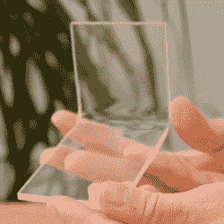

# 基本丙烯酸弯曲，不需要特殊工具

> 原文：<https://hackaday.com/2019/09/16/basic-acrylic-bending-no-special-tools-needed/>

丙烯酸板相对便宜、漂亮，并且可以非常有效地加热成型。有专门用于切割、加热和弯曲丙烯酸树脂的刀片和工具，但是【Marija】表明，即使没有它们[丙烯酸树脂也可以通过一点小心和耐心](https://creativityhero.com/how-to/how-to-bend-acrylic-and-make-amazing-shapes/)来切割和弯曲。

 亚克力板材易碎，容易开裂，但钢锯是手工切割的好方法。切割后，[Marija]使用一个小型便携式煤气炉以最低设置提供温和的热量，直到丙烯酸变软，然后可以使用常见的商店和家庭用品形成不同的形状。这是一个需要耐心和练习的过程，所以她分享了一些有用的技巧:

*   切割后，但在加热成型前，去除保护膜。否则薄膜将更难去除。
*   加热过度会产生气泡，破坏丙烯酸树脂。
*   加热不均匀将导致弯曲不良，或“热点”,从而产生上述气泡。
*   这种加热方法自然软化了很大一部分区域，但是仍然可以通过使用木模板并在移动之前让丙烯酸冷却来获得直的和平的弯曲。

[Marija]使用这种加热和弯曲丙烯酸的方法完成了她早期的[灯项目，我们在过去的](https://hackaday.com/2018/03/20/curved-wood-led-lamp-needs-no-fancy-tools/)中展示过。丙烯酸可能会激光切割得很漂亮，可能会有便宜的工具来加热和弯曲它，但拥有一些不需要任何特殊东西的可靠技术总是好的。

 [https://www.youtube.com/embed/s5nP7MDf63Y?version=3&rel=1&showsearch=0&showinfo=1&iv_load_policy=1&fs=1&hl=en-US&autohide=2&wmode=transparent](https://www.youtube.com/embed/s5nP7MDf63Y?version=3&rel=1&showsearch=0&showinfo=1&iv_load_policy=1&fs=1&hl=en-US&autohide=2&wmode=transparent)

