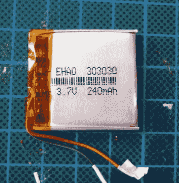

# 电池交换保持珊莎剪辑+突突作响

> 原文：<https://hackaday.com/2018/11/21/battery-swap-keeps-sansa-clip-chugging/>

你没有意识到仍然有一群顽固的人带着专用的 MP3 播放器到处跑，这是可以原谅的。虽然它们在大约十年前风靡一时，但大多数消费者已经转向使用他们方便的时髦袖珍超级计算机来播放音乐。当然，还要控制他们个人生活和财务的方方面面。虽然那完全是另一个故事。

 但是正如【Conno Brooks】向我们解释的那样，有一个相当大的开源狂热者群体更喜欢在运行 Rockbox 固件的设备上存储他们的 jams。唯一的问题是，一些令人满意的 Rockbox 兼容播放器来自专注播放器的黄金时代，而且不再年轻。在最近的一篇博客文章中，他简要回顾了他在 2009 年发布的特别受欢迎的播放器 Sansa Clip+ 中安装新电池的最终成功尝试。

根据[Conno]的说法，这一程序存在一些问题，使其无法广泛传播。首先，Sansa Clip+非常小，不容易拆卸而不损坏。更糟糕的是，小巧的 30 毫米 x 36 毫米 x 3 毫米 OEM 电池实际上是不含钛的。但具有讽刺意味的是，他能够找到一个更小的电池，看起来应该可以工作，假设他可以把它连接起来。

Clip+上的 OEM 电池使用三根电线，[Conno]推测这是一些热保护系统的一部分。他首先试图将电路板从原来的废电池上取下，并将其移植到现代电池上，但肯定有什么东西跳闸了，因为产生的 Franken-pack 没有输出任何电压。在他的第二次尝试中，他只是忽略了第三根电线，幸运的是，Clip+似乎没有抱怨，并按预期启动。

[Conno]表示，安装新电池组和正确关闭 Clip+需要一些小心的弯曲，新电池的低容量在一定程度上降低了设备的运行时间。但如果这意味着又要让老大哥远离你的数字媒体习惯几年，他认为这是一笔值得的交易。

在这一点上，我们实际上已经看到了一些针对 Sansa Clip 系列播放器的黑客攻击，这要感谢它作为开源宠儿的第二次重生；从[略显老套的电池更换](https://hackaday.com/2012/09/13/ugly-upgrade-keeps-the-tunes-playing-longer/)，到[增加一个接入选项](https://hackaday.com/2011/09/20/adding-an-external-audio-input-to-the-sansa-clip/)。当你厌倦了听汉森的唱片目录，你甚至可以[启动可能是世界上最糟糕的毁灭之港](https://hackaday.com/2016/12/30/sansa-mp3-player-runs-doom-unplayably/)。