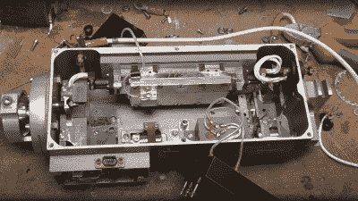

# 龙卷风喷气式战斗机激光装置的漂亮工程

> 原文：<https://hackaday.com/2022/03/13/beautiful-engineering-in-this-laser-unit-from-a-tornado-jet-fighter/>

那些来自英国的人可能非常熟悉皇家空军的龙卷风战斗机，它被设计用于理论上的核战争，并为这个国家服务了 40 多年。这个飞行死亡陷阱(作者几年前见过的一名皇家空军现役战斗机飞行员的话)是一个极其复杂的机器，拥有当时最先进的技术，但显然有一点习惯，偶尔在空中爆炸起火！

无论如何，最后一个舰队现在已经退役很久了，里面的一些技术开始渗透到公共领域，因为有些部件可以在易贝买到。*mikeselectricsuff*的【Mike】一直在[挖掘龙卷风激光头单元](https://www.youtube.com/watch?v=rgJFJTSohdo)内部，这是轰炸机激光制导导弹子系统的一部分，好家伙，这是一次多么机械和电子的旅程啊！

Pulse-mode optically pumped YAG laser

这个单元很大程度上是愚蠢的，所有聪明的东西都发生在航空电子设备舱的深处，但仍然有很多旧的高端技术展出。使用氙放电管泵浦的钇铝石榴石(YAG)激光器，以脉冲模式工作，该装置的工作是用红外光斑照射地面目标，随后发射的导弹将瞄准该目标。

激光头是为地面跟踪设计的，当飞机高速飞行时，激光头有三个力矩度，可能与飞机运动同步，以保持光束稳定。光学组件非常有趣，氙管和 YAG 棒在金属外壳内的液体冷却池中游动。光束通过许多棱镜在外壳内反弹，并通过一个 Q 开关进行门控，这使得光束在射向目标之前能够增强强度。同样值得注意的是我们见过的最大的光电二极管——直径轻松超过一英寸，分为四个象限，使传感器能够解析反射红外点的方向变化并跟踪其误差。一个独立的光电二极管接收器构成了飞行时间光学测距仪的一部分，这也是瞄准时需要的重要信息。

有很多不寻常的三相定位电机，位置传感器和速率陀螺仪的组合，整个事情制作精美，连线军事规格。这绝对是一个大开眼界的机会，让我们看到了冷战时期真正的可能性，尽管这种技术从未渗透到民用领域。

我们以前见过一些关于龙卷风的东西，像这个[过度设计的姿态指示器](https://hackaday.com/2020/06/03/fighter-jets-gyro-stays-upright-before-it-self-destructs/)，这是一架老式[飞机的内部 QAR(快速访问记录器)](https://hackaday.com/2018/10/15/teardown-d50761-aircraft-quick-access-recorder/)

 [https://www.youtube.com/embed/rgJFJTSohdo?version=3&rel=1&showsearch=0&showinfo=1&iv_load_policy=1&fs=1&hl=en-US&autohide=2&wmode=transparent](https://www.youtube.com/embed/rgJFJTSohdo?version=3&rel=1&showsearch=0&showinfo=1&iv_load_policy=1&fs=1&hl=en-US&autohide=2&wmode=transparent)

谢谢[赞]的提示！