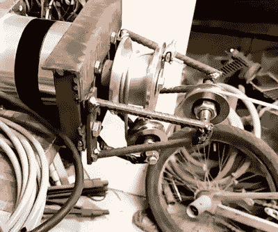

# 美丽的移动折纸灯由废料制成

> 原文：<https://hackaday.com/2018/11/22/beautiful-moving-origami-light-made-from-scrap/>

每当[MakerMan]用他的一个创造击中我们的提示线，我们知道它将是特别的。他的项目几乎完全是用废料和回收的组件建造的，这真的提醒了我们，如果你愿意打开你的思维，什么是可能的。不管是出于节俭还是必要，他证明了一句古老的格言:一个人的垃圾往往是另一个人的财富。

 我们主要期待来自【MakerMan】的实用建筑，所以[美丽的天花板灯，他称之为“动态吊灯”](https://www.youtube.com/watch?v=nlvyQXNPbDM)，是一种节奏的改变。计算机控制的灯能够像雨伞一样折叠起来，同时发出令人愉快的漫射 led 光。他告诉我们，这是他为一个客户委托制作的原型，我们可以大胆地说，他会有一个非常满意的客户。

像他所有的作品一样，这款动感吊灯几乎完全是由重新设计的组件制成的。当他发现支撑杆时，它们已经生锈和弯曲，但在将它们切割成一定尺寸并喷上一层喷漆后，你绝不会怀疑它们不是特意制作的。这种灯的“轮毂”是用角磨机从一大块钢材上切割下来的，并使用自行车链条的碎片作为灵活的连接。

也许最令人印象深刻的是他的 DIY 绞盘，用来提升和降低灯光的中心。[MakerMan]在车床上拧下一个铝滑轮，以安装结实的齿轮马达，然后用焊接在一起的钢筋将它与几个惰轮配对。这看起来像是来自疯狂的麦克斯的东西，但是它完成了任务。

最后，他从几个廉价的工作灯中抢救出 LED 面板，并焊接更多的钢筋，以适当的角度将它们安装到绞盘上。当从下面看时，这给光一个令人印象深刻的内部发光，而没有一个清晰的来源，并真正给它一个超凡脱俗的外观。

这不是我们第一次看到黑客组装他们自己的吊灯，也不是我们第一次在 T2 看到用废弃零件组装吊灯。但是,[MakerMan]在这里总结的很可能是我们迄今为止看到的最客观最有吸引力的一个。

 [https://www.youtube.com/embed/nlvyQXNPbDM?version=3&rel=1&showsearch=0&showinfo=1&iv_load_policy=1&fs=1&hl=en-US&autohide=2&wmode=transparent](https://www.youtube.com/embed/nlvyQXNPbDM?version=3&rel=1&showsearch=0&showinfo=1&iv_load_policy=1&fs=1&hl=en-US&autohide=2&wmode=transparent)

