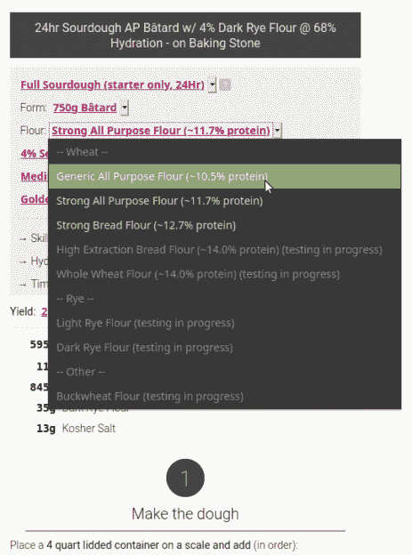

# 由于动态配方参数化，在家中制作出漂亮的酸面团面包

> 原文：<https://hackaday.com/2020/05/26/beautiful-sourdough-bread-at-home-thanks-to-dynamic-recipe-paramatrization/>

比以往任何时候都有更多的人在家里制作酸面团，虽然找到一个像样的食谱可能不需要太多努力，但尝试使用食谱来弄清楚面包实际上是如何工作的以及为什么工作却完全是另一回事。令人欣慰的是，[Makefast Workshop]已经将大量的研究和数百次试验转化为[一个充满下拉选项的动态酸面团(和半酸面团)面包配方](https://makefastworkshop.com/hacks/?p=20200515)，不仅可以定制配料，还可以定制烘焙方法和其他配方元素。想要调整数量或面包样式？玩水化还是面粉型？这一切都在那里，他们甚至有快速设置选项为他们的个人最爱。

 为了做到这一切，【快速制作工作室】需要对面包有更深层次的理解。在研究过程中，他们观察到食谱的格式经常是理解好面包实际上是如何制作的一个障碍。原因很简单:配方是作为描述固定过程的独立文档出现的；一组特定的步骤，遵循这些步骤会产生特定的结果。他们做的*而不是*通常做的是描述配料和过程之间的相互作用和平衡，这使得人们很难理解食谱到底是如何以及为什么会产生它所产生的效果。没有这些知识，就不可能知道哪些元素可以调整，以及如何调整。动态配方改变了这一切。

[Makefast Workshop]进行了数百次测试，一个接一个地输入参数，以获得填充动态配方所需的洞察力。它有清晰的流程和下拉选项，不仅可以动态更新配方步骤，还可以更新 URL。这意味着你可以随心所欲地修改食谱，然后简单地复制并粘贴网址来记录你烤了什么。

说到对食物的深思熟虑，这肯定不是[快速制作工作室]的第一次表演。我们讲述了他们制作美味 speculoos 的[美丽的指导，包括有效的 3D 打印模具](https://hackaday.com/2017/11/19/3d-printed-cookie-molds-for-the-best-speculoos/)，为比利时经典做出现代的改变。