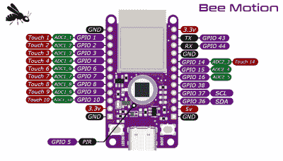

# Bee Motion 将 ESP32 与 PIR 传感器和 USB-C 相结合

> 原文：<https://hackaday.com/2022/05/07/bee-motion-combines-esp32-with-pir-sensor-and-usb-c/>

ESP32 开发板并不缺乏，其中许多都提供了一些“杀手级应用”功能，这些功能可能会也可能不会与您想要做的事情保持一致。但是如果你有一个项目可以受益于强大的 WiFi 微控制器和被动红外(PIR)运动传感器的配对，那么由[Paul Price]创建的[蜜蜂运动当然值得仔细看看](https://github.com/strid3r21/Bee-Motion)。

 这款试验板兼容封装将 ESP32-S2 模块与顶部安装的 PIR 传感器相结合，使其成为各种运动检测项目的交钥匙解决方案。除了预期的板载电压调节外，还有一个 LiPo 充电控制器和状态 led，用于移动或电池供电操作。

虽然[Paul]无法给出蜜蜂运动的具体运行时间，但他计算了一些数字，发现如果利用 MCU 的深度睡眠功能，1500 mAH 的电池可能会让主板运行一年多。当需要充电时，无论何时，主板的 USB-C 连接器意味着您不必四处寻找合适的电缆。

Bee Motion GitHub repo 中提供了原理图和 CAD 文件，【Paul】也在 Tindie 上[销售组装板。你现在需要的就是从我们过去报道过的一些](https://www.tindie.com/products/smartbee/bee-motion-esp32-pir-motion-sensor/)[巧妙的 PIR 项目中获得灵感](https://hackaday.com/2019/05/22/dummy-security-camera-is-smarter-than-it-looks/)。

 [https://www.youtube.com/embed/eUtSaV774to?version=3&rel=1&showsearch=0&showinfo=1&iv_load_policy=1&fs=1&hl=en-US&autohide=2&wmode=transparent](https://www.youtube.com/embed/eUtSaV774to?version=3&rel=1&showsearch=0&showinfo=1&iv_load_policy=1&fs=1&hl=en-US&autohide=2&wmode=transparent)

