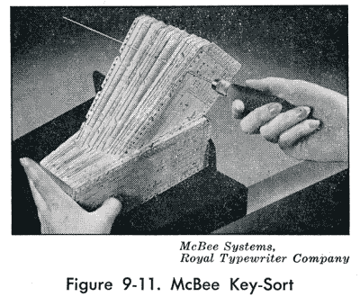
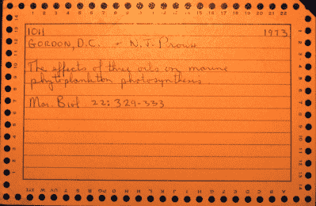

# 计算机出现之前:缺口卡数据库

> 原文：<https://hackaday.com/2019/06/18/before-computers-notched-card-databases/>

很难记住，实用计算机甚至还没有出现一个世纪。现代计算机出现的时间甚至更短。然而，不知何故，人们在没有任何计算机帮助的情况下计算表格、保存分类账，甚至写书。有时他们只是使用蛮力，但有时他们使用小技巧，我们几乎已经忘记了。例如，我们中只有少数人记得如何使用计算尺，但是他们帮助人类登上了月球。但是数据库管理在 1925 年是什么样子的呢？你可能会认为它只不过是一个文件柜和一个知道如何在里面找到东西的人。但是实际上有一个更好的系统被广泛使用。

## 如何对大量纸质记录进行分类？

不是说人们没有文件柜。问题是你只有一个主键或者有很多重复的主键。考虑给学生发成绩单。如果它们在文件柜里，你可能希望文件夹里有学生的名字。或者他们的成绩。或者他们的老师。有了数据库表，就可以很容易地创建一个基于任何这些项目的查询的视图。在一个文件柜里，我需要三份成绩单——在一个很难生产出份成绩单的日子里。当然，你可以想出一些方案，像班级和教师文件夹有名单，但这是一个黑客，不是一个好办法。

另外，如果有人想要 8 年级、9 年级和 10 年级所有女生的成绩单会怎么样？这需要大量的手动选择。成绩单也很简单。想象一下，如果你有一个非常复杂的数据集。

## 切割切口的高科技

答案在一种穿孔卡片上。不是我们从老式电脑中知道的穿孔卡片。这些卡片的边缘都打了孔。它们通常被称为边缘穿孔卡或边缘开槽卡。我们也听说过它们被称为“针卡”,其原因很快就会明了。有几个著名的品牌，包括 Cope-Chat、E-Z Sort、Flexisort 和 McBee Keysort 卡。

让我们回到我们的成绩单的例子。如果你的成绩单是在边缘打孔的卡片上，它的周围会有小孔和小标签。有人可能会说是一年级。另一个二年级学生。另一个可能会在写着“女性”的旁边写着“男性”无论是谁制作了这张卡，他都会用某种工具打开卡上的孔。所以，如果一张卡片是给米勒太太四年级班上的一个女孩的，你应该打开女性、四年级和米勒太太的卡片。

不过，寻找穿孔其实并不那么有用。你还不如只找卡片上的文字。价值在于你叠牌的时候。

将有刻痕的卡片与没有刻痕的卡片分开。[图片来源:[你能相信吗](https://blog.canyoubelieve.me/2018/08/nagasaki-shorts.html)

你可以以任何顺序拿着这叠东西，把一根长针——像织针一样——穿过，比如说，4 级孔。当你提起针的时候，所有在那个点上有一个完整的洞的那些会留在针上。任何有洞的都会掉到你的桌子上。

## 手动逻辑操作

当然，最好的查询有多个部分。如果你从桌子上拿起卡片，用“女性”槽口和“米勒夫人”槽口重复操作，你就完成了逻辑与运算。你也可以使用多根针，但最终会变得难以处理。如果你在停留在针上的卡片上重复操作，你正在做或操作。如果要逻辑反转，就用手里的叠，不用桌上的牌。简单。

当然，卡片不会一直这样分类。此外，像大多数东西一样，随着时间的推移，卡片变得越来越复杂。

## 变得更有创造力

另一个常见的改进是切掉每张卡片的一角，这样如果一张卡片在一叠中没有正确排列，它就会伸出来(你可以在图片中看到卡片右上角的一个小角)。有些卡片有两层洞，所以你可以做一个内置和操作。

扎托编码是一种用卡片解决特别困难问题的方法。对于学校的成绩单，你可能有 12 个成绩，在卡片边缘打 12 个洞不成问题。但是假设你正在尝试做图书馆的图书记录(如果你足够大，能够记住卡片目录——另一种类型的数据库)。可能有上百个实验对象。你可以为历史、电子、恐怖和其他数百个你可能想索引的主题留一个洞。

Zatocoding 解决了这个问题。关键是为每个主题选择一个多孔模式。美国历史可能用 1、5 和 15。电子产品可能是 5、12 和 16。一次插三根针，掉出来的卡片就是美国历史。因为一些书可能在多个类别中，所以其他一些书也可能会掉出。例如，一本归入电子类{5，12，16}和其他两个类别{1，9，11}和{4，7，15}的书在搜索美国历史时会掉出。你必须手动拒绝这些。

选择多少根针以及如何创建图案因方案而异——扎托编码只是一种方法。但是这个想法是将一堆物品映射到更少的孔上。如果你做得对，你会消除或至少最大限度地减少你不得不拒绝的项目。

对于数字，您可以使用 7 4 2 1 0 的穿孔，这将允许您对 0-9 之间的任何数字进行编码。如果你懂二进制，你可以在 4 个孔中完成这项工作，但 74210 系统更常见。你甚至可以用[少量的运算](http://www.cutoutfoldup.com/402-self-sorting-cards.php)对数字进行排序。

显然还有其他类似的系统在卡片的整个表面打孔。也有类似功能的躲猫猫卡片。假设我们的图书馆有 5000 本书，我们有预先印好的编号为 1-5000 的纸张。我们在一页上写下“美国历史”，并打出适用的书籍。在另一页上，我们写下“电子”并打出那一页的书。如果我们想看看是否有关于电子和美国历史的书，我们只需把书页放在一起，对着光。任何穿过堆栈的洞都匹配。然后你必须按号码去找书。

## 你自己试试

想试试玩麦克比纸牌吗？还是想为僵尸启示录做准备？下面的视频向你展示了如何改变螺旋冲头的用途。我们听说你还可以把钢丝钳带到螺旋笔记本上来解放穿孔纸。

 [https://www.youtube.com/embed/-mQ5p1pL-M0?version=3&rel=1&showsearch=0&showinfo=1&iv_load_policy=1&fs=1&hl=en-US&autohide=2&wmode=transparent](https://www.youtube.com/embed/-mQ5p1pL-M0?version=3&rel=1&showsearch=0&showinfo=1&iv_load_policy=1&fs=1&hl=en-US&autohide=2&wmode=transparent)

【主要图片来源:[美国国家人文科学基金会](https://www.neh.gov/divisions/odh/featured-project/12000-neh-grant-records-1966-1979-now-available)