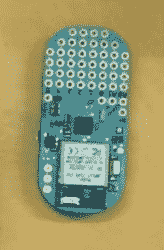
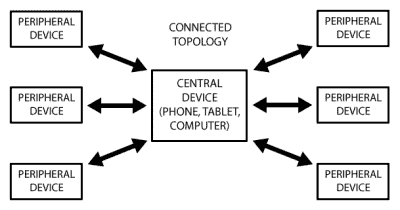
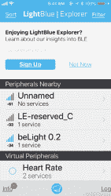
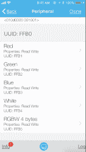
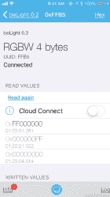
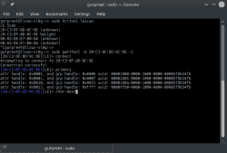
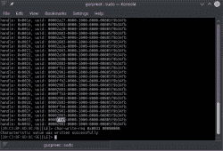
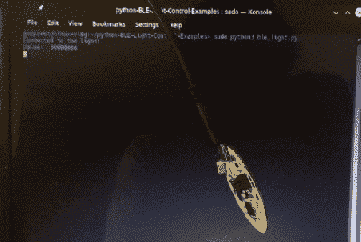

# 开始 BLE 实验，让一切变得更好

> 原文：<https://hackaday.com/2018/08/03/beginning-ble-experiments-and-making-everything-better/>

在没有物理电线的情况下成功连接事物对创客大脑有着深远的影响。如今，没有任何电缆的机器之间的交流和十年前一样令人惊叹。当蓝牙问世时，它是一个突破，因为它提供了一种将手机连接到 PC 的无线方式。但蓝牙是一个复杂的高带宽耗电设备，对于吞吐量要求较低的电池供电设备来说，支付能源价格是没有意义的。进入蓝牙 LE (BLE)，其功率要求适中，足以支持多种应用，包括低功率传感器节点和信标。

这些年来，出现了许多 BLE 设备，如浅蓝豆、BLE 信标以及像 FlexBot 这样依靠 BLE 进行通信的四轴飞行器。Android 或 iOS 应用程序是与这些奇妙的小工具对话的主要方法，尽管也有替代方法。

这是关于使用 BLE 设备进行建筑的两部分系列的第一部分。首先，我将调查一些 BLE 设备以及如何从 Linux 命令行开始使用 BLE。稍后，我们将描述制作 NodeJS 跨平台应用程序的过程，该应用程序将利用 BLE 功能并将其连接到互联网。让我们开始吧。

## 可用的 ble 硬件

有许多硬件制造商跳上了 BLE 的马车，向制造商推出了一些产品——第一块板是免费的。一些董事会比其他的更成功，然而，也有一些董事会未能经受住时间的考验。这里有一个关于花钱的小饰品的简短总结。

#### 浅蓝色豆



由穿洞设计的浅蓝色豆必须是当时最受欢迎的 BLE 板之一。它配有一个温度传感器、一个加速度计和一个 RGB LED。为了使编程更容易，它受 Arduino IDE 支持并对其进行编程，你可以使用“Bean Loader”来无线上传你的草图。

这部电影已经停产了，但是如果你想制作自己的电影，你可以随意下载硬件文件并开始制作。

#### TI LED 灯和传感器标签

作为参考设计出售的, [TI 蓝牙低能量灯](http://www.ti.com/tool/TIDC-BLUETOOTH-LOW-ENERGY-LIGHT)和 TI BLE 传感器标签对于刚起步的人来说是极好的起点。BLE 灯使用 USB 电源，BLE 传感器标签有各种传感器供您尝试 BLE 集成。

#### Flexbot

我甚至不确定这个是否在市场上有售，但它是一个实时 ble 应用程序的好例子。这是一架四轴飞行器，可以通过 BLE 与电话通话。芯片为 CC2650，主控制器为 Atmega32U4。

#### 伊穆杜伊诺

最初在 Kickstarter 项目中推出，[Alex Albino]在创建一个可用的 ble 设备方面做得非常出色，该设备带有 IMU 传感器和气压计。附带的软件是这个项目的亮点，你可以做很多事情。

#### BBC 微:比特

BBC Micro:Bit 是一个非常强大的设备，支持 MicroPython 和十几种其他语言。ARM 驱动的设备已经由许多大公司开发，值得初学者以及更高级的制造商看看。

#### 英特尔爱迪生和 Arduino 101

英特尔 Edison 和 Arduino 101/英特尔 Curie 都是英特尔对创客市场的实验的一部分，都被砍掉了。他们支持 BLE，并被认为是进入可穿戴市场的一次冒险，然而这并没有成功。不过，很棒的板子。

#### 树莓 Pi 3 B/B+

把最好的留到最后——Raspberry Pi 3 B/B+支持 BLE，太棒了。你为台式机/笔记本项目编写的相同的软件在单板计算机上不会有(太多)的停顿。这就是我在这篇文章中的目的。既然 RPi 3 支持 BLE，那么是什么阻止了制造商社区利用这一奇妙的技术制造大量的物联网设备和传感器节点呢？不多。

这是这篇文章的前提。让我们看看选项。

## BLE 用最简单的语言交流

 BLE 或蓝牙低能耗与传统的串行仿真设备非常不同。每一个 BLE 外围设备都可以被认为是一个准备好接受连接的服务器。它定期在电视上为自己做广告。客户端将连接到该设备，并可以请求该设备提供的“服务”列表。服务还具有其他特征——例如，一些服务只能被读取，而另一些服务只能被写入。有些人两样都能做。然后，客户端可以根据需要请求对服务进行读或写操作。

Adafruit 有一个初学者指南，尽管你可能不需要所有的信息。这里需要注意的重要一点是，一个设备可能有多个服务，每个服务可能有多个特征。

## 测试 BLE 设备–Android 和 iOS 上的浅蓝色应用

那么，我如何知道我的 BLE 设备开始工作？我们可以用智能手机相对轻松地回答这个问题。就我而言，我有一部安装了浅蓝色应用程序的 iPhone。接受测试的 BLE 设备是 TI BLE 灯，它在应用程序中显示为 beLight 0.2。连接到它就像点击图标一样简单，它提供的服务列表就会弹出来。在截图中，服务 UUID FFB0 用于 LED 控制，服务本身具有四个特征。

[](https://hackaday.com/2018/08/03/beginning-ble-experiments-and-making-everything-better/screen-shot-2018-07-29-at-1-22-14-am/)[](https://hackaday.com/2018/08/03/beginning-ble-experiments-and-making-everything-better/screen-shot-2018-07-29-at-1-22-49-am/)[](https://hackaday.com/2018/08/03/beginning-ble-experiments-and-making-everything-better/screen-shot-2018-07-29-at-1-23-36-am/)

每个特性就像一个我们可以写入的存储位置，在我的实验中，我可以向 RGBW 特性写入四个字节，然后用它来控制四个 led 的亮度。

这很容易，因为硬件可以工作，iOS 应用程序也可以工作。只有一个问题。如果我希望能够像色调灯泡一样使用颜色选择器来控制光线的颜色，该怎么办？如果我想和多个 LED 灯通话呢？如果我想把它们连接到互联网上呢？

而我不想学 Java(Android)或者 iOS 的 swift/C++怎么办？

## 手机应用的替代品——命令行工具

如果您有一台 Linux 机器，那么最简单的选择就是使用几个命令行工具。这是我在 OpenSUSE 上使用的配方，尽管它可以在任何带有 BLE 界面的 Linux 笔记本电脑上运行。

需要两种工具。第一个是`hcitool`，它允许您与主机控制器接口对话。它预装在大多数现代发行版中，但是您可以手动安装。(我发现[这个页面](https://www.jaredwolff.com/blog/get-started-with-bluetooth-low-energy/)挺有用的)。第二个工具是`gatttool`，它也可以预装或手动安装。

第一步是看看你的 Linux 机器上的 BLE 适配器是否能被`hcitool`识别。

```
hcitool dev
Devices:
hci0 xx:xx:xx:xx:xx:xx
```

如果没有显示，你可以检查板载 BLE 适配器是否启用，或者如果你有一个旧的笔记本电脑或树莓派，获得 BLE USB 加密狗。这些在易贝之类的地方很便宜。

第二步是扫描 BLE 设备，这将产生附近的 BLE 设备列表。

```
sudo hcitool lescan
```

第 3 步是尝试连接设备。这才是真正有趣的地方。有两种选择，第一种是使用交互模式。

```
sudo gatttool -b xx:ma:c_:ad:re:ss -I
```

这将弹出一个提示，您只需输入`connect`就可以建立连接。要获取设备上的服务列表，请键入`primary`并按 return 键。根据设备的不同，应该会弹出一些服务。要获得一个特性列表，输入`char-desc`来获得设备上所有特性及其句柄的列表。这很重要，因为我们需要对应于适当特征的句柄。

我们实验的最后一步是根据适当的特征进行读写。这是通过使用
`char-write-req handle data`完成的。
这里是我的 OpenSUSE 笔记本电脑上的练习截图。我发现[这一页](http://i-miss-erin.blogspot.com/2010/12/gatttool-in-bluez-over-bredr.html)在这个问题上提供了相当多的信息。

[](https://hackaday.com/2018/08/03/beginning-ble-experiments-and-making-everything-better/screenshot_20180729_021534/)[](https://hackaday.com/2018/08/03/beginning-ble-experiments-and-making-everything-better/screenshot_20180729_021724/)

要读取数据，发出命令`char-read handle`。

`gatttool`也可以在交互模式之外运行，可用于直接读取或写入设备:
`sudo gatttool -b xx:ma:c :ad:re:ss --char-write-req -a handle -n value`。如果您想编写一组像 bash 甚至 Python 这样的命令，这是非常有用的。让我们看一个简单的例子。如果你没有安装`pexpect`，你会需要它。

```

import pexpect
import time

LIGHT01 = &quot;20:C3:8F:8D:8C:9E&quot;
VALUE = [&quot;00000000&quot;, &quot;FF000000&quot;, &quot;00FF0000&quot;, &quot;0000FF00&quot;, &quot;000000FF&quot;, &quot;00000000&quot;];

child = pexpect.spawn(&quot;gatttool -I&quot;)

child.sendline(&quot;connect {0}&quot;.format(LIGHT01))
child.expect(&quot;Connection successful&quot;, timeout=5)
print (&quot;Connected to the light!&quot;)
while True:
    for i in range(6):
        child.sendline(&quot;char-write-req 0x0031 {0}&quot;.format(VALUE[i]))
        print (&quot;Value: &quot;, VALUE[i])
        child.expect(&quot;Characteristic value was written successfully&quot;, timeout=5)
        time.sleep(1);

child.sendline(&quot;disconnect&quot;)

child.close()

print (&quot;Light Turned OFF&quot;)
```

这一小段代码通过 Python 调用`gatttool`。在这里，我循环通过 RGBW 灯，但这可以扩展到你喜欢的程度。

## 结论

我们刚刚看到了控制 BLE LED 是多么容易，而且这可以通过多种方式进行扩展。例如，你可以把它作为一个可穿戴项目的起点。我们还可以将它连接到互联网上，我们将在下一期讨论这个问题。现在，我想听听你在 BLE 的冒险经历。愉快的实验。